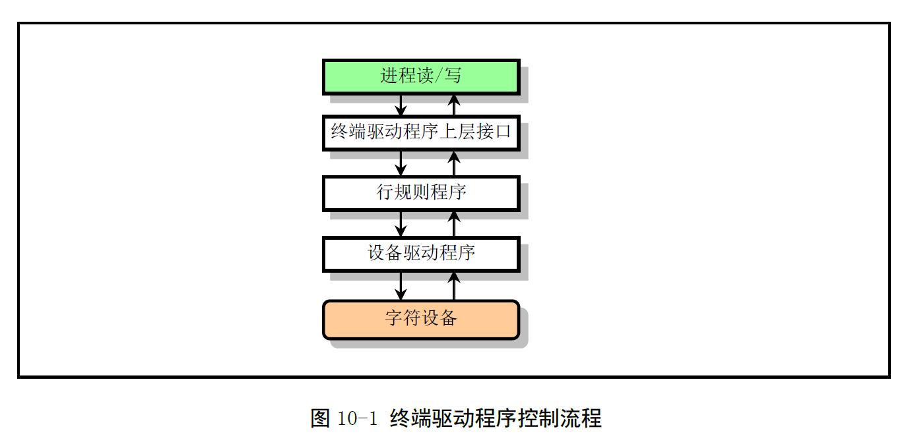
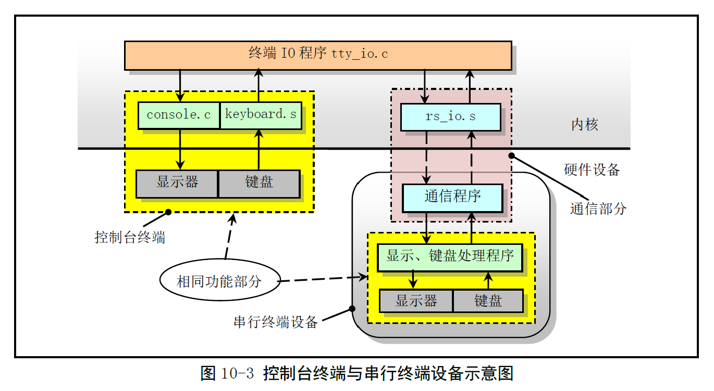
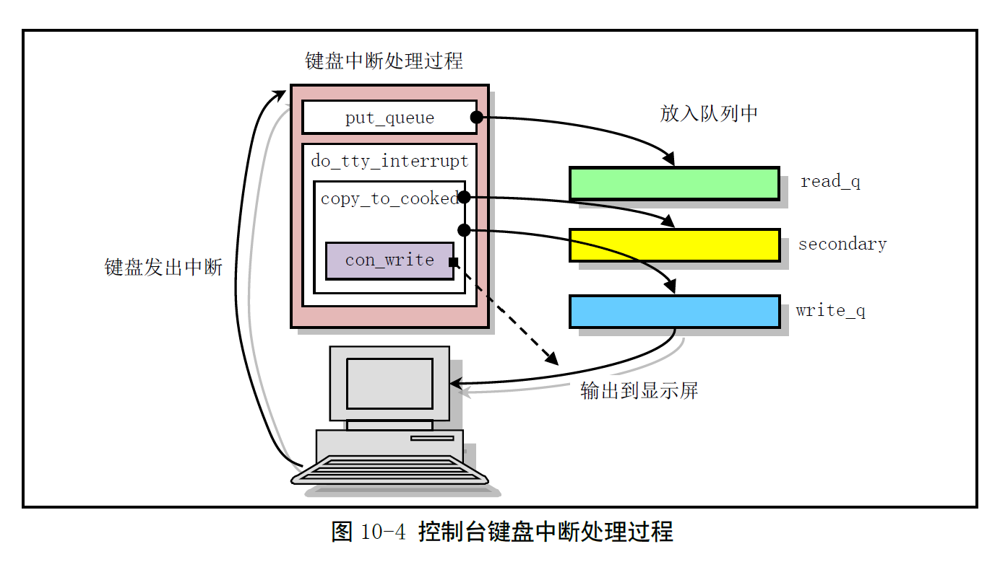
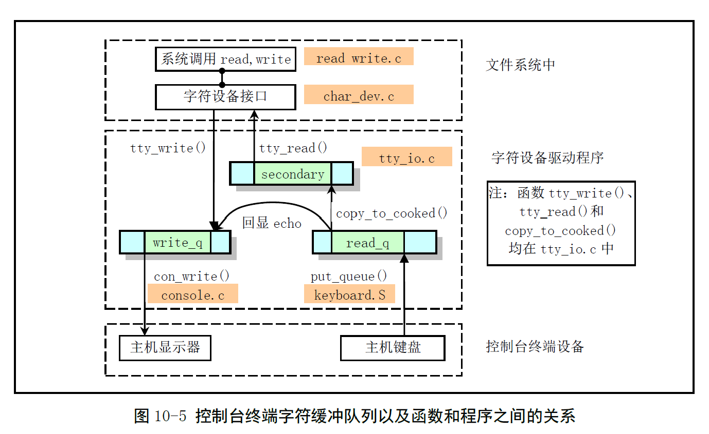
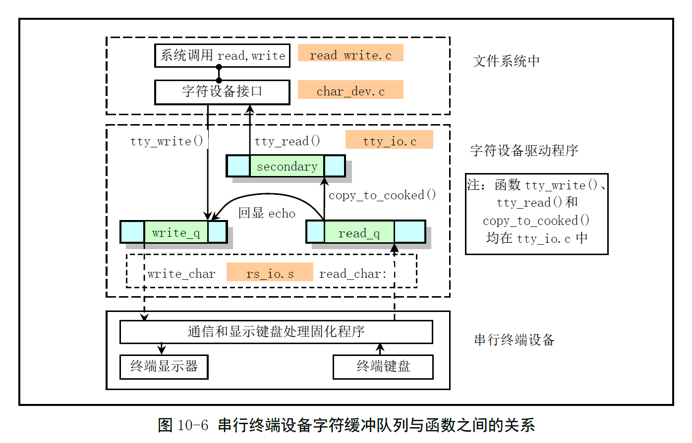

# Chapter 10.1 - 字符设备驱动程序 总体功能

Created by : Mr Dk.

2019 / 08 / 24 23:41

Ningbo, Zhejiang, China

---

在 Linux 0.12 中，字符设备主要包括 **控制终端设备** 和 **串行终端设备**。

---

## 10.1 总体功能

### 10.1.1 终端驱动程序基本原理

终端驱动程序用于控制终端设备，在 **终端设备** 和 **进程** 之间传输数据，并对传输的数据进行一定的处理。用户在键盘上键入原始数据，通过驱动程序处理后，传送给一个接收进程；进程向终端发送的数据，在驱动程序处理后，显示到终端屏幕或发送到远程终端。根据驱动程序对待输入、输出数据的方式，终端工作模式分为：

* 规范 (canonical) 模式：使用 **行规则函数** 对指定字符进行变换
* 非规范 (non-canonical) 模式：行规则函数仅在终端和进程之间传递数据，不进行变换处理



### 10.1.2 Linux 支持的终端设备类型

终端是一种字符型设备，有很多种类型，使用 tty 来简称各类终端设备 (Teletype 的缩写)。终端设备分为以下类型：

1. 串行端口终端 /dev/ttySn：计算机把每个串口都看作是一个字符设备
2. 伪终端 /dev/ptyp, /dev/ttyp：功能类似一般终端的设备，不与任何终端硬件相关，配对使用 - 主设备 + 从设备；两个程序可以通过逻辑设备互相交流
3. 控制终端 /dev/tty
4. 控制台 /dev/ttyn, /dev/console：计算机显示器
5. 其它类型终端

### 10.1.3 终端基本数据结构

每个终端设备都有一个 `tty_struct` 数据结构，保存该设备的所有信息。Linux 内核使用数组 `tty_table[]` 保存系统中每个终端设备的信息。

```c
struct tty_struct {
    struct termios termios; // 终端 I/O 属性和控制字符数据结构
    int pgrp; // 所属进程组
    int stopped; // 停止标志
    void (*write)(struct tty_struct * tty); // tty 写函数指针
    struct tty_queue read_q; // tty 读队列
    struct tty_queue write_q; // tty 写队列
    struct tty_queue secondary; // tty 辅助队列
};

extern struct tty_struct tty_table[];
```

Linux 0.12 内核支持三个终端设备：

- 一个控制台设备
- 两个串行终端设备

终端所处理的数据被保存在 3 个 `tty_queue` 结构的字符缓冲队列中：

```c
struct tty_queue {
    unsigned long data; // ?
    unsigned long head; // 数据头指针
    unsigned long tail; // 数据尾指针
    struct task_struct * proc_list; // 等待缓冲队列的进程列表
    char buf[1024]; // 队列缓冲区
};
```

每个 tty 字符队列的缓冲区长度为 1K 字节

* 读缓冲队列 `read_q` 存放来自键盘或串行终端输入的原始字符
* 写缓冲队列 `write_q` 存放输出到控制台显示屏或串行终端的数据
* 辅助队列 `secondary` 用于存放从 `read_q` 中取出并进行 **行规则变换** 后的数据；转换后，以字符行为单位供应用程序读取使用

当读取用户输入的数据时，中断处理程序只负责把原始字符放入输入缓冲队列。中断处理过程调用的 C 函数 `copy_to_cooked()` 负责处理字符的变换工作，将 `read_q` 中的字符经过处理，放入 `secondary` 中。如果终端设备设置了回显标志 `L_ECHO`，则也把该字符放入写队列 `write_q` 中，并调用终端写函数把字符显示在屏幕上。`termios` 结构保存了设备的所有控制标志：

```c
struct termios {
    unsigned long c_iflag; // 输入模式标志
    unsigned long c_oflag; // 输出模式标志
    unsigned long c_cflag; // 控制模式标志
    unsigned long c_lflag; // 本地模式标志
    unsigned char c_line; // 线路规程 (速率)
    unsigned char c_cc[NCCS]; // 控制字符数组
};
```

* `c_iflag` 实现了 POSIX.1 定义的所有 11 个输入标志，终端驱动程序利用这些标志控制如何对输入字符进行变换
* `c_oflag` - 终端驱动程序使用这些标志控制如何把字符输出到终端上
* `c_cflag` - 定义串行终端传输特性 - 波特率、字符比特位数、停止位数
* `c_lflag` - 控制驱动程序与用户的交互
* `c_cc[]` 数组定义了终端所有可以修改的特殊字符

### 10.1.4 规范模式和非规范模式

#### 10.1.4.1 规范模式

`c_lflag` 中的 ICANON 标志置位。此时输入字符会被装配成行，进程以字符行为单位进行读取。一行字符输入后，终端驱动程序立刻返回。行的界定符：

* `NL`
* `EOL`
* `EOL2`
* `EOF`：会被处理程序删除，其它字符会作为一行的最后一个字符返回给调用程序

#### 10.1.4.2 非规范模式

终端驱动程序不对字符进行处理。输入数据也没有行的概念。终端驱动程序何时返回读进程由 MIN 和 TIME 的值决定 - 位于 `c_cc[]` 中。

### 10.1.5 控制台终端和串行终端设备

Linux 0.12 仅支持这两种终端设备：

> 我的理解是一个用于本地，一个用于远程。因此肯定多了一部分和串口通信相关的代码。而其它部分一定有功能相同的部分。



#### 10.1.5.1 控制台驱动程序

- `keyboard.S` - 处理用户键入的字符，把它们放入读缓冲队列
- `console.c` - 实现控制台终端收到代码后的输出处理

用户在键盘上键入一个字符，引发键盘中断响应：INT 33。**键盘中断处理程序** 从 **键盘控制器** 读入对应的键盘扫描码，翻译成对应的字符后，放入 tty 读队列 `read_q` 中。然后调用中断处理程序的 C 函数 `do_tty_interrupt`。其中调用 **行规则函数** `copy_to_cooked()` 对该字符进行过滤处理，并放入 tty 辅助队列 `secondary` 和写队列 `write_q` 中，调用 **写控制台函数** `con_write()` 进行显示操作。整个过程的示意图如图所示：



对于 tty 写操作，终端驱动程序时一个字符一个字符进行处理的。当写缓冲队列 `write_q` 未满时，程序从用户缓冲区取一个字符，经过处理后放入 `write_q` 中。当用户数据全部放入 `write_q` 或此时 `write_q` 已满，就调用 `tty_struct` 指定的写函数，将 `write_q` 中的数据输出到控制台。程序与操作的关系如图所示：



#### 10.1.5.2 串行终端驱动程序

- `serial.c`：对串行端口进行初始化操作
- `rs_io.s`：串行终端处理过程

引起系统串行中断的情况：

1. modem 状态发生变化
2. 线路状态发生变化
3. 接收到字符
4. 在 **中断允许标志寄存器** 中设置了 **发送保持寄存器中断允许标志**，需要发送字符

对于前两种情况，读取相应的状态寄存器值即可使其复位。接收到字符的情况下，首先把字符放入读缓冲队列中，再调用行规则函数处理后放入辅助队列。对于要发送字符的情况，首先从写缓冲队列尾部取出字符发送出去，再判断写缓冲队列是否为空，若还有字符，则循环执行发送操作。

处理过程：对于一个接在串行端口上的中断，键入的字符通过串行线路传送到主机，引发主机串行口的中断请求。串行口中断处理程序将字符放入串行终端的读缓冲队列中，然后调用中断处理过程中的 C 函数 `do_tty_interrupt()`，而该函数又会直接调用行规则函数 `copy_to_cooked()`，对字符进行处理，并放入辅助队列。同时该字符也会被放入写队列，并调用写串口终端的函数 `rs_write()`，将字符送回串行终端进行回显。

串行终端的 `tty_struct` 数据结构的写函数是 `rs_write()`：

* 该函数会取消对 **发送保持寄存器** 的 **空允许中断** 的屏蔽
* 发送保持寄存器为空时，引起串行中断的产生
* 串行中断处理过程从写缓冲队列中取出字符，放入发送保持寄存器中
* 一次中断发送一个字符
* 写缓冲队列为空时，屏蔽发送保持寄存器的 **空允许中断**，从而禁止此类中断的发生

程序与操作的关系如图所示：



### 10.1.6 终端驱动程序接口

通常，用户通过 **文件系统** 与设备打交道。每个设备都有一个文件名称，因此在文件系统中占用一个类型为设备的 inode，用户可以直接使用文件系统的系统调用来访问设备。而终端驱动程序需要向文件系统提供调用的接口函数 - 在 `tty_io.c` 中实现：

* 读终端函数 `tty_read()`
* 写终端函数 `tty_write()`
* 行规则函数 `copy_to_cooked()`

在 `tty_ioctl.c` 程序中，实现了修改终端参数的输入输出控制函数 `tty_ioctl()` (修改 `termios` 结构体)。对于不同的终端设备，可以有不同的行规则程序与之匹配。但 Linux 0.12 中仅有一个行规则函数。

