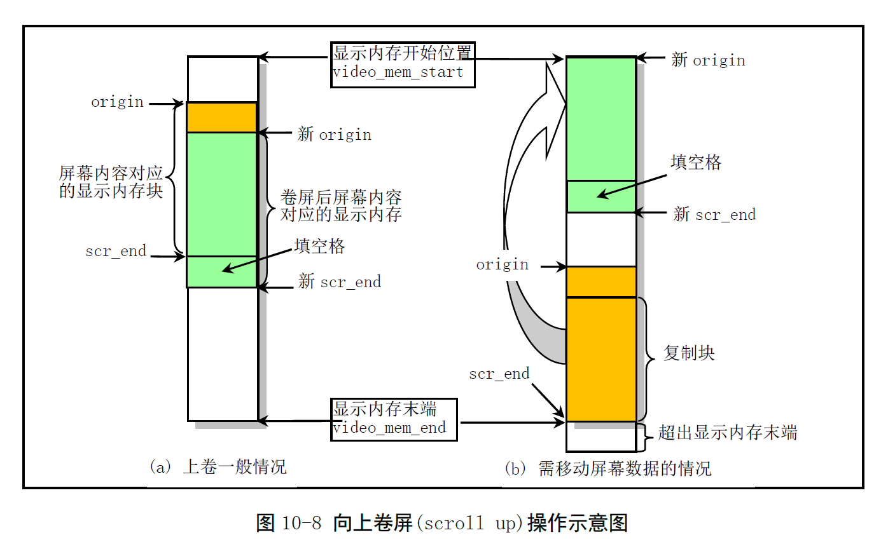

# Chapter 10.3 - console.c 程序

Created by : Mr Dk.

2019 / 08 / 26 12:15

Ningbo, Zhejiang, China

---

## 10.3 console.c 程序

### 10.3.1 功能描述

是内核中最长的程序，但功能极为单一......

所有子程序都是为了实现终端屏幕写函数 `con_write()`

以及进行终端屏幕显示的控制操作

函数 `con_write()` 主要由转换语句组成

* 从终端写缓冲队列中取出字符或字符序列
* 根据字符的性质，把字符写到显示内存中

### 10.3.2 代码注释

### 10.3.3 其它信息

#### 10.3.3.2 滚屏操作原理

将屏幕看作 __显示内存__ 上对应屏幕内容的一个 __窗口__

屏幕内容上下移动就是将窗口沿显示内存上下移动

在程序中即重新设置 __显示控制器__ 中显存的起始位置

程序处理过程分三步进行：

1. 调整屏幕的起始位置 origin
2. 判断屏幕内的数据是否超出显示内存的下边界，如果是，则将屏幕对应的内存数据移动到显示内存的开始位置处
3. 对于滚屏后的屏幕出现的新行，用空格字符填满

以下是向上卷屏的操作示意图：

向下卷屏也是同样的原理

只不过判断的是屏幕内的数据是否超出显示内存的上边界

如果是，需要将屏幕对应的内存拷贝到显示内存的末端

---

## Summary

这段代码实在是没兴趣看了

---

