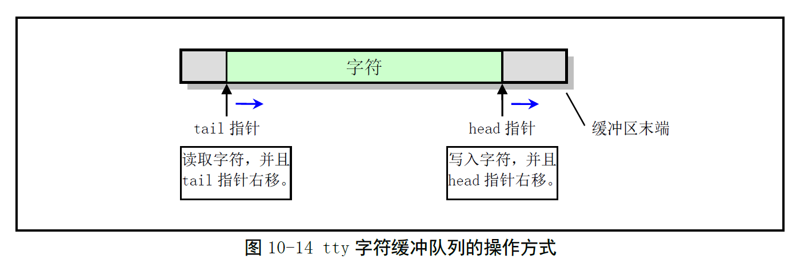

# Chapter 10.6 - tty_io.c 程序

Created by : Mr Dk.

2019 / 08 / 27 12:04

Ningbo, Zhejiang, China

---

## 10.6 tty_io.c 程序

### 10.6.1 功能描述

对每个设备的缓冲队列的操作方式：

* 读操作从缓冲队列的左端取字符，并把尾指针向右移动
* 写操作从缓冲队列的右端取字符，并把头指针向右移动

若任何指针超出了缓冲队列的末端，则折回左端重新开始



本程序中包含字符设备的 __上层接口函数__

* 终端读函数 `tty_read()`
* 终端写函数 `tty_write()`
* 行规则函数 `copy_to_cooked()`

`tty_read()` 和 `tty_write()` 将会在文件系统中操作字符设备文件时被调用

当程序读写文件时，在对应的系统调用中

若判断出所读文件是一个字符设备文件时

根据所读设备的子设备号，由字符设备读写表最终调用到这两个函数

`copy_to_cooked()` 由键盘中断过程调用

* 根据终端的 `termios` 结构体中设置的字符输入/输出标志，对读缓冲队列中的字符进行处理
* 把字符转换为以行为单位的规范模式字符队列
* 保存在辅助缓冲队列中
* 若终端设置了回显标志，还要把字符放入写队列中，并调用终端写函数
* 唤醒等待辅助缓冲队列的进程

函数实现的步骤：

1. 若读队列为空，或辅助队列已满，则直接唤醒等待 __辅助队列__ 的进程，结束
2. 从读队列的 __尾指针__ 处取一个字符，尾指针前移
3. 若是 __回车__ 或 __换行__，则根据终端 termios 结构体中的标志作相应转换
4. 若 __大写转小写标志__ 置位，则把字符替换为对应的小写字符
5. 若 __规范模式标志__ 置位，则对字符进行规范模式处理
   1. 删行字符 - 删除辅助队列中的一行字符 (头指针后退)
   2. 擦除字符 - 删除辅助队列头指针处的一个字符
   3. 停止字符 - 设置终端的停止标志
   4. 开始字符 - 复位终端的停止标志
6. 若 __接收键盘信号标志__ 置位，则为进程生成键入控制字符的对应信号
7. 行结束字符 - 辅助队列的行数统计值 data 增 1
8. 若 __本地回显标志__ 置位，则把字符也放入写缓冲队列中，并调用终端写函数
9. 把该字符放入辅助队列中，返回步骤 1 处理其它字符
10. 唤醒睡眠在辅助队列上的进程，退出

### 10.6.2 代码注释

#### 访问 termios 结构体中的标志的宏

```c
// 取三个模式标志集合之一
#define _L_FLAG(tty,f) ((tty)->termios.c_lflag & f) // 本地模式标志
#define _I_FLAG(tty,f) ((tty)->termios.c_iflag & f) // 输入模式标志
#define _O_FLAG(tty,f) ((tty)->termios.c_oflag & f) // 输出模式标志

// 取本地模式标志集中的一个标志
#define L_CANON(tty) _L_FLAG((tty),ICANON) // 取规范模式标志
#define L_ISIG(tty) _L_FLAG((tty),ISIG) // 取信号标志
#define L_ECHO(tty) _L_FLAG((tty), ECHO) // 取回显字符标志
#define L_ECHOE(tty) _L_FLAG((tty),ECHOE) // 规范模式时取回显擦出标志
#define L_ECHOK(tty) _L_FLAG((tty),ECHOK) // 规范模式时取 KILL 擦除当前行标志
#define L_ECHOCTL(tty) _L_FLAG((tty),ECHOCTL) // 取回显控制字符标志
#define L_ECHOKE(tty) _L_FLAG((tty),ECHOKE) // 规范模式时取 KILL 擦除行并回显标志
#define L_TOSTOP(tty) _L_FLAG((tty),TOSTOP) // 对于后台输出发送 SIGTTOU 信号

// 取输入模式标志集中的一个标志
#define I_UCLC(tty) _I_FLAG((tty),IUCLC) // 取大写到小写转换标志
#define I_NLCR(tty) _I_FLAG((tty),INLCR) // 取换行符 NL 转回车符 CR 标志
#define I_CRNL(tty) _I_FLAG((tty),ICRNL) // 取回车符 CR 转换行符 NL 标志
#define I_NOCR(tty) _I_FLAG((tty),IGNCR) // 取忽略回车符 CR 标志
#define I_IXON(tty) _I_FLAG((tty),IXON) // 取输入控制流标志 XON

// 取输出模式标志集中的一个标志
#define O_POST(tty) _O_FLAG((tty),OPOST) // 取执行输出处理标志
#define O_NLCR(tty) _O_FLAG((tty),ONLCR) // 取换行符 NL 转回车换行符 CR-NL 标志
#define O_CRNL(tty) _O_FLAG((tty),OCRNL) // 取回车符CR转换行符NL标志
#define O_NLRET(tty) _O_FLAG((tty),ONLRET) // 取换行符NL执行回车功能的标志
#define O_LCUC(tty) _O_FLAG((tty),OLCUC) // 取小写转大写字符标志

// 取控制标志集中的波特率
#define C_SPEED(tty) ((tty)->termios.c_cflag & CBAUD)
// 判断 tty 终端是否已挂线 (hang up)，即波特率是否为 0
#define C_HUP(tty) (C_SPEED(tty) == B0)
```

#### 终端的数据结构定义

包含：

* tty 终端使用的缓冲队列结构体数组 `tty_queues`
* tty 终端表结构体数组 `tty_table`

每个 tty 终端使用三个缓冲队列：读队列、写队列、辅助队列

共有 8 个控制台终端，2 个串行终端，4 对伪终端，共 18 个中断，需要 54 个缓冲队列

```c
#define QUEUES (3*(MAX_CONSOLES + NR_SERIALS + 2*NR_PTYS))
static struct tty_queue tty_queues[QUEUES]; // tty 缓冲队列数组
struct tty_struct tty_table[256]; // tty 表结构数组

// 定义每种类型的 tty 在缓冲队列数组中起始项的位置
#define con_queues tty_queues // 控制台 tty 占用起始 8 * 3 = 24 项
#define rs_queues ((3*MAX_CONSOLES) + tty_queues) // 两个串行终端占用其后 6 项
#define mpty_queues ((3*(MAX_CONSOLES+NR_SERIALS)) + tty_queue) // 4 个主伪终端
#define spty_queues ((3*(MAX_CONSOLES+NR_SERIALS+NR_PTYS)) + tty_queue) // 4 个从伪终端

// 定义每种类型的 tty 终端在 tty_table 数组中的起始项位置
#define con_table tty_table // 8 个控制台终端占用前 64 项
#define rs_table (64+tty_table) // 两个串行终端使用随后两项
#define mpty_table (128+tty_table) // 4 个主伪终端使用从 128 开始的项，最多 64 项
#define spty_table (192+tty_table) // 4 个从伪终端使用从 192 开始的项，最多 64 项

int fg_console = 0; // 当前前台控制台号
```

#### 汇编程序 rs_io.s 中使用的缓冲队列结构地址表

```c
struct tty_queue * table_list[] = {
    con_queues + 0, con_queues + 1, // 控制台的读写缓冲队列地址
    rs_queues + 0, rs_queues + 1, // 串行终端 1 的读写缓冲队列地址
    rs_queues + 3, rs_queues + 4 // 串行终端 2 的读写缓冲队列地址
};
```

#### 改变前台控制台函数 change_console()

```c
void change_console(unsigned int new_console)
{
    if (new_console == fg_console || new_console >= NR_CONSOLES)
        return;
    fg_console = new_console;
    table_list[0] = con_queues + 0 + fg_console * 3; // 控制台的读缓冲队列地址
    table_list[1] = con_queues + 1 + fg_console * 3; // 控制台的写缓冲队列地址
}
```

#### 若队列缓冲区空，让进程进入可中断睡眠状态 - sleep_if_empty()

进程在取缓冲区中的字符之前，需要调用此函数加以验证

若没有信号要处理，且指定的队列缓冲区为空

则进程进入可中断睡眠状态

并让缓冲队列的等待指针指向该进程

```c
static void sleep_if_empty(struct tty_queue * queue)
{
    cli();
    while (!(current->signal & ~current->blocked) && EMPTY(queue))
        interruptible_sleep_on(&queue->proc_list);
    sti();
}
```

#### 若队列缓冲区满，让进程进入可中断睡眠状态 - sleep_if_full()

进程在往缓冲区写字符之前，需要调用此函数加以验证

若进程没有信号需要处理，且缓冲区中剩余空闲长度 ＜ 128

则进程进入可中断睡眠状态

并让队列的进程等待指针指向该进程

```c
static void sleep_if_full(struct tty_queue * queue)
{
    if (!FULL(queue))
        return;
    cli();
    while (!(current->signal & ~current->blocked) && LEFT(queue) < 128)
        interruptible_sleep_on(&queue->proc_list);
    sti();
}
```

#### 行规则函数 copy_to_cooked()

根据终端 termios 结构体中设置的各种标志

将指定 tty 终端的读队列缓冲区中的字符复制并转换为规范模式

并存放在复制队列中

```c
void copy_to_cooked(struct tty_struct * tty)
{
    signed char c;
    
    // 检查终端各缓冲队列指针是否有效
    if (!(tty->read_q || tty->write_q || tty->secondary)) {
        printk("copy_to_cooked: missing queues\n\r");
        return;
    }
    
    while (1) {
        if (EMPTY(tty->read_q))
            break;
        if (FULL(tty->secondary))
            break;
        GETCH(tty->read_q, c); // 取一个字符到 c，并前移尾指针
        
        if (c == 13) {
            // 回车符 CR
            if (I_CRNL(tty))
                // 回车转换行标志置位
                c = 10; // 转换为换行符
            else if (I_NOCR(tty))
                // 忽略回车标志置位
                continue; // 忽略
        } else if (c == 10 && I_NLCR(tty))
            // 换行符 && 换行转回车标志置位
            c = 13; // 转换为回车符
        
        if (I_UCLC(tty))
            // 大写转小写输入标志置位
            c = tolower(c);
        
        if (L_CANON(tty)) {
            // 规范模式标志置位
            if ((KILL_CHAR(tty) != _POSIX_VDISABLE) &&
                (c == KILL_CHAR(tty))) {
                // 键盘终止控制字符 KILL (^U)
                // 删除当前行
                while (!(EMPTY(tty->secondary) ||
                       (c = LAST(tty->secondary)) == 10 ||
                         ((EOF_CHAR(tty) != _POSIX_VDISABLE) &&
                          (c = EOF_CHAR(tty))))) {
                    // 辅助队列不为空
                    // 不是回车或 EOF
                    if (L_ECHO(tty)) {
                        // 本地回显置位，向写队列写入擦除字符 ERASE
                        if (c < 32)
                            // 控制字符 - 两字节
                            PUTCH(127, tty->write_q);
                        PUTCH(127, tty->write_q);
                        tty->write(tty); // 调用 tty 写函数
                    }
                    DEC(tty->secondary->head); // 头指针后退
                }
                continue;
            }
            if ((ERASE_CHAR(tty) != _POSIX_VDISABLE) &&
                (c == ERASE_CHAR(tty))) {
                // 删除字符 ERASE (^H)
                if (EMPTY(tty->secondary) ||
                    (c = LAST(tty->secondary)) == 10 ||
                    ((EOF_CHAR(tty) != _POSIX_VDISABLE) &&
                     (c == EOF_CHAR(tty))))
                    continue;
                if (L_ECHO(tty)) {
                    // 本地回显置位
                    if (c < 32)
                        PUTCH(127, tty->write_q);
                    PUTCH(127, tty->write_q);
                    tty->write(tty);
                }
                DEC(tty->secondary->head);
                continue;
            }
        }
        
        if (I_IXON(tty)) {
            // 使终端停止/开始字符起作用
            if ((STOP_CHAR(tty) != _POSIX_VDISABLE) &&
                (c == STOP_CHAR(tty))) {
                tty->stopped = 1;
                tty->write(tty);
                continue;
            }
            if ((STOP_CHAR(tty) != _POSIX_VDISABLE) &&
               (c == START_CHAR(tty))) {
                tty->stopped = 0;
                tty->write(tty);
                continue;
            }
        }
        
        if (L_ISIG(tty)) {
            // 终端键盘可以产生信号
            if ((INTR_CHAR(tty) != _POSIX_VDISABLE) &&
               (c == INTR_CHAR(tty))) {
                kill_pg(tty->pgrp, SIGINT, 1);
                continue;
            }
            if ((QUIT_CHAR(tty) != _POSIX_VDISABLE) &&
               (c == QUIT_CHAR(tty))) {
                kill_pg(tty->pgrp, SIGQUIT, 1);
                continue;
            }
            if ((SUSPEND_CHAR(tty) != _POSIX_VDISABLE) && 
               (c == SUSPEND_CHAR(tty))) {
                if (!is_orphaned_pgrp(tty->pgrp))
                    kill_pg(tty->pgrp, SIGTSTP, 1);
                continue;
            }
        }
        
        // 换行符或文件结束符，表明一行已经处理完
        // 辅助队列中的行数值 + 1
        if (c == 10 ||
            (EOF_CHAR(tty) != _POSIX_VDISABLE && c == EOF_CHAR(tty)))
            tty->secondary->data++;
        
        if (L_ECHO(tty)) {
            if (c == 10) {
                // 换行符 NL
                PUTCH(10, tty->write_q);
                PUTCH(13, tty->write_q);
            } else if (c < 32) {
                // 控制字符
                if (L_ECHOCTL(tty)) {
                    // 回显控制字符
                    PUTCH('^', tty->write_q);
                    PUTCH(c + 64, tty->write_q);
                }
            } else
                PUTCH(c, tty->write_q);
            tty->write(tty);
        }
        
        // 每次循环的最后将字符放入辅助队列中
        PUTCH(c, tty->secondary);
    }
    
    // 辅助队列写入完毕
    // 如果有等待辅助队列的进程，则唤醒
    wake_up(&tty->secondary->proc_list);
}
```

#### 向使用终端的进程组中的所有进程发送信号 tty_signal()

```c
int tty_signal(int sig, struct tty_struct *tty)
{
    if (is_orphaned_pgrp(current->pgrp))
        return -EIO;
    (void) kill_pg(current->pgrp, sig, 1); // 发送信号
    if ((current->blocked & (1<<(sig - 1))) ||
        ((int) current->sigaction[sig-1].sa_handler == 1))
        // 信号被屏蔽 || 信号被当前进程忽略
        return -EIO;
    else if (current->sigaction[sig-1].sa_handler)
        // 设置了新的处理句柄
        return -EINTR; // 可被中断
    else
        // 重新启动系统调用
        return -ERESTARTSYS;
}
```

#### tty 读函数 tty_read()

从终端的 __辅助队列__ 中读取指定数量的字符，放到用户缓冲区中

```c
int tty_read(unsigned channel, char * buf, int nr)
{
    struct tty_struct * tty;
    struct tty_struct * other_tty = NULL;
    char c, *b = buf;
    int minimum, time;
    
    if (channel > 255)
        return -EIO;
    tty = TTY_TABLE(channel);
    if (!(tty->write_q || tty->read_q || tty->secondary))
        // 缓冲队列指针合法
        return -EIO;
    if ((current->tty == channel) && (tty->pgrp != current->pgrp))
        // 终端的进程组号与当前进程组号不同
        // 当前进程是后台进程组中的一个进程
        // 停止当前进程组中的所有进程
        return(tty_signal(SIGTTIN, tty));
    if (channel & 0x80)
        // 当前终端是伪终端
        // 对应的另一个终端
        other_tty = tty_table + (channel ^ 0x40);
    
    // 根据 VTIME 和 VMIN 对应的控制字符数组
    // 设置读字符操作的超时定时值 time 和最少需要读取的字符个数 minimum
    // VMIN 是为了满足操作而需要读取的最少字符个数
    // VTIME 是一个 0.1s 的计数计时值
    time = 10L * tty->termios.c_cc[VTIME]; // 设置读操作超时定时值
    minimum = tty->termios.c_cc[VMIN]; // 最少需要读取的字符个数
    
    if (L_CANON(tty)) {
        // 规范模式
        minimum = nr; // 设置最少读取字符数
        current->timeout = 0xffffffff; // 不会超时
        time = 0;
    } else if (minimum)
        // 非规范模式
        // 已经设置了最少读取字符数
        current->timeout = 0xffffffff;
    else {
        // 非规范模式
        // 没有设置最少读取字符数
        minimum = nr;
        if (time)
            current->timeout = time + jiffies;
        time = 0;
    }
    if  (minimum > nr)
        // 最多读取要求的字符数
        minimum = nr;
    
    while (nr > 0) {
        if (other_tty)
            // 伪终端
            // 让另一个伪终端把字符写入当前伪终端的辅助队列中
            other_tty->write(other_tty);
        cli();
        if (EMPTY(tty->secondary) ||
            (L_CANON(tty) &&
             !FULL(tty->read_q) &&
             !tty->secondary->data)) {
            // 辅助队列为空
            // 设置规范模式标志，且 tty 读缓冲队列未满，辅助队列字符行数为 0
            if (!current->timeout ||
                (current->signal & ~current->blocked)) {
                // 没有设置过读取超时值 || 进程收到信号
                // 退出
                sti();
                break;
            }
            if (IS_A_PTY_SLAVE(channel) && C_HUP(other_tty))
                // 伪终端 && 对应的主伪终端已经挂断
                // 退出
                break;
            interruptible_sleep_on(&tty->secondary->proc_list);
            sti();
            continue;
        }
        sti();
        
        do {
            GETCH(tty->secondary, c); // 取缓冲队列字符
            if ((EOF_CHAR(tty) != _POSIX_VDISABLE &&
                 c == EOF_CHAR(tty))
                || c == 10)
                // 文件结束符 || 换行符
                tty->secondary->data--;
            if ((EOF_CHAR(tty) != _POSIX_VDISABLE &&
                 c == EOF_CHAR(tty))
                && L_CANON(tty))
                // 文件结束符 && 规范模式标志
                break;
            else {
                put_fs_byte(c, b++);
                if (!--nr)
                    break;
            }
            if (c == 10 && L_CANON(tty))
                // 规范模式 && 换行符
                break;
        } while (nr > 0 && !EMPTY(tty->secondary));
        
        // 规范模式下，tty 读到了换行符或文件结束符
        // 非规范模式下，已经读取了 nr 个字符，或辅助队列为空
        wake_up(&tty->read_q->proc_list);
        if (time)
            // 超时定时值不为 0
            // 等待一定的时间，让其它进程可以把字符写入读队列中
            current->timeout = time + jiffies;
        if (L_CANON(tty) || b-buf >= minimum)
            // 处于规范模式 || 已经读取了 nr 个字符
            break; // 退出循环
    }
    
    current->timeout = 0;
    if ((current->signal & ~current->blocked) && !(b-buf))
        // 进程收到信号 && 没有读取任何字符
        return -ERESTARTSYS; // 重新启动系统调用
    return (b-buf); // 返回已读取的字符数
}
```

#### tty 写函数 tty_write()

把用户缓冲区中的字符放入 tty 写队列缓冲区中

```c
int tty_write(unsigned channel, char *buf, int nr)
{
    static cr_flag = 0;
    struct tty_struct * tty;
    char c, *b = buf;
    
    if (channel > 255)
        return -EIO;
    tty = TTY_TABLE(channel); // 取得 tty 设备结构体
    if (!(tty->write_q || tty->read_q || tty->secondary))
        // 缓冲队列合法性
        return -EIO;
    
    if (L_TOSTOP(tty) &&
        (current->tty == channel) &&
        (tty->pgrp != current->pgrp))
        // 后台进程输出时需要发送信号 SIGTTOU
        // 当前进程是后台进程组中的一个进程，不在前台
        // 等待其成为前台进程组后再进行写操作
        return (tty_signal(SIGTTOU, tty));
    
    while (nr > 0) {
        sleep_if_full(tty->write_q); // 写队列已满
        if (current->signal & ~current->blocked)
            // 当前进程有信号要处理
            break;
        while (nr > 0 && !FULL(tty->write_q)) {
            // 要写的字符 > 0 && tty 写缓冲队列不满
            c = get_fs_byte(b); // 从用户缓冲区取一字节
            if (O_POST(tty)) {
                // 输出处理标志
                if (c == '\r' && O_CRNL(tty))
                    c = '\n';
                else if (c == '\n' && O_NLRET(tty))
                    c = '\r';
                if (c == '\n' && !cr_flag && O_NLCR(tty)) {
                    cr_flag = 1;
                    PUTCH(13, tty->write_q);
                    continue;
                }
                if (O_LCUC(tty))
                    c = toupper(c);
            }
            b++; // 用户缓冲区指针
            nr--; // 要写的字符数量
            cr_flag = 0;
            PUTCH(c, tty->write_q); // 放入写队列中
        }
        
        // 要求的字符全部写完
        // 写队列已满
        tty->write(tty); // 调用对应的 tty 写函数
        // 若还有字节要写，需要等待写队列中的字节被其它进程取走
        if (nr > 0)
            schedule();
        // 调度返回后，将在循环中继续执行
    }
    return (b-buf); // 返回写入的字节数
}
```

#### tty 中断处理的调用函数 do_tty_interrupt()

在 __串口读字符中断__ 和 __键盘中断__ 的处理函数中被调用

将 tty 终端读缓冲队列中的字符复制或转换为 __规范模式__

并存放在辅助队列中

```c
void do_tty_interrupt(int tty)
{
    copy_to_cooked(TTY_TABLE(tty));
}
```

#### tty 终端初始化函数 tty_init()

初始化所有的终端缓冲队列

初始化串口终端和控制台终端

```c
void tty_init(void)
{
    int i;
    
    // 初始化所有的终端的缓冲队列结构
    for (i = 0; i < QUEUES; i++)
        tty_queues[i] = (struct tty_queue) { 0, 0, 0, 0, "" };
    // 设置串行终端的读/写缓冲队列
    rs_queues[0] = (struct tty_queue) { 0x3f8, 0, 0, 0, "" };
    rs_queues[1] = (struct tty_queue) { 0x3f8, 0, 0, 0, "" };
    rs_queues[3] = (struct tty_queue) { 0x2f8, 0, 0, 0, "" };
    rs_queues[4] = (struct tty_queue) { 0x2f8, 0, 0, 0, "" };
    // 初始化所有终端的 tty 结构体
    for (i = 0; i < 256; i++) {
        tty_table[i] = (struct tty_struct) {
            { 0, 0, 0, 0, 0, INIT_C_CC },
            0, 0, 0, NULL, NULL, NULL, NULL
        };
    }
    
    // 初始化控制台终端
    con_init();
    for (i = 0; i < NR_CONSOLES; i++) {
        con_table[i] = (struct tty_struct) {
            {
                ICRNL,
                OPOST | ONLCR,
                0,
                IXON | ISIG | ICANON | ECHO | ECHOCTL | ECHOKE,
                0,
                INIT_C_CC
            },
            0,
            0,
            0,
            con_write,
            con_queues + 0 + i * 3,
            con_queues + 1 + i * 3,
            con_queues + 2 + i * 3
        };
    }
    
    // 初始化串行终端
    for (i = 0; i < NR_SERIALS; i++) {
        rs_table[i] = (struct tty_struct) {
            {
                0,
                0,
                B2400 | CS8,
                0,
                0,
                INIT_C_CC
            },
            0,
            0,
            0,
            rs_write,
            rs_queues + 0 + i * 3,
            rs_queues + 1 + i * 3,
            rs_queues + 2 + i * 3
        };
    }
    
    // 初始化伪终端 tty
    for (i = 0; i < NR_PTYS; i++) {
        mpty_table[i] = (struct tty_struct) {
            {
                0,
                0,
                B9600 | CS8,
                0,
                0,
                INIT_C_CC
            },
            0,
            0,
            0,
            mpty_write,
            mpty_queues + 0 + i * 3,
            mpty_queues + 1 + i * 3,
            mpty_queues + 2 + i * 3
        };
        spty_table[i] = (struct tty_struct) {
            {
                0,
                0,
                B9600 | CS8,
                IXON | ISIG | ICANON,
                0,
                INIT_C_CC
            },
            0,
            0,
            0,
            spty_write,
            spty_queues + 0 + i * 3,
            spty_queues + 1 + i * 3,
            spty_queues + 2 + i * 3
        };
    }
    
    rs_init();
    printk("%d virtual consoles\n\r", NR_CONSOLES);
    printk("%d pty's\n\r", NR_PTYS);
}
```

---

