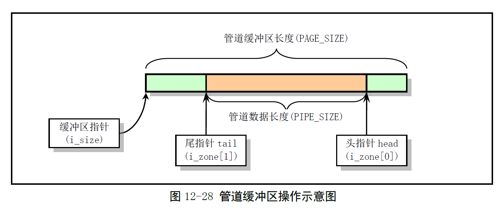

# Chapter 12.11 - pipe.c 程序

Created by : Mr Dk.

2019 / 09 / 15 09:09

Nanjing, Jiangsu, China

---

## 12.11 pipe.c 程序

### 12.11.1 功能描述

管道操作是进程间通信的最基本方式。本程序中实现了：

- 管道系统调用：`sys_pipe()`
- 管道读操作：`read_pipe()`
- 管道写操作：`write_pipe()`

每个管道对应一个 inode，并有一页内存作为缓冲区、缓冲区的地址、管道头指针、管道尾指针存放在 inode 中。



- 读操作从管道的尾指针取数据，尾指针前进
- 写操作从管道的头指针开始放入数据，头指针前进

对于读操作来说，如果管道中为空，就唤醒写管道进程，自己进入睡眠状态；对于写操作来说，如果管道已满，就唤醒读管道进程，自己进入睡眠。管道的内存位于内核空间，读取或写入时，需要和用户空间互相拷贝。

### 12.11.2 代码注释

#### read_pipe() - 管道读操作函数

将 inode 指向的管道中的指定数量字节复制到用户空间 buf 中，返回读取的字节数。

```c
int read_pipe(struct m_inode * inode, char * buf, int count)
{
    int chars, size, read = 0;
    
    // 需要读取的字节数大于 0
    while (count > 0) {
        while (!(size = PIPE_SIZE(*inode))) {
            // 管道中没有数据
            wake_up(&PIPE_WRITE_WAIT(*inode));
            if (inode->i_count != 2)
                // 已经没有写管道者
                return read;
            if (current->signal & ~current->blocked)
                // 重启系统调用 ?
                return read ? read : -ERESTARTSYS;
            interruptible_sleep_on(&PIPE_READ_WAIT(*inode));
        }
        
        // 管道中已有数据
        
        chars = PAGE_SIZE - PIPE_TAIL(*inode); // 管道尾指针到缓冲区末端的字节数
        if (chars > count)
            chars = count; // 已大于要读取的字节数
        if (chars > size)
            chars = size; // 已大于管道中剩余的数据量
        
        count -= chars; // 递减要读取的字节数
        read += chars; // 累加已读取的字节数
        size = PIPE_TAIL(*inode); // size 指向管道尾部
        
        // 调整尾指针
        PIPE_TAIL(*inode) += chars; // 尾指针前移
        PIPE_TAIL(*inode) &= (PAGE_SIZE - 1); // 超出缓冲区尾部，循环绕回
        
        // 拷贝管道数据到用户空间
        while (chars-- > 0)
            put_fs_byte(((char *) inode->i_size)[size++], buf++);
    }
    
    wake_up(&PIPE_WRITE_WAIT(*inode)); // 唤醒等待写管道的进程
    return read;
}
```

> 最外面的 while 循环每次迭代只处理从尾指针开始，到缓冲区尾部的管道数据。如果说缓冲区头部还有管道中的数据，那么在读取数据修正尾指针时，尾指针会重新绕到缓冲区头部，然后还要再迭代一次。

#### write_pipe() - 管道写操作函数

将用户空间 buf 中，count 个字节的数据写入管道，返回写入的字节数。

```c
int write_pipe(struct m_inode * inode, char * buf, int count)
{
    int chars, size, written = 0;
    
    // 还有数据要写入管道
    while (count > 0) {
        while (!(size = (PAGE_SIZE - 1) - PIPE_SIZE(*inode))) {
            // 管道空闲空间为 0
            wake_up(&PIPE_READ_WAIT(*inode)); // 唤醒读管道的进程
            if (inode->i_count != 2) {
                // 没有读管道的进程了，返回
                current->signal |= (1 << (SIGPIPE - 1));
                return written ? written : -1;
            }
            sleep_on(&PIPE_WRITE_WAIT(*inode)); // 自身进入睡眠
        }
        
        chars = PAGE_SIZE - PIPE_HEAD(*inode); // 头指针到缓冲区尾的字节数
        // 调整本次实际写入的长度
        if (chars > count) // 大于需要写入的长度
            chars = count;
        if (chars > size) // 大于管道剩余长度
            chars = size;
        
        count -= chars;
        written += chars;
        
        size = PIPE_HEAD(*inode); // size 指向管道目前的头部
        
        PIPE_HEAD(*inode) += chars; // 管道头部前移
        PIPE_HEAD(*inode) &= (PAGE_SIZE - 1); // 如果超出缓冲区，循环至头部
        
        while (chars-- > 0)
            ((char *) inode->i_size)[size++] = get_fs_byte(buf++);
    }
    
    // 写入管道操作结束
    wake_up(&PIPE_READ_WAIT(*inode)); // 唤醒等待读取管道的进程
    return written;
}
```

#### sys_pipe() - 创建管道系统调用

参数中传入一个数组，在该数组中创建一对文件句柄 (文件描述符)。这对文件句柄指向一个管道 inode，一个用于读管道，一个用于写管道：

```c
int sys_pipe(unsigned long * fildes)
{
    struct m_inode * inode;
    struct file * f[2];
    int fd[2];
    int i, j;
    
    // 从系统文件表中取两个空闲项
    // 依次寻找，如果只能找到一个，则失败，找到的那一个也需要被放回
    j = 0;
    for (i = 0; j < 2 && i < NR_FILE; i++)
        if (!file_table[i].f_count) // 存在空闲项
            // 占用系统文件表中的这一项，并让 file * f 指向文件表中的项
            (f[j++] = file_table + i)->f_count++;
    if (j == 1)
        // 只找到了一个空闲项
        // 归还占用的 1 项
        f[0]->f_count = 0;
    if (j < 2)
        return -1;
    
    // 在进程 PCB 的文件结构中寻找两个空闲文件句柄，分别指向这两个文件结构
    // 如果只能找到一个空闲句柄，则释放这一个句柄
    // 如果没有找到两个空闲句柄，还要释放上面已经获取到的文件结构项
    j = 0;
    for (i = 0; j < 2 && i < NR_OPEN; i++)
        if (!current->filp[i]) {
            current->filp[fd[j] = i] = f[j];
            j++;
        }
    if (j == 1)
        current->filp[fd[0]] = NULL;
    if (j < 2) {
        f[0]->f_count = f[1]->f_count = 0;
        return -1;
    }
    
    // 申请管道 inode，并分配管道的缓冲区
    // 如果不成功，则释放上述两部占用的项
    if (!(inode = get_pipe_inode())) {
        current->filp[fd[0]] = current->filp[fd[1]] = NULL;
        f[0]->f_count = f[1]->f_count = 0;
        return -1;
    }
    
    // 对文件结构进行初始化操作
    // 指向管道 inode，并把读写指针置 0
    f[0]->f_inode = f[1]->f_inode = inode;
    f[0]->f_pos = f[1]->f_pos = 0;
    f[0]->f_mode = 1; // 文件模式 - 读
    f[1]->f_mode = 2; // 文件模式 - 写
    put_fs_long(fd[0], fildes + 0); // 复制文件描述符到用户空间
    put_fs_long(fs[1], fildes + 1);
    
    return 0;
}
```

#### pipe_ioctl() - 管道 I/O 控制函数

```c
int pipe_ioctl(struct m_inode * pino, int cmd, int arg)
{
    switch(cmd) {
        // 管道当前可读数据长度
        case FIONREAD:
            verify_area((void *) arg, 4);
            put_fs_long(PIPE_SIZE(*pino), (unsigned long *) arg);
            return 0;
        default:
            return -EINVAL;
    }
}
```

---

## Summary

关于这个文件结构 `file`，咋只见过定义，没见过具体的操作函数呢？？？是我漏看了，还是暂时没看到哦？

