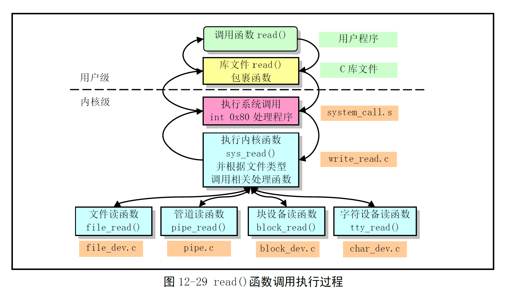

# Chapter 12.13 - read_write.c 程序

Created by : Mr Dk.

2019 / 09 / 18 15:37

Nanjing, Jiangsu, China

---

## 12.13 read_write.c 程序

### 12.13.1 功能描述

实现了文件操作的系统调用：

* `read()`
* `write()`
* `lseek()` - 用于设置文件读写指针

`read()` 和 `write()` 是之前几个文件的上层接口。在这两个函数中，判断文件的类型，并调用对应的处理函数。

### 12.13.2 代码注释

#### 定义在前几个文件中的各设备的读写操作函数

```c
// 字符设备
extern int rw_char(int rw, int dev, char * buf, int count, off_t * pos);
// 管道设备
extern int read_pipe(struct m_inode * inode, char * buf, int count);
extern int write_pipe(struct m_inode * inode, char * buf, int count);
// 块设备
extern int block_read(int dev, off_t * pos, char * buf, int count);
extern int block_write(int dev, off_t * pos, char * buf, int count);
// 文件
extern int file_read(struct m_inode * inode, struct file * filp, char * buf, int count);
extern int file_write(struct m_inode * inode, struct file * filp, char * buf, int count);
```

#### sys_lseek() - 重定位读写指针系统调用

对于 `origin` 参数，表示偏移的起始位置，有三种选择：

* `SEEK_SET` - 0 - 从文件开始处
* `SEEK_CUR` - 1 - 从文件当前位置
* `SEEK_END` - 2 - 从文件末尾处

```c
int sys_lseek(unsigned int fd, off_t offset, int origin)
{
    struct file * file;
    int tmp;
    
    // 参数有效性判断
    if (fd >= NR_OPEN || // 大于程序最多打开的文件数
        !(file = current->filp[fd]) || // 该句柄的文件结构为空
        !(file->f_inode) || // 文件对应的 inode 为空
        !IS_SEEKABLE(MAJOR(file->f_inode->i_dev))) // 指针不可定位
        return -EBADF;
    if (file->f_inode->i_pipe) // 管道节点指针不可随意移动
        return -ESPIPE;
    
    switch(origin) {
        case 0: // 指针位于文件开始处
            if (offset < 0)
                return -EINVAL;
            file->f_pos = offset;
            break;
        case 1: // 指针位于当前读写指针的位置
            if (file->f_pos + offset < 0)
                return -EINVAL;
            file->pos += offset;
        case 2: // 指针位于当前文件末尾
            if ((tmp = file->f_inode->i_size + offset) < 0)
                return -EINVAL;
            file->f_pos = tmp;
            break;
        default:
            return -EINVAL;
    }
    
    return file->f_pos; // 返回重定位后的读写指针
}
```

#### sys_read() - 读文件系统调用

```c
int sys_read(unsigned int fd, char * buf, int count)
{
    struct file * file;
    struct m_inode * inode;
    
    // 参数有效性判断
    if (fd >= NR_OPEN || // 超过程序最多打开文件数
        count < 0 || // 需要读取的字节数小于 0
        !(file = current->filp[fd])) // 句柄的文件结构指针为空
        return -EINVAL;
    if (!count)
        return 0;
    
    verify_area(buf, count); // 验证存放数据的缓冲区内存限制
    
    inode = file->f_inode; // 取 inode
    if (inode->i_pipe)
        // 管道文件，且是读管道模式
        return (file->f_mode & 1) ? read_pipe(inode, buf, count) : -EIO;
    if (S_ISCHR(inode->i_mode))
        // 字符型设备文件
        return rw_char(READ, inode->i_zone[0], buf, count, &file->f_pos);
    if (S_ISBLK(inode->i_mode))
        // 块设备文件
        return block_read(inode->i_zone[0], &file->f_pos, buf, count);
    if (S_ISDIR(inode->i_mode) || S_ISREG(inode->i_mode)) {
        // 目录或普通文件
        if (count + file->f_pos > inode->i_size)
            // 读取的字节数已经大于文件长度，则调整
            count = inode->i_size - file->f_pos;
        if (count <= 0)
            // 读取的字节数小于等于 0
            return 0;
        return file_read(inode, file, buf, count);
    }
    
    // 执行到此处，则无法判断文件属性
    printk("(Read)inode->i_mode=%06o\n\r", inode->i_mode);
    return -EINVAL;
}
```

#### sys_write() - 写文件系统调用

```c
int sys_write(unsigned int fd, char * buf, int count)
{
    struct file * file;
    struct m_inode * inode;
    
    // 判断参数有效性
    if (fd >= NR_OPEN || count < 0 || !(file = current->filp[fd]))
        return -EINVAL;
    if (!count)
        return 0;
    
    inode = file->f_inode; // 取文件的 inode
    if (inode->i_pipe)
        // 管道文件，且为写管道模式
        return (file->f_mode & 2) ? write_pipe(inode, buf, count) : -EIO;
    if (S_ISCHR(inode->i_mode))
        // 字符设备文件
        return rw_char(WRITE, inode->i_zone[0], buf, count, &file->f_pos);
    if (S_ISBLK(inode->i_mode))
        // 块设备文件
        return block_write(inode->i_zone[0], &file->f_pos, buf, count);
    if (S_ISREG(inode->i_mode))
        // 常规文件
        return file_write(inode, file, buf, count);
    
    // 执行到这里，则无法判断文件属性
    printk("(Write)inode->i_mode=%06o\n\r", inode->i_mode);
    return -EINVAL;
}
```

### 12.13.3 用户程序读写操作过程

应用程序不直接调用 Linux 系统调用，而是调用封装了系统调用的库函数，以保证程序的可移植性。对于 Linux 系统，所有的 I/O 均通过读写文件的方式完成。在读写文件之前，需要打开文件，通知 OS 将要开始的动作：

* OS 将检查是否具有权限进行操作
* 如果 ok，OS 将会向程序返回一个文件描述符，替代文件名来确定访问的文件
* 此时，被打开的文件的信息由 OS 维护，用户通过文件描述符来访问文件

库函数中的 read 和 write：

```c
int read(int fd, char * buf, int n);
int write(int fd, char * buf, int n);
```

库函数的具体实现：

```c
#define __LIBRARY__
#include <unistd.h>

_syscall3(int, read, int, fd, char *, buf, off_t count)
```

其中 `_syscall3` 是一个宏，将被展开为：

```c
int read(int fd, char * buf, off_t count)
{
    long __res;
    __asm__ volatile (
        "int &0x80"
        : "=a" (__res)
        : "" (__NR_read), "b" ((long)(fd)), "c" ((long)(buf)), "d" ((long)(count))
    );
    if (__res >= 0)
        return int __res;
    errno = -__res;
    return -1;
}
```

以 `__NR_read` (3) 为功能号，调用了 Linux 的系统调用中断。该中断在 `eax` 寄存器中返回了实际读取的字节数：如果返回的值小于 0，则表示此次读操作出错，对出错号进行取反，存入 errno 中，并返回 -1。整体函数的执行过程：

* 判断参数有效性
  * 文件描述符大于系统最多同时打开的文件数 (20)
  * 读取字节数小于 0
  * 该文件还没有被打开 (文件结构项指针为 NULL)
* 验证存放数据的缓冲区大小是否合适
  * 如果太小，系统会对其进行扩充 - 可能会冲毁后面的数据
* 获得该文件的 inode，根据其中的标志信息对文件类型进行判断
  * 管道文件
  * 字符设备文件 - 根据子设备号，调用字符设备驱动程序
  * 块设备文件 - 调用内存高速缓冲处理程序 - 最后调用块设备驱动程序
  * 常规文件 - 最后也会调用块设备驱动程序，但还需要维护内部文件表结构
* 返回，库函数 `read()` 根据返回值来判断操作是否正确
  * 若出错，则将错误号取反，并返回 -1

调用层次：



---

