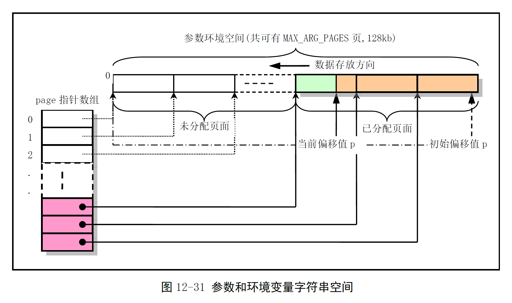
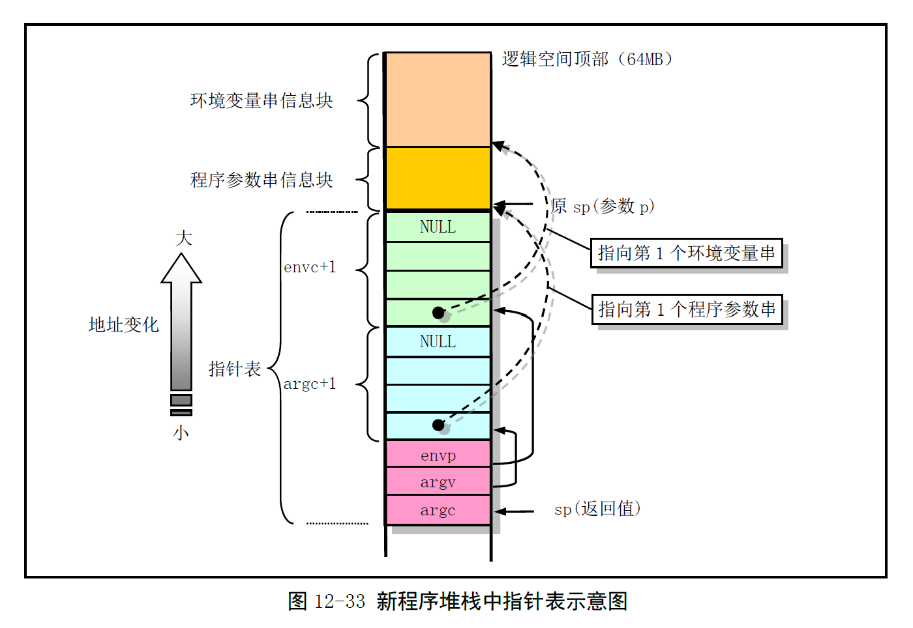
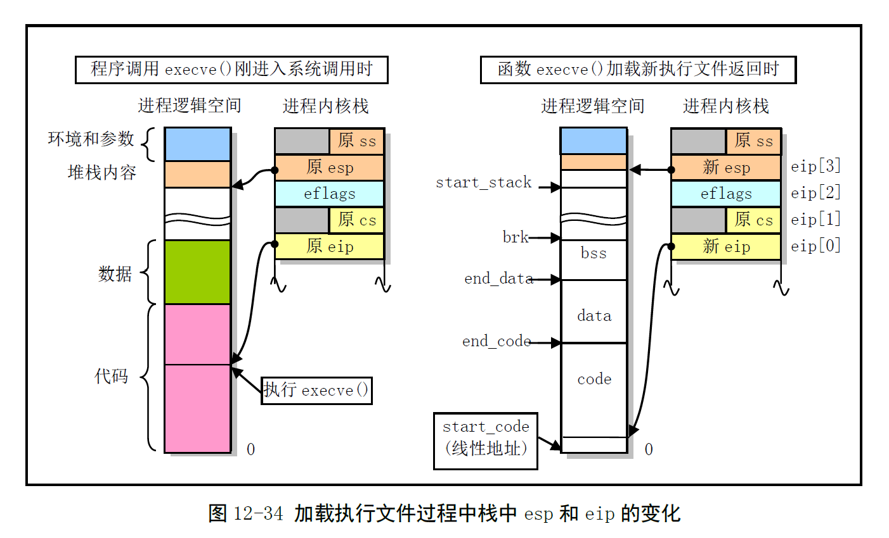

# Chapter 12.15 - exec.c 程序

Created by : Mr Dk.

2019 / 09 / 21 15:57

Nanjing, Jiangsu, China

---

## 12.15 exec.c 程序

### 12.15.1 功能描述

实现对 __二进制可执行文件__ 的加载与执行

最主要的函数是 `do_execve()`

Linux 0.12 内核仅支持 `a.out` 格式的执行文件

这种文件中，保存了一个 exec 数据结构

```c
struct exec {
    unsigned long a_magic; // ?
    unsigned long a_text; // 代码字节长度
    unsigned long a_data; // 数据字节长度
    unsigned long a_bss; // 文件未初始化数据区字节长度
    unsigned long a_syms; // 文件中的符号表字节长度
    unsigned long a_entry; // 执行开始地址
    unsigned long a_trsize; // 代码重定位信息字节长度
    unsigned long a_drsize; // 数据重定位信息字节长度
};
```

程序通过 `fork()` 创建了一个子进程时

在子进程中调用 `exec()` 族函数之一 __加载__ 、__执行__ 另一个新程序

此时，子进程的代码段、数据段被新程序完全替换

由此，`execve()` 函数的主要功能：

* 对 __命令行参数__ 和 __环境参数__ 空间页面的初始化操作；取执行对象的 inode；计算参数个数和环境变量个数；检查文件类型和执行权限
* 根据 inode，读取 exec 结构中的信息；判断是否可执行
* 初始化：指向新执行文件的 inode；复位信号处理句柄；设置局部描述符；设置参数和环境参数页面指针；修改进程执行字段的内容
* 替换堆栈上 `execve()` 的返回地址为新执行程序的运行地址

系统会清掉 `fork()` 复制的原程序的目录项和页表项，并释放对应页面

为新加载的代码重新设置 PCB 中的信息

申请和映射命令行参数和环境参数所占内存页面

设置了代码执行点

此时，并不立刻从块设备上加载新程序代码

而是通过首次运行时的缺页异常中断

在主内存区为新程序申请内存页面，设置页表，载入页面 - Load on demand (按需加载)

对于新进程来说，是否关闭父进程打开的文件，由文件描述符的 close on exec 标志有关

* 如果该标志被设置，则执行 `execve()` 后，对应的描述符将被关闭

对于参数的处理：

```c
int main(int argc, char *argv[], char *envp)
```

* `argc` 为参数个数
* `argv` 为字符串参数数组，以 NULL 结尾
* `envp` 为环境变量参数

`execve()` 为命令行参数和环境变量参数预留了 MAX_ARG_PAGES (32) 个页面 (128kB)

在该空间中，以类似于堆栈操作的方式，从 128kB 末端放入参数：



然后根据参数变量个数 argc 和环境变量个数 envc

在新程序的用户态堆栈中创建指针表

其中，需要分别为命令行参数和环境变量各预留一个 NULL 指针，作为参数表的结束标志

并最终存放命令行参数表和环境变量表的首地址，以及命令行参数个数

调整堆栈指针到命令行参数个数的位置：



在函数 `do_execve()` 返回时

将内核态堆栈上保存的 eip 替换为新执行程序的入口地址

将内核态堆栈上保存的 esp 替换为新的用户态堆栈位置 (如上图所示)

系统调用返回指令会弹出这两个值，并使 CPU 执行新的程序：



>  在进入该系统调用时，程序的用户堆栈的 eip 和 esp 被保存在内核态堆栈上：
>
> * eip 指向系统调用返回后，继续执行的程序指令
> * esp 指向用户态堆栈栈顶
>
> 经过 `execve()` 函数的处理后
>
> 为程序设置了新的环境和参数及其指针表，并使 esp 指向参数表地址
>
> 重新设置了程序的代码段、数据段 (但不立刻分配页面 - Load on demand)
>
> 将 eip 设置为代码段的首条指令咯
>
> 这样，从中断返回后
>
> 用户态堆栈 esp 指向了新设置的环境参数
>
> 从 eip 指向的新程序的第一条指令开始执行
>
> 此时引发缺页，再分配页面，将新程序的开头部分载入内存
>
> 这一套机制有点复杂的哦，但挺巧妙的 🤤

### 12.15.2 代码注释

#### sys_uselib() - 替换进程库文件系统调用

```c
int sys_uselib(const char * library)
{
    struct m_inode * inode;
    unsigned long base;
    
    if (get_limit(0x17) != TASK_SIZE)
        // 当前进程是否为普通进程
        // 普通进程的长度被设置为 TASK_SIZE (64MB)
        return -EINVAL;
    if (library) {
        if (!(inode = namei(library))) // 库文件 inode
            return -ENOENT;
    } else
        inode = NULL;
    
    // 放回原库文件 inode
    iput(current->library);
    current->library = NULL;
    // 释放库代码占用的内存页
    base = get_base(current->ldt[2]);
    base += LIBRARY_OFFSET;
    free_page_tables(base, LIBRARY_SIZE);
    
    current->library = inode;
    return 0;
}
```

#### create_tables() - 创建参数指针表

```c
static unsigned long * create_tables(char * p, int argc, int envc)
{
    unsigned long * argv, *envp;
    unsigned long * sp;
    
    sp = (unsigned long *) (0xfffffffc & (unsigned long) p);
    sp -= envc + 1; // sp 向下移动留出环境变量的所有指针空间 (包括一个 NULL)
    envp = sp; // envp 指向环境变量指针表
    sp -= argc + 1; // sp 向下移动留出命令行参数的所有指针空间 (包括一个 NULL)
    argv = sp; // argv 指向命令行参数指针表
    put_fs_long((unsigned long) envp, --sp); // 环境变量指针表指针
    put_fs_long((unsigned long) argv, --sp); // 命令行参数指针表指针
    put_fs_long((unsigned long) argc, --sp); // 命令行参数个数
    
    while (argc-- > 0) {
        put_fs_long((unsigned long) p, argv++);
        while (get_fs_byte(p++)); // next string
    }
    put_fs_long(0, argv); // argv 表的最后是 NULL
    while (envc-- > 0) {
        put_fs_long((unsigned long) p, envp++);
        while (get_fs_byte(p++)); // next string
    }
    put_fs_long(0, envp); // envp 表的最后是 NULL
    return sp; // 返回新栈指针
}
```

#### count() - 计算命令行参数/环境变量的个数

指针表中的最后一个指针项为 NULL

```c
static int count(char ** argv)
{
    int i = 0;
    char ** tmp;
    
    if (tmp = argv)
        while (get_fs_long((unsigned long *) (tmp++)))
            i++;
    return i;
}
```

#### copy_strings() - 拷贝参数/环境字符串

增加了 `from_kmem` 参数

指明了字符串或字符串数组是来自用户端还是内核段

| from_kmem | 指针 argv *  | 字符串 argv ** |
| --------- | ------------ | -------------- |
| 0         | User space   | User space     |
| 1         | Kernel space | User space     |
| 2         | Kernel space | Kernel space   |

一般来说，所有参数字符串都在用户空间中

> 注意，`get_fs_long()` 是将 fs 指向段中的 long 数据拷贝到 ds 指向段中
>
> 因此，如果被拷贝的数据在内核数据段，需要让 fs 指向内核空间

```c
static unsigned long copy_strings(int argc, char ** argv, unsinged long *page, unsigned long p, int from_kmem)
{
    char *tmp, *pag;
    int len, offset = 0;
    unsigned long old_fs, new_fs;
    
    if (!p)
        return 0;
    new_fs = get_ds(); // 段寄存器 ds 指向内核数据段
    old_fs = get_fs(); // 段寄存器 fs 指向用户数据段
    if (from_kmem == 2)
        set_fs(new_fs); // 使 fs 指向内核空间
    
    while (argc-- > 0) {
        if (from_kmem == 1) // 若 argv 指向内核空间，则使 fs 指向内核空间
            set_fs(new_fs);
        if (!(tmp = (char *) get_fs_long(((unsigned long *) argv) + argc)))
            panic("argc is wrong");
        if (from_kmem == 1)
            set_fs(old_fs); // fs 指回用户空间
        
        // tmp 为字符串指针，指向参数字符串
        // 从用户空间取字符串
        len = 0;
        do {
            len++;
        } while (get_fs_byte(tmp++));
        // 统计了字符串的长度
        // 此时 tmp 指向字符串尾
        // 字符串此时应当位于内核空间中
        
        if (p - len < 0) {
            // 不太可能发生
            set_fs(old_fs);
            return 0;
        }
        
        // 将字符串逐个字符复制到参数和环境空间末端
        // 首先判断相应位置是否已有内存页面
        while (len) {
            --p; --tmp; --len;
            // offset 为页面中的偏移
            if (--offset < 0) {
                offset = p % PAGE_SIZE;
                if (from_kmem == 2)
                    set_fs(old_fs);
                if (!(pag = (char *) page[p/PAGE_SIZE]) &&
                    !(pag = (char *) page[p/PAGE_SIZE] = (unsigned long *) get_free_page()))
                    return 0;
                if (from_kmem == 2)
                    set_fs(old_fs);
            }
            *(pag + offset) = get_fs_byte(tmp);
        }
    }
    
    if (from_kmem == 2)
        set_fs(old_fs);
    return p;
}
```

> 擦 这吊毛函数到底 tm 什么意思啊？？？

#### change_ldt() - 修改任务的 LDT

```c
static unsigned long change_ldt(unsigned long text_size, unsigned long * page)
{
    unsigned long code_limit, data_limit, code_base, data_base;
    int i;
    
    // 代码段和数据段长度设置为 64MB
    code_limit = TASK_SIZE;
    data_limit = TASK_SIZE;
    // 重新设置 LDT 中代码段和数据段的基址和段限长
    code_base = get_base(current->ldt[1]);
    data_base = code_base;
    set_limit(current->ldt[1], code_limit);
    set_limit(current->ldt[2], data_limit);
    
    // 将参数和环境空间中已存放数据的页面放到数据段末端
    // 从进程空间库代码开始处逆向一页一页地放 (库代码占用进程空间末端 4MB 部分)
    __asm__("push $0x17\n\tpop %%fs"::);
    data_base += data_limit - LIBRARY_SIZE;
    for (i = MAX_ARG_PAGES - 1; i >= 0; i--) {
        data_base -= PAGE_SIZE;
        if (page[i])
            put_dirty_page(page[i], data_base);
    }
    return data_limit;
}
```

> 新执行的程序和原程序使用的段基址与原程序相同
>
> 所有不用再重新设置段基址了，只需要设置段限长

#### do_execve() - execve 系统中断调用函数

函数的参数全部由汇编压入堆栈

```c
int do_execve(unsigned long * eip, long tmp, char * filename, char ** argv, char ** envp)
{
    struct m_inode * inode;
    struct buffer_head * bh;
    unsigned long page[MAX_ARG_PAGES];
    int i, argc, envc;
    int e_uid, e_gid;
    int retval;
    int sh_bang = 0; // 是否需要执行脚本程序
    unsigned long p = PAGE_SIZE * MAX_ARG_PAGES - 4;
    
    // 内核准备了 32 个 page (128kB) 存放参数和环境字符串
    // p 被初始化指向 128kB 空间的最后一个长字
    // p 指明在 128kB 中的当前位置
    
    if ((0xffff & eip[1]) != 0x000f)
        // CS 寄存器应当指向当前任务的段选择符 0x000f
        // 若不是，则只可能是内核代码段，但内核代码是不能被 execve 替换的
        panic("execve called from supervisor mode");
    for (i = 0; i < MAX_ARG_PAGES; i++)
        // 页面清零
        page[i] = 0;
    if (!(inode = namei(filename))) // 取执行文件的 inode
        return -ENOENT;
    argc = count(argv); // 计算命令行参数个数
    envc = count(envp); // 计算环境字符串变量个数
    
restart_interp:
    // 要执行的必须是一个文件
    if (!S_ISREG(inode->i_mode)) {
        retval = -EACCES;
        goto exec_error2;
    }
    
    // 权限判断
    i = inode->i_mode;
    e_uid = (i & S_ISUID) ? inode->i_uid : current->euid;
    e_gid = (i & S_ISGID) ? inode->i_gid : current->egid;
    if (current->euid == inode->i_uid)
        i >>= 6;
    else if (in_group_p(inode->i_gid))
        i >>= 3;
    if (!(i & 1) && !((inode->i_mode & 0111) && suser())) {
        retval = -ENOEXEC;
        goto exec_error2;
    }
    
    // 权限检查通过
    // 取出文件首部的数据
    if (!(bh = bread(inode->i_dev, inode->i_zone[0]))) {
        retval = -EACCES;
        goto exec_error2;
    }
    ex = *((struct exec *) bh->b_data); // exec 头部
    if ((bh->b_data[0] == '#') && (bh->b_data[1] == '!') && (!sh_bang)) {
        // 文件头部以 #! 开头
        // ...
    }
    
    brelse(bh); // 文件头部已被拷贝到 exec 中，先释放缓冲块
    // 文件合法性的判断
    if (N_MAGIC(ex) != ZMAGIC ||
        ex.a_trsize ||
        ex.a_drsize ||
        ex.a_text + ex.a_data + ex.a_bss > 0x3000000 ||
        inode->i_size < ex.a_text + ex.a_data + ex.a_syms + N_TXTOFF(ex)) {
        retval = -ENOEXEC;
        goto exec_error2;
    }
    // 执行文件中代码开始处不位于页边界
    if (N_TXTOFF(ex) != BLOCK_SIZE) {
        printk("%s: N_TXTOFF != BLOCK_SIZE. See a.out.h.", filename);
        retval = -ENOEXEC;
        goto exec_error2;
    }
    if (!sh_bang) {
        // 复制命令行参数和环境字符串到对应内存空间中
        p = copy_strings(envc, envp, page, p, 0);
        p = copy_strings(argc, argv, page, p, 0);
        if (!p) {
            retval = -ENOMEM;
            goto exec_error2;
        }
    }
    
    if (current->executable)
        iput(current->executable); // 放回原执行程序的 inode
    current->executable = inode; // 设置新的执行文件 inode
    current->signal = 0; // 复位所有信号
    // 处理所有信号
    for (i = 0; i < 32; i++) {
        current->sigaction[i].sa_make = 0;
        current->sigaction[i].sa_flags = 0;
        if (current->sigaction[i].sa_handler != SIG_IGN)
            current->sigaction[i].sa_handler = NULL;
    }
    // 关闭打开的文件 (根据 close_on_exec 标志)
    for (i = 0; i < NR_OPEN; i++)
        if ((current->close_on_exec >> i) & 1)
            sys_close(i);
    current->close_on_exec = 0;
    
    // 释放原来程序的代码段和数据段所对应的物理页面和页表
    free_page_tables(get_base(current->ldt[1]), get_limit(0x0f));
    free_page_tables(get_base(current->ldt[2]), get_limit(0x17));
    // 如果原进程使用了协处理器
    if (last_task_used_math == current)
        last_task_used_math = NULL;
    current->used_math = 0;
    // 在栈空间中创建指针表，共 main() 使用
    p += change_ldt(ex.a_text, page);
    p -= LIBRARY_SIZE + MAX_ARG_PAGES * PAGE_SIZE;
    p = (unsigned long) create_tables((char *) p, argc, envc);
    
    // 修改进程 PCB
    current->brk = ex.a_bss +
        (current->end_data = ex.a_data +
         (current->end_code = ex.a_text));
    current->start_stack = p & 0xfffff000;
    current->suid = current->euid = e_uid;
    current->sgid = current->egid = e_gid;
    
    eip[0] = ex.a_entry; // eip 指向程序入口地址
    eip[3] = p; // esp 指向参数表顶端
    return 0;
    
exec_error2:
    iput(inode);
exec_error1:
    for (i = 0; i < MAX_ARG_PAGES; i++)
        free_page(page[i]);
    return (retval);
}
```

---

## Summary

涉及到内存的部分太多了 看得一头雾水

大致思想就是把命令行参数和环境参数拷贝到页面上

然后在堆栈中设置指针表指向这些参数

最终将中断返回地址替换为新程序的入口地址

当然，为新程序分配资源的同时，也要回收原程序占用的资源

细节的部分我实在是看不懂了我太菜了 😭

---

