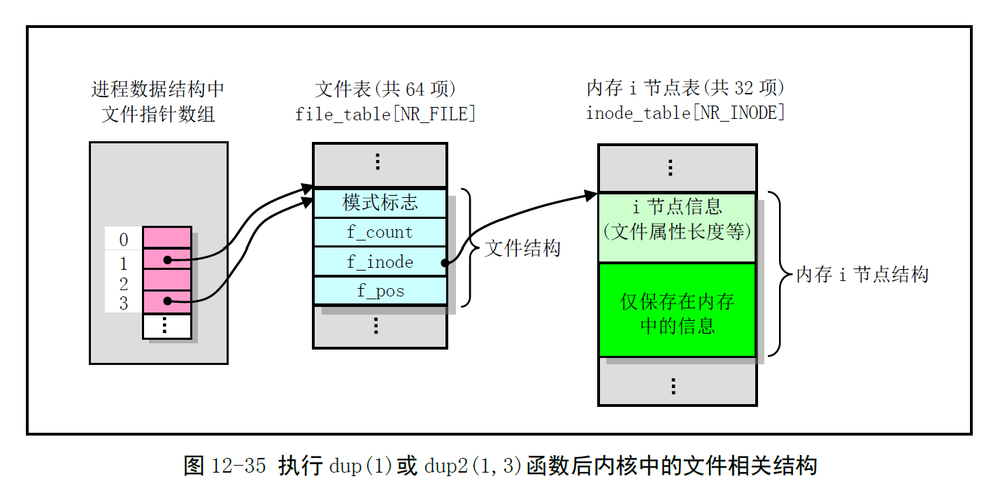

# Chapter 12.17 - fcntl.c 程序

Created by : Mr Dk.

2019 / 09 / 21 22:42

Nanjing, Jiangsu, China

---

## 12.17 fcntl.c 程序

### 12.17.1 功能描述

实现了文件控制系统调用 `fcntl()` 和两个文件句柄 (描述符) 复制系统调用 `dup()` 和 `dup2()`。

* `dup2()` 指定了新句柄的最小数值
* `dup()` 指定了当前值最小的未用句柄
* `fcntl()` 用于修改已打开的文件的状态或复制句柄

`dup()` 和 `dup2()` 返回的文件句柄与被复制句柄将 **共用同一个文件表项**。



对于使用 `dup()` 和 `dup2()` 函数新建的句柄，`close_on_exec` 标志会被清除。运行 `exec()` 类系统调用不会关闭 `dup()` 建立的文件句柄。

关于文件控制，有如下命令：

* F_DUPFD - 复制文件句柄，等效于 `dup()`
* F_GETFD / F_SETFD - 读取或设置文件句柄的 close_on_exec 标志
* F_GETFL / F_SETFL - 读取或设置文件操作和访问标志
  * RDONLY
  * O_WRONLY
  * O_RDWR
  * O_APPEND
  * O_NONBLOCK
* F_GETLK / F_SETLK / F_SETLKW - 读取或设置文件上锁标志 (Linux 0.12 暂未实现)

### 12.17.2 代码注释

#### dupfd() - 复制文件句柄 (描述符)

arg 指定了新文件句柄的最小值。

```c
static int dupfd(unsigned int fd, unsigned int arg)
{
    if (fd >= NR_OPEN || !current->filp[fd])
        return -EBADF;
    if (arg >= NR_OPEN)
        return -EINVAL;
    
    // 寻找 ≥ arg 的空闲文件描述符
    while (arg < NR_OPEN)
        if (current->filp[arg])
            arg++;
        else
            break;
    
    if (arg >= NR_OPEN)
        return -EMFILE;
    
    current->close_on_exec &= ~(1 << arg); // 复位 close_on_exec 标志
    // 复制文件描述符 (文件描述符指向同一个文件表项)
    // 文件项引用次数加 1
    (current->filp[arg] = current->filp[fd])->f_count++;
    return arg; // 返回新的文件描述符
}
```

#### sys_dup2() - 复制文件句柄系统调用

复制指定的 oldfd，新文件句柄的值为 newfd。如果 newfd 已打开，则先关闭。

```c
int sys_dup2(unsigned int oldfd, unsigned int newfd)
{
    sys_close(newfd);
    return dupfd(oldfd, newfd);
}
```

#### sys_dup() - 复制文件句柄系统调用

返回的新句柄是当前最小的未用句柄。

```c
int sys_dup(unsigned int fildes)
{
    return dupfd(fildes, 0);
}
```

#### sys_fcntl() - 文件控制系统调用

```c
int sys_fcntl(unsigned int fd, unsigned int cmd, unsigned long arg)
{
    struct file * filp;
    
    // filp 指向文件描述符对应的文件表项
    if (fd >= NR_OPEN || !(filp = current->filp[fd]))
        // 文件句柄无效
        return -EBADF;
    
    switch(cmd) {
        case F_DUPFD: // 复制文件句柄
            return dupfd(fd, arg);
        case F_GETFD: // 取文件的 close_on_exec 标志
            return (current->close_on_exec >> fd) & 1;
        case F_SETFD: // 设置文件的 close_on_exec 标志
            if (arg & 1)
                // 置位
                current->close_on_exec |= (1 << fd);
            else
                // 复位
                current->close_on_exec &= ~(1 << fd);
            return 0;
        case F_GETFL: // 取文件状态标志和访问模式
            return filp->f_flags;
        case F_SETFL: // 设置文件状态和访问模式
            filp->f_flags &= ~(O_APPEND | O_NONBLOCK);
            filp->f_flags |= arg & (O_APPEND | O_NONBLOCK);
            return 0;
        case F_GETLK:
        case F_SETLK:
        case F_SETLKW:
            // 未实现
            return -1;
        default:
            return -1;
    }
}
```

---

