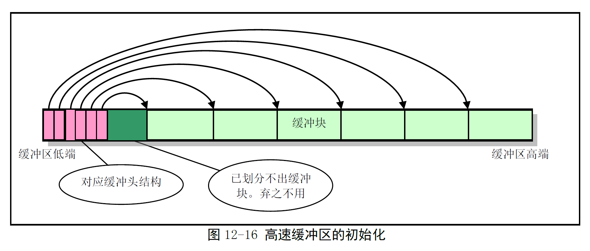
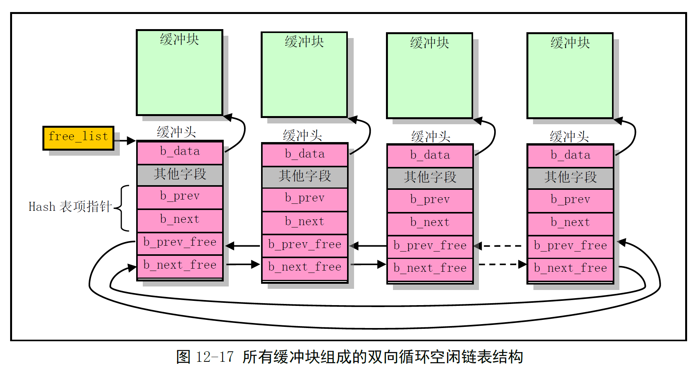
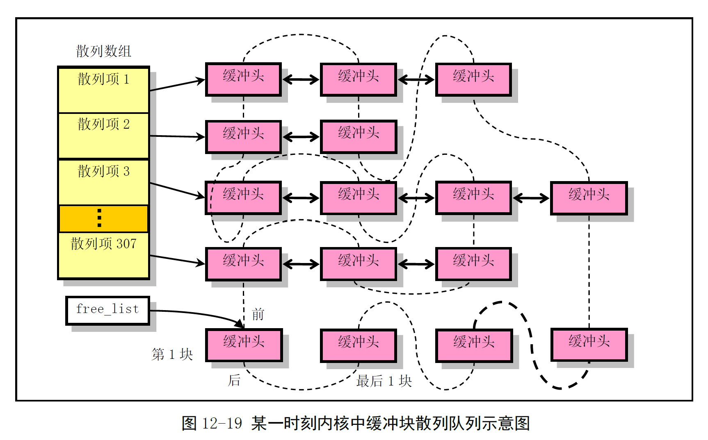

# Chapter 12.2 - buffer.c 程序

Created by : Mr Dk.

2019 / 09 / 02 0:46

Ningbo, Zhejiang, China

---

## 12.2 buffer.c 程序

高速缓冲管理程序

### 12.2.1 功能描述

#### 1. 高速缓冲区的物理位置

高速缓冲区位于 __内核代码__ 和 __主内存区__ 之间

除了 __块设备驱动程序__

内核程序如果需要访问块设备中的数据

都需要经过高速缓冲区来间接地进行操作

#### 2. 高速缓冲区初始化

在初始化时，高速缓冲区被划分为 1024B 大小的缓冲块

从整个缓冲区两端开始，分别同时设置 __缓冲块头结构__ 和 __缓冲块__

* 地址高端被划分为 1024B 的缓冲块
* 地址低端分别建立起对应各头结构的 `buffer_head`

持续到缓冲区没有足够的内存再划分出缓冲块为止



#### 3. 高速缓冲区结构和链表

buffer_head 的结构体定义如下：

```c
struct buffer_head {
    char * b_data; // 指向对应缓冲块
    unsigned long b_blocknr; // 块号
    unsigned short b_dev; // 设备号 (0 代表空闲)
    unsigned char b_uptodate; // 数据是否已更新
    unsigned char b_dirt; // 数据是否已修改
    unsigned char b_count; // 使用该块的引用数
    unsigned char b_lock; // 缓冲区是否被锁定
    struct task_struct * b_wait; // 等待该缓冲区解锁的任务
    struct buffer_head * b_prev; // hash 队列正向指针
    struct buffer_head * b_next; // hash 队列反向指针
    struct buffer_head * b_prev_free; // 空闲链表正向指针
    struct buffer_head * b_next_free; // 空闲链表反向指针
};
```

数据结构之间的关系如图：



所有缓冲块的 buffer_head 被链接成一个 __双向链表__ 结构 - 称为 __空闲链表__

* 由 `b_prev_free` 和 `b_next_free` 链接
* 实际上是一个 LRU (Least Recently Used) 链表

> 但是空闲链表中的项并不都是空闲的... 🤨

`free_list` 指针是链表的头指针，指向近期最少使用的缓冲块

该缓冲块的反向指针指向链表的最后一个缓冲块，即最近刚使用的缓冲块

`b_lock` 是锁定标志 - 表示 __驱动程序__ 正在对该缓冲块的内容进行修改

* 更新数据块信息时，当前进程会自愿睡眠等待，别的进程有机会访问该缓冲块
* 应当在睡眠之前锁定该缓冲块

`b_count` 表示相应缓冲块被各个进程引用的次数

* 计数不为 0 时，就不能释放相应缓冲块
* 计数为 0 时，表示该缓冲块空闲
* 对于程序申请的缓冲块，如果在 hash 表中已经存在该块，则直接将 b_count 加 1
* 否则重新申请一块空闲缓冲块，并将 b_count 设备为 1
* 程序释放对缓冲块的引用时，b_count 减 1

`b_dirt` 是 __脏__ 标志 - 说明缓冲块中的内容已被修改，与块设备上对应内容不同

`b_uptodate` 是数据有效标志 - 说明缓冲块中的数据是否有效

* 初始化或释放块时，`b_dirt` 和 `b_uptodate` 都应设置为 0

#### 4. 高速缓冲区的 hash 表

为了能够快速有效地在缓冲区中判断 __请求的数据块是否在缓冲区中__

* 使用了具有 307 个 buffer_header 指针项的 hash 表
* 由 `b_prev` 和 `b_next` 链接

Hash 函数：`(设备号 ^ 逻辑块号) mod 307`

* 将具有相同 hash 的缓冲块链接在 hash 表的同一项上

数据结构关系的示意：



实线为 hash 表指针，虚线为之前所谓的空闲链表指针

#### 5. 缓冲块搜索函数

首先在 hash 表某项的队列中搜索指定 __设备号__ 和 __逻辑块号__ 的缓冲块是否已存在

若存在，则之间返回 buffer_head 指针

若不在，则需要从空闲链表的头部开始，寻找一个空闲的缓冲块

* 其中还需要对找到的空闲缓冲块作比较 - 哪个比较适合？
* 权值 - 由 __锁定标志__ 和 __修改标志__ 计算

若没有找到空闲块，则进程进入睡眠状态，醒来了再接着找

若空闲块被锁定，则进程也进入睡眠状态，等待驱动程序对其解锁

* 若从睡眠到醒来继续执行之间的时间里，该块被其它进程占用，则需要重新开始搜索

如果该缓冲块已被修改过，则需要将缓冲块与硬盘同步 - 写盘

* 再次等待该块解锁
* 如果该块又被其它进程占用，则又前功尽弃，需要重新开始搜索

如果，在当前进程睡眠时，其它进程已经将我们需要的缓冲块加入了 hash 队列中

* 因此还需要搜索一下 hash 队列，又需要重新执行

最终，找到了一块 __未被进程使用、没上锁、没被修改__ 的空闲块

* 将该块的引用次数置 1
* 复位其它几个标志
* 从空闲链表中移除该块，设置 __设备号__ 和 __逻辑块号__ 后
* 插入 hash 表对应项的头部
* 链接到空闲链表的末尾处

由于操作是从空闲链表的头部开始搜索，移除最近最不常用的块后，插入尾部

因此实现了 LRU 算法

算法策略：

* 缓冲块已在 hash 表中，则直接使用
* 从空闲链表头部开始搜索最近最少使用的缓冲块并使用
* 优先级
  * 根据 `b_dirt` 和 `b_lock` 计算权重
  * 由于写入操作较为耗时，需要加到 `b_dirt` 的权重
  * 在权重最小的缓冲块上等待

#### 6. 缓冲块读取函数

取得的缓冲块可能是一个新的空闲块

也可能是正好含有需要的数据的缓冲块

因此要判断缓冲块的 `b_uptodate` 查看缓冲块数据是否有效

如果有效，则数据块可以直接被返回给申请程序

否则就调用 __低层块设备读写函数 ll_rw_block()__ ，并让自身进入睡眠

等待数据被读入缓冲块

醒来后再判断数据是否已经有效

如果有效，则可以返回给申请的程序

否则读操作失败，于是释放缓冲块，并返回 NULL

当程序不再需要使用缓冲块中的数据时

就释放缓冲块，并唤醒因等待缓冲块而睡眠的进程

空闲链表中的缓冲块，只有当：

* 被写盘刷新
* 解锁
* 引用计数为 0

才能挪作他用

#### 7. 高速缓冲区访问过程和同步操作

让内存中的一些缓冲块内容与磁盘块设备上的信息一致

* 比如 `sync_inodes()` 是为了把 inode_table 中的 inode 信息与磁盘一致起来

同步操作通常被分为两个阶段：

1. 数据结构信息与高速缓冲区中缓冲块的同步
2. 高速缓冲区中数据块与磁盘对应块的同步

### 12.2.2 代码注释

#### 指针定义

```c
extern int end; // 内核代码末端
struct buffer_head * start_buffer = (struct buffer_head *) &end;
struct buffer_head * hash_table[NR_HASH]; // NR_HASH = 307
static struct buffer_head * free_list; // 空闲链表头指针
static struct task_struct * buffer_wait = NULL; // 空闲缓冲块等待队列

int NR_BUFFERS = 0; // 系统中含有的缓冲区个数
```

#### wait_on_buffer() - 等待指定缓冲区解锁

如果指定的缓冲块已经上锁

则让进程不可中断地等待在缓冲块的等待队列中

缓冲块解锁时，等待队列上的进程将被唤醒

其中涉及到了开 / 关中断：

* 虽然进程是在关中断之后进入休眠的
* 但由于每个进程都有独立的 EFLAGS，保存在 TSS 段中
* 因此进程切换时，当前 EFLAGS 也随之改变

即 - 每个进程中断的开 / 关状态是独立的

```c
static inline void wait_on_buffer(struct buffer_head * bh)
{
    cli();
    while (bh->b_lock)
        sleep_on(&bh->b_wait);
    sti();
}
```

#### sys_sync() - 同步设备和高速缓冲中的数据

首先调用 inode 同步函数，将内存中所有修改过的 inode 写入高速缓冲

然后扫描整个高速缓冲区，对已经被修改的缓冲块生成写盘请求

```c
int sys_sync(void)
{
    int i;
    struct buffer_head * bh;
    
    sync_inodes();
    
    bh = start_buffer; // 缓冲区开始处
    for (i = 0; i < NR_BUFFERS; i++) {
        wait_on_buffer(bh);
        if (bh->d_dirt)
            // 缓冲块已被修改
            ll_rw_block(WRITE, bh); // 调用块设备驱动程序
    }
    return 0;
}
```

#### sync_dev() - 对指定设备执行高速缓冲数据与设备上数据的同步操作

先搜索所有的高速缓冲块

对指定设备 dev 的缓冲块，若其数据已被修改，则进行同步操作

然后将内存 inode 的数据写入高速缓冲中，再对指定设备执行一次相同的同步操作

* 采用两边同步操作是为了提高内核执行效率

```c
int sync_dev(int dev)
{
    int i;
    struct buffer_head * bh;
    
    // 同步指定设备所有已修改缓冲块
    bh = start_buffer;
    for (i = 0; i < NR_BUFFERS; i++, bh++) {
        if (bh->b_dev != dev)
            continue;
        wait_on_buffer(bh); // 等待缓冲区解锁
        if (bh->b_dev == dev && bh->b_dirt)
            ll_rw_block(WRITE, bh);
    }
    
    sync_inodes(); // 将 inode 写入高速缓冲
    
    bh = start_buffer;
    for (i = 0; i < NR_BUFFERS; i++, bh++) {
        if (bh->b_dev != dev)
            continue;
        wait_on_buffer(bh);
        if (bh->b_dev == dev && bh->b_dirt)
            ll_rw_block(WRITE, bh);
    }
    
    return 0;
}
```

#### invalidate_buffers() - 使指定设备在高速缓冲区中的数据无效

对指定设备的缓冲块复位 `b_uptodate` 和 `b_dirt` 标志

```c
void inline invalidate_buffers(int dev)
{
    int i;
    struct buffer_head * bh;
    
    bh = start_buffer;
    for (i = 0; i < NR_BUFFERS; i++, bh++) {
        if (bh->b_dev != dev)
            continue;
        wait_on_buffer(bh);
        if (bh->b_dev == dev)
            bh->b_uptodate = bh->b_dirt = 0;
    }
}
```

#### Hash 计算、查找宏

```c
#define _hashfn(dev, block) (((unsigned) (dev^block)) % NR_HASH)
#define hash(dev, block) hash_table[_hashfn(dev, block)]
```

#### remove_from_queues() - 从 hash 队列和空闲链表中移走缓冲块

```c
static inline void remove_from_queues(struct buffer_head * bh)
{
    // 从 hash 队列中移除缓冲块
    if (bh->b_next)
        bh->b_next->b_prev = bh->b_prev;
    if (bh->b_prev)
        bh->b_prev->b_next = bh->b_next;
    // 该缓冲块是 hash 队列的第一块
    // 需要让 hash 表中的项指向该项
    if (hash(bh->b_dev, bh->b_blocknr) == bh)
        hash(bh->b_dev, bh->b_blocknr) = bh->b_next;
    
    // 从空闲链表中移除缓冲块
    if (!(bh->b_prev_free) || !(bh->b_next_free))
        panic("Free block list corrupted");
    bh->b_prev_free->b_next_free = bh->b_next_free;
    bh->b_next_free->b_prev_free = bh->b_prev_free;
    // 如果空闲链表头指向本缓冲块
    // 则指向下一缓冲块
    if (free_list == bh)
        free_list = bh->b_next_free;
}
```

#### insert_into_queues() - 将缓冲块插入空闲链表尾部，同时放入 hash 队列中

```c
static inline void insert_into_queues(struct buffer_head * bh)
{
    // 插入空闲链表尾部
    bh->b_next_free = free_list;
    bh->b_prev_free = free_list->b_prev_free;
    free_list->b_prev_free->b_next_free = bh;
    free_list->b_prev_free = bh;
    
    // 放入 hash 队列
    bh->b_prev = NULL;
    bh->b_next = NULL;
    if (!bh->b_dev)
        return;
    bh->b_next = hash(bh->b_dev, bh->b_blocknr);
    hash(bh->b_dev, bh->b_blocknr) = bh;
    if (bh->b_next)
        bh->b_next->b_prev = bh;
}
```

#### find_buffer() - 利用 hash 表在高速缓冲中寻找给定设备和指定块号的缓冲块

```c
static struct buffer_head * find_buffer(int dev, int block)
{
    struct buffer_head * tmp;
    
    for (tmp = hash(dev, block); tmp != NULL; tmp = tmp->b_next)
        if (tmp->b_dev == dev && tmp->b_blocknr == block)
            return tmp;
    return NULL;
}
```

#### get_hash_table() - 利用 hash 表寻找指定缓冲块

若找到，则对缓冲块上锁，并返回块的头指针

```c
struct buffer_head * get_hash_table(int dev, int block)
{
    struct buffer_head * bh;
    
    for (;;) {
        if (!(bh = find_buffer(dev, block)))
            // 缓冲块中没有
            return NULL;
        bh->b_count++; // 增加引用次数
        wait_on_buffer(bh); // 等待解锁
        // 睡眠状态后，需要检验缓冲块的正确性
        if (bh->b_dev == dev && bh->b_blocknr == block)
            return bh;
        // 缓冲块状态发生改变，撤销引用，重新寻找
        bh->b_count--;
    }
}
```

#### getblk() - 取高速缓冲中指定的缓冲块

检查指定设备号和块号的缓冲块是否已在高速缓冲中

如果是，则返回对应的头指针

如果不是，则设置一个对应设备号和块号的新项，并返回缓冲块头指针

首先定义了判断缓冲块权重的宏：

* 修改标志的权重较高

```c
#define BADNESS(bh) (((bh)->b_dirt<< 1)+(bh)->b_lock)
```

```c
struct buffer_head * getblk(int dev, int block)
{
    struct buffer_head * tmp, * bh;
    
repeat:
    if (bh = get_hash_table(dev, block))
        // 缓冲区已在高速缓冲中
        return bh;
    
    // 否则就开始扫描空闲链表
    tmp = free_list;
    do {
        if (tmp->b_count)
            // 缓冲块正被使用，跳过
            continue;
        if (!bh || BADNESS(tmp) < BADNESS(bh)) {
            bh = tmp;
            if (!BADNESS(tmp))
                // BADNESS == 0
                // 没有锁定，没有修改的块
                break;
        }
    } while ((tmp = tmp->b_next_free) != free_list);
    
    if (!bh) {
        // 所有缓冲块都被使用，则睡眠等待
        sleep_on(&buffer_wait);
        // 唤醒后重新寻找缓冲块
        goto repeat;
    }
    
    // 找到了一个比较合适的空闲缓冲块
    
    wait_on_buffer(bh);
    if (bh->b_count)
        // 唤醒后该块又被占用了
        goto repeat;
    // 缓冲区已被修改
    while (bh->b_dirt) {
        // 数据写盘
        sync_dev(bh->b_dev);
        // 再次等待缓冲区解锁
        wait_on_buffer(bh);
        if (bh->b_count)
            // 又被占用......
            goto repeat;
    }
    
    // 睡眠等待的过程中
    // 其它进程可能已经将该缓冲块加入高速缓冲中
    // 再次检查
    if (find_buffer(dev, block))
        goto repeat;
    
    // 占用缓冲块
    bh->b_count = 1;
    bh->b_dirt = 0;
    bh->b_uptodate = 0;
    
    remove_from_queue(bh); // 移出空闲链表
    bh->b_dev = dev;
    bh->b_blocknr = block;
    insert_into_queues(bh); // 插入到空闲链表尾部
    return bh;
}
```

#### brelse() - 释放指定缓冲块

等待缓冲块解锁，然后将引用计数递减，最后唤醒等待空闲缓冲块的进程

```c
void brelse(struct buffer_head * buf)
{
    if (!buf)
        return;
    wait_on_buffer(buf);
    if (!(buf->b_count--))
        panic("Trying to free free buffer");
    wake_up(&buffer_wait);
}
```

#### bread() - 读取指定数据块，并返回含有数据的缓冲区

根据设备号和数据块号

在高速缓冲区申请一块缓冲块

若缓冲块已含有有效的数据，就直接返回缓冲块指针

否则读取指定的数据到缓冲块，并返回缓冲块指针

```c
struct buffer_head * bread(int dev, int block)
{
    struct buffer_head * bh;
    
    if (!(bh = getblk(dev, block)))
        panic("bread: getblk returned NULL\n");
    if (bh->b_uptodate)
        // 数据有效，可直接使用
        return bh;
    
    ll_rw_block(READ, bh); // 产生读取块设备的请求
    wait_on_buffer(bh); // 等待数据被读入，等待缓冲区解锁
    if (bh->b_uptodate)
        // 缓冲区已更新
        return bh;
    // 读设备操作失败，释放缓冲区
    brelse(bh);
    return NULL;
}
```

#### bread_page() - 一次读取四个缓冲块

同时读取四块可以获得速度上的好处

参数中的数组 `b[4]` 包含了四个设备数据块号

复制内存块的宏 - 从 from 地址复制一块 (1024B) 到 to 位置

```c
#define COPYBLK(from, to) \
__asm__("cld\n\t" \
    "rep\n\t" \
    "movsl\n\t" \
    ::"c"(BLOCK_SIZE/4), "S"(from), "D"(to) \
    :"cx", "di", "si")
```

```c
void bread_page(unsigned long address, int dev, int b[4])
{
    struct buffer_head * bh[4];
    int i;
    
    for (i = 0; i < 4; i++)
        if (b[i]) {
            if (bh[i] = getblk(dev, b[i]))
                // 取得对应缓冲块
                if (!bh[i]->b_updodate)
                    // 如果缓冲块中的数据不可用
                    // 产生读设备请求
                    ll_rw_block(READ, bh[i]);
        } else {
            bh[i] = NULL;
        }
    
    for (i = 0; i < 4; i++)
        if (bh[i]) {
            wait_on_buffer(bh[i]); // 等待缓冲区解锁
            if (bh[i]->b_uptodate)
                // 数据有效，复制数据
                COPYBLK((unsigned long) bh[i]->b_data, address);
            brelse(bh[i]); // 释放缓冲区
        }
}
```

#### breada() - 从指定设备读取指定的一些块

函数参数个数可变

成功时返回第一块的 buffer_head 指针，否则返回 NULL

```c
struct buffer_head * breada(int dev, int first, ...)
{
    va_list args;
    struct buffer_head * bh, * tmp;
    
    va_start(args, first);
    if (!(bh = getblk(dev, first)))
        panic("bread: getblk returned NULL\n");
    if (!bh->b_uptodate)
        ll_rw_block(READ, bh);
    
    // 预读随后的数据块
    // 只需读进高速缓冲区，并不马上使用
    // 因此读完后将其引用计数递减，释放掉该块
    while ((first = va_arg(args, int)) >= 0) {
        tmp = getblk(dev, first);
        if (tmp) {
            if (!tmp->b_uptodate)
                ll_rw_block(READA, tmp);
            tmp->b_count--;
        }
    }
    
    va_end(args);
    wait_on_buffer(bh); // 等待第一个缓冲区解锁
    if (bh->b_uptodate)
        // 缓冲区数据有效
        return bh;
    // 读操作失败，释放缓冲区，返回 NULL
    brelse(bh);
    return (NULL);
}
```

#### buffer_init() - 缓冲区初始化函数

从缓冲区头和尾分别初始化 buffer_head 和对应的数据块

直到缓冲区中的所有内存都被分配完毕

```c
void buffer_init(long buffer_end)
{
    struct buffer_head * h = start_buffer;
    void * b;
    int i;
    
    // 确定缓冲区高端的实际位置
    if (buffer_end == 1 << 20)
        // 缓冲区高端等于 1MB
        // 640KB - 1MB 被显存和 BIOS 使用
        // 实际缓冲区高端应为 640KB
        b = (void *) (640*1024);
    else
        b = (void *) buffer_end;
    
    while ( (b -= BLOCK_SIZE) >= ((void *) (h + 1)) ) {
        h->b_dev = 0; // 缓冲区设备号
        h->b_dirt = 0;
        h->b_count = 0;
        h->b_lock = 0;
        h->b_uptodate = 0;
        h->b_wait = NULL;
        h->b_next = NULL;
        h->b_prev = NULL;
        h->b_data = (char *) b;
        h->b_prev_free = h-1;
        h->b_next_free = h+1;
        h++;
        NR_BUFFERS++;
        if (b == (void *) 0x100000)
            // b 递减到 1MB，则跳过 384KB
            b = (void *) 0xA0000; // 让 b 指向 640KB 处
    }
    
    h--; // h 指向最后一个缓冲块头
    free_list = start_buffer; // 空闲链表头指针
    free_list->b_pref_free = h; // 头部和尾部关联循环
    h->b_next_free = free_list;
    
    // 初始化所有的 hash 表项
    for (i = 0; i < NR_HASH; i++)
        hash_table[i] = NULL;
}
```

---

## Summary

这里涉及到很多的 sleep 和 wake up

进程状态的改变和对全局数据结构的操作封装在子函数内

导致代码向高层封装的时候越来越难懂了...

看懂都很难了，更不用提开发的难度了..

还是很佩服的 👍

---

