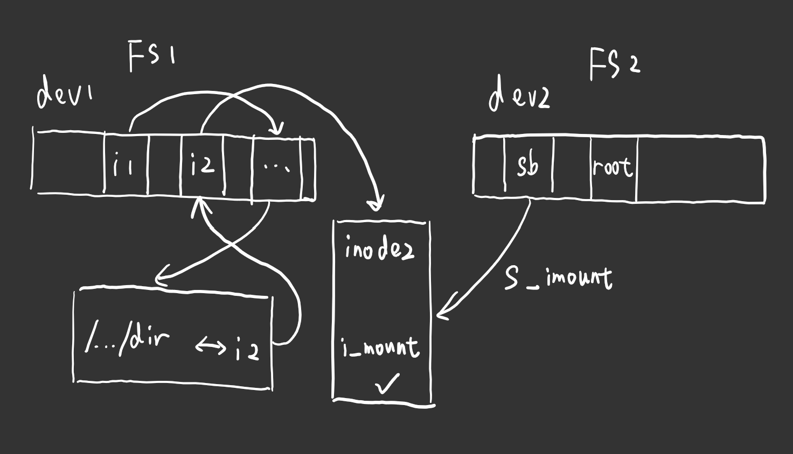

# Chapter 12.7 - namei.c 程序

Created by : Mr Dk.

2019 / 09 / 07 15:42

Nanjing, Jiangsu, China

---

## 12.7 namei.c 程序

### 12.7.1 功能描述

主要实现根据目录名或文件名寻找对应 inode 的函数 `namei()`，以及一些关于目录建立、删除等的操作函数和系统调用。

MINIX 文件系统与传统 UNIX 文件系统的目录项结构相同，文件名对应的目录项存储在目录 inode 对应的数据块中。文件系统根目录下所有的文件名信息保存在指定 inode (1 号 inode) 的数据块中。

每个目录项的结构定义：

```c
#define NAME_LEN 14
#define ROOT_INO 1

struct dir_entry {
    unsigned short inode;
    char name[NAME_LEN];
};
```

文件的其它信息则被存放在编号为结构体中 `inode` 的 inode 中。每个编号的 inode 都位于磁盘上的固定位置处。打开文件时，根据给定的文件名，从根目录 (1 号 inode) 或相对路径的 inode 开始查找。

### 12.7.2 代码注释

#### permission() - 检查文件访问许可权限

```c
static int permission(struct m_inode * inode, int mask)
{
    int mode = inode->i_mode;
    
    if (inode->i_dev && !inode->i_nlinks)
        // inode 的链接计数已经为 0，表示文件已删除
        return 0;
    else if (current->euid == inode->i_uid)
        // 文件宿主访问权限
        mode >>= 6;
    else if (in_group_p(inode->i_gid))
        // 组用户访问权限
        mode >>= 3;
    if (((mode & mask & 0007) == mask) || suser())
        return 1;
    return 0;
}
```

#### match() - 指定长度字符串比较函数

相当于 `strncmp` 函数：

- 相同返回 1
- 不同返回 0

判断 len 长度的 name 是否与目录项 de 中的文件名相同。

```c
static int match(int len, const char * name, struct dir_entry * de)
{
    register int same __asm__("ax");
    
    if (!de || !de->inode || len > NAME_LEN)
        return 0;
    
    // 特殊处理
    // "" 与 "." 相同
    // 处理 /usr/lib//libc.a 的情况
    if (!len && (de->name[0] == '.') && (de->name[1] == '\0'))
        return 1;
    if (len < NAME_LEN && de->name[len])
        // 如果 de->name[len] 不为 NULL
        // 说明 de 中 name 的长度超过 len
        return 0;
    // 用内联汇编进行快速比较
    __asm__("cld\n\t"
            "fs ; repe; cmpsb\n\t"
            "setz %%al"
            :"=a"(same)
            :""(0), "S"((long) name), "D"((long) de->name), "c"(len)
            :"cx", "di", "si");
    return same;
}
```

#### find_entry() - 在指定目录中查找指定文件名的目录项

返回含有对应目录项的高速缓冲区指针，另外还返回该目录项指针 (该返回值是通过参数返回的)。因为返回值只能有一个

> 代码中对于 `../` 的特殊处理，涉及到文件系统挂载的问题：
>
> 
>
> 挂载点位于 FS1 的目录 `/.../dir` 上，通过其上一级目录的 inode1，找到该目录对应的 inode - inode2。inode2 中有一个挂载标志，被挂载的 FS2 文件系统超级块中的 `s_imount` 指向被挂载的 inode2。同时，FS2 中自己的 1 号 inode 作为 FS2 的根目录，所以存在这样的问题：
>
> 在 FS2 的根目录上使用 `../`，就需要退到 FS 1 的 inode2 中

```c
static struct buffer_head * find_entry(struct m_inode ** dir,
    const char * name, int namelen,
    struct dir_entry ** res_dir) // 目录项地址通过这个参数返回
{
    int entries;
    int block, i;
    struct buffer_head * bh;
    struct dir_entry * de;
    struct super_block * sb;
    
#ifdef NO_TRUNCATE
    if (namelen > NAME_LEN)
        return NULL;
#else
    if (namelen > NAME_LEN)
        namelen = NAME_LEN; // 文件名超出长度时，截断
#endif
    
    // 计算有多少个目录项
    entries = (*dir)->i_size / (sizeof (struct dir_entry));
    *res_dir = NULL;
    
    // 对于 ".." 的路径
    if (namelen == 2 && get_fs_byte(name) == "." && get_fs_byte(name + 1) == ".") {
        if ((*dir) == current->root)
            // 如果这个目录已经是当前进程的根目录
            // 就将 .. 处理为 . (只修改路径名长度)
            // 不能后退到父目录中
            namelen = 1;
        else if ((*dir)->i_num == ROOT_INO) {
            // 该目录已经是 root inode
            // 让 *dir 指向被安装文件系统的 inode
            sb = get_super((*dir)->i_dev); // 取得该文件系统的超级块
            if (sb->s_imount) {
                // 超级块被安装在另一个文件系统的 inode 上
                iput(*dir);
                (*dir) = sb->s_imount; // 是 dir 指向安装该文件系统的 inode
                (*dir)->i_count++;
            }
        }
    }
    
    // 目前，dir 指针应当已经定位到了 inode 上
    // 待搜索的路径名也应当已经合法
    if (!(block = (*dir)->i_zone[0])) // 第一个直接块号 (0 则退出)
        return NULL;
    if (!(bh = bread((*dir)->i_dev, block))) // 将第一个直接块读入缓冲区
        return NULL;
    
    i = 0;
    de = (struct dir_entry *) bh->b_data; // 指向直接块缓冲区第一项
    while (i < entries) {
        if ((char *) de >= bh->b_data + BLOCK_SIZE) {
            // 当前缓冲块已搜索完
            brelse(bh);// 释放已经搜索完的缓冲区
            bh = NULL;
            // 该目录共有 entries 个目录项
            // 占用 entries / DIR_ENTRIES_PER_BLOCK 个逻辑块
            // 取得该目录项第 i / DIR_ENTRIES_PER_BLOCK 个逻辑块的块号
            // 并将该块号读入缓冲区
            if (!(block = bmap(*dir, i / DIR_ENTRIES_PER_BLOCK)) ||
                !(bh = bread((*dir)->i_dev, block))) {
                // 读取失败则跳过这一个逻辑块
                i += DIR_ENTRIES_PER_BLOCK;
                continue;
            }
            de = (struct dir_entry *) bh->b_data; // 指向新的缓冲块的开始处
        }
        if (match(namelen, name, de)) {
            // 目录项已匹配
            *res_dir = de; // 通过参数返回该目录项的指针
            return bh; // 通过返回值返回含有该目录项的缓冲块指针
        }
        de++;
        i++; // 下一个 entry
    }
    
    brelse(bh); // 释放最后查找的缓冲块
    return NULL; // 未找到
}
```

#### add_entry() - 向指定目录添加一个指定文件名的目录项

```c
static struct buffer_head * add_entry(struct m_inode * dir,
    const char * name, int namelen,
    struct dir_entry ** res_dir)
{
    int block, i;
    struct buffer_head * bh;
    struct dir_entry * de;
    
    *res_dir = NULL;
#ifdef NO_TRUNCATE
    if (namelen > NAME_LEN)
        return NULL;
#else
    if (namelen > NAME_LEN)
        namelen = NAME_LEN;
#endif
    
    if (!namelen)
        return NULL;
    if (!(block = dir->i_zone[0])) // 取目录第一个直接块号
        return NULL;
    if (!(bh = bread(dir->i_dev, block))) // 将第一个直接块读入缓冲区
        return NULL;
    
    // 在所有的数据块中，查找未使用的空目录项
    i = 0;
    de = (struct dir_entry *) bh->b_data;
    while (1) {
        if ((char *) de >= bh->b_data + BLOCK_SIZE) {
            // 当前缓冲块已扫描完
            // 释放当前块，寻找下一块
            brelse(bh);
            bh = NULL;
            // 下一块的逻辑块号 (如果没有就申请一块)
            block = create_block(dir, i / DIR_ENTRIES_PER_BLOCK);
            if (!block)
                return NULL;
            // 将下一块读入缓冲区
            if !(bh = bread(dir->i_dev, block)) {
                i += DIR_ENTRIES_PER_BLOCK;
                continue;
            }
            de = (struct dir_entry *) bh->b_data; // 指向新块的头部
        }
        if (i * sizeof(struct dir_entry) >= dir->i_size) {
            // 超出了该目录的文件大小
            // 需要更新该目录 inode 中的文件大小
            de->inode = 0; // 该项可以被使用
            dir->i_size = (i + 1) * sizeof(struct dir_entry);
            dir->i_dirt = 1; // inode 修改标志
            dir->i_ctime = CURRENT_TIME;
        }
        // de->inode == 0 表示找到了空闲项 || 添加了新项
        if (!de->inode) {
            dir->i_mtime = CURRENT_TIME;
            for (i = 0; i < NAME_LEN; i++)
                de->name[i] = (i < namelen) ? get_fs_byte(name + i) : 0;
            bh->b_dirt = 1; // 缓冲区中的目录项被修改
            *res_dir = de;
            return bh;
        }
        de++;
        i++;
    }
    // 由于搜索不到空闲项会开辟新的项
    // 所以下面的代码将不会被执行到 (与上个函数不同)
    brelse(bh);
    return NULL;
}
```

#### follow_link() - 查找符号链接链接的文件 inode

```c
static struct m_inode * follow_link(struct m_inode * dir, struct m_inode * inode)
{
    unsigned short fs;
    struct buffer_head * bh;
    
    if (!dir) {
        // 没有给出目录 inode，就使用进程的 root inode
        dir = current->root;
        dir->i_count++;
    }
    if (!inode) {
        // 没有给出目录项 inode
        iput(dir);
        return NULL;
    }
    if (!S_ISLNK(inode->i_mode)) {
        // 不是符号链接，直接返回该目录项的 inode
        iput(dir);
        return inode;
    }
    
    __asm__("mov %%fs, %0":"=r"(fs)); // 取 fs 寄存器，需保证指向用户数据段
    // 将该 inode 的第一个直接块读入缓冲区
    if (fs != 0x17 || !inode->i_zone[0] || !(bh = bread(inode->i_dev), inode->i_zone[0])) {
        iput(dir);
        iput(inode);
        return NULL;
    }
    
    iput(inode); // 放回符号链接的 inode
    __asm__("mov %0, %%fs"::"r"((unsigned short) 0x10)); // fs 暂时指向内核数据款
    // 需要处理的数据在内核空间中
    inode = _namei(bh->b_data, dir, 0); // 解析符号链接指向的 inode
    // 符号链接的数据区中存放了对应文件的路径名字符串
    // 根据该字符串，查找到对应文件的 inode
    __asm__("mov %0, %%fs"::"r"(fs)); // 恢复 fs
    brelse(bh); // 释放缓冲块
    return inode;
}
```

#### get_dir() - 根据给定路径名进行搜索，直到到达最内层目录

给定路径名和起始目录的 inode。

> 啥叫最顶端目录？`/usr/a/b/ccc.txt`，返回的应该是 `/usr/a/b/` 目录的 inode，即最内层目录的上一级目录的 inode。

```c
static struct m_inode * get_dir(const char * pathname, struct m_inode * inode)
{
    char c;
    const char * thisname;
    struct buffer_head * bh;
    int namelen, inr;
    struct dir_entry * de;
    struct m_inode * dir;
    
    if (!inode) {
        // 如果没有给定起始目录，则从进程的当前工作目录开始
        inode = current->pwd;
        inode->i_count++;
    }
    if ((c = get_fs_byte(pathname)) == '/') {
        // 绝对路径
        // 从进程的 root inode 开始
        iput(inode);
        inode = current->root;
        pathname++; // 忽略 '/' 符号
        inode->i_count++;
    }
    
    // 对各目录名或文件名部分进行循环处理
    while (1) {
        thisname = pathname; // 指向当前处理的字符串头部
        if (!S_ISDIR(inode->i_mode) || !permission(inode, MAY_EXEC)) {
            // 当前所在 inode 不是目录 || 没有进入该目录的权限
            iput(inode);
            return NULL;
        }
        for (namelen = 0; (c = get_fs_byte(pathname++)) && (c != '/'); namelen++)
            ;
        // 此时 pathname 指向当前处理字符串的结束尾部
        if (!c)
            // 目录名已结束，直接返回该目录的 inode
            return inode;
        // 在该目录下寻找指定名称的目录项
        if (!(bh = find_entry(&inode, thisname, namelen, &de))) {
            iput(inode);
            return NULL;
        }
        inr = de->inode; // 该目录项的 inode 编号
        brelse(bh);
        dir = inode;
        if (!(inode = iget(dir->i_dev, inr))) { // 取该 inode 的内容
            iput(dir);
            return NULL;
        }
        if (!(inode = follow_link(dir, inode)))
            return NULL;
    }
}
```

#### dir_namei() - 返回指定目录名的 inode，以及最内层目录的名称

> 根据我对代码的理解，返回的是最内层目录的上一级目录的 inode，以及最内层的目录或文件名 (即最后一个 `/` 右边的部分)。

```c
static struct m_inode * dir_namei(const char * pathname, 
    int * namelen, const char ** name, struct m_inode * base)
{
    char c;
    const char * basename;
    struct m_inode * dir;
    
    if (!(dir = get_dir(pathname, base)))
        return NULL;
    basename = pathname;
    while (c = get_fs_byte(pathname++))
        if (c == '/')
            basename = pathname;
    *namelen = pathname - basename - 1;
    *name = basename;
    return dir;
}
```

#### _namei() - 取指定路径名的 inode 子函数

```c
struct m_inode * _namei(const char * pathname, struct m_inode * base, int follow_links)
{
    const char * basename;
    int inr, namelen;
    struct m_inode * inode;
    struct buffer_head * bh;
    struct dir_entry * de;
    
    if (!(dir = dir_namei(pathname, &namelen, &basename)))
        return NULL;
    if (!namelen)
        return dir; // 比如 /usr/
    if (!(base = dir_namei(pathname, &namelen, &basename, base)))
        return NULL;
    if (!namelen)
        return base;
    
    // 处理 /usr/src/linux --> /usr/src/linux/
    bh = find_entry(&base, basename, namelen, &de);
    if (!bh) {
        iput(base);
        return NULL;
    }
    
    inr = de->inode; // 取得最内层的 inode 号
    brelse(bh);
    if (!(inode = iget(base->i_dev, inr))) { // 取得最内层的 inode
        iput(base);
        return NULL;
    }
    if (follow_links)
        inode = follow_link(base, inode);
    else
        iput(base);
    inode->i_atime = CURRENT_TIME;
    inode->i_dirt = 1;
    return inode;
}
```

#### lnamei() - 取指定路径名的 inode，不跟随符号链接

```c
struct m_inode * lnamei(const char * pathname)
{
    return _namei(pathname, NULL, 0);
}
```

#### namei() - 取指定路径名的 inode，跟随符号链接

```c
struct m_inode * namei(const char * pathname)
{
    return _namei(pathnam, NULL, 1);
}
```

#### open_namei() - 打开文件使用的 namei() 函数

```c
int opne_namei(const char * pathname, int flag, int mode, struct m_inode ** res_inode)
{
    const char * basename;
    int inr, dev, namelen;
    struct m_inode * dir, *inode;
    struct buffer_head * bh;
    struct dir_entry * de;
    
    if ((flag & O_TRUNC) && !(flag & O_ACCMODE))
        flag |= O_WRONLY;
    mode &= 0777 & ~current->umask;
    mode |= I_REGULAR; // 常规文件标志 - 用于打开文件不存在，需要创建文件时
    
    // 寻找路径 inode，并得到最内层文件名和长度
    if (!(dir = dir_namei(pathname, &namelen, &basename, NULL)))
        return -ENOENT;
    if (!namelen) {
        // /usr/
        if (!(flag & (O_ACCMODE | O_CREATE | O_TRUNC))) {
            // 打开目录名
            // 直接返回该目录的 inode
            *res_inode = dir;
            return 0;
        }
        iput(dir);
        return -EISDIR;
    }
    bh = find_entry(&dir, basename, namelen, &de); // 找最内层的目录项所在缓冲块
    if (!bh) {
        // 没有找到对应目录项
        // 创建文件操作
        if (!(flag & O_CREAT)) {
            // 不是创建文件操作，退出
            iput(dir);
            return -ENOENT;
        }
        if (!permission(dir, MAY_WRITE)) {
            // 对目录没有写的权利，退出
            iput(dir);
            return -EACCES;
        }
        inode = new_inode(dir->i_dev); // 申请一个新的 inode
        if (!inode) {
            iput(dir);
            return -ENOSPC;
        }
        inode->i_uid = current->euid;
        inode->i_mode = mode;
        inode->i_dirt = 1;
        bh = add_entry(dir, basename, namelen, &de); // 在目录中加入新项
        if (!bh) {
            // 添加目录项操作失败
            // 放回申请到的 inode
            inode->i_nlinks--;
            iput(inode);
            iput(dir);
            return -ENOSPC;
        }
        de->inode = inode->i_num; // 将新 inode 的编号计入 dir 目录的目录项中
        bh->b_dirt = 1;
        brelse(bh);
        iput(dir);
        *res_inode = inode;
        return 0;
    }
    
    // 之前的取文件名对应目录项的操作成功
    // 指定文件名的文件已经存在
    inr = de->inode; // 该文件的 inode 编号
    dev = dir->i_dev;
    brelse(bh);
    if (flag & O_EXCL) {
        // 独占操作标志置位
        // 文件已存在，退出
        iput(dir);
        return -EEXIST;
    }
    
    // 读取该文件的 inode
    if (!(inode = follow_link(dir, iget(dev, inr))))
        return -EACCES;
    if ((S_ISDIR(inode->i_mode) && (flag & O_ACCMODE)) ||
        !permission(inode, ACC_MODE(flag))) {
        // 是一个目录 inode，且访问模式是只写或读写
        // 没有访问许可权限
        // 放回 inode 并退出
        iput(inode);
        return -EPERM;
    }
    inode->i_atime = CURRENT_TIME; // 更新 inode 访问时间
    if (flag & O_TRUNC) // 截 0 标志
        truncate(inode);
    *res_inode = inode;
    return 0;
}
```

#### sys_mknod() - 创建一个设备文件或普通文件结点

```c
int sys_mknod(const char * filename, int mode, int dev)
{
    const char * basename;
    int namelen;
    struct m_inode * dir, * inode;
    struct buffer_head * bh;
    struct dir_entry * de;
    
    if (!suser())
        // 不是超级用户
        return -EPERM;
    if (!(dir = dir_namei(filename, &namelen, &basename, NULL)))
        // 找不到路径
        return -ENOENT;
    if (!namelen) {
        // 没有指定文件名
        iput(dir);
        return -ENOENT;
    }
    if (!permission(dir, MAY_WRITE)) {
        // 对该目录没有可写权限
        iput(dir);
        return -EPERM;
    }
    
    bh = find_entry(&dir, basename, namelen, &de);
    if (bh) {
        // 指定文件已存在
        // 不能创建同名结点
        brelse(bh);
        iput(dir);
        return -EEXIST;
    }
    
    // 目录项未找到，申请新的 inode
    inode = new_inode(dir->i_dev);
    if (!inode) {
        iput(dir);
        return -ENOSPC;
    }
    inode->i_mode = mode;
    if (S_ISBLK(mode) || S_ISCHR(mode))
        // 块设备或字符设备文件，存放设备号
        inode->i_zone[0] = dev;
    inode->i_mtime = inode->i_atime = CURRENT_TIME;
    inode->i_dirt = 1;
    
    // 在目录中加入目录项
    bh = add_entry(dir, basename, namelen, &de);
    if (!bh) {
        iput(dir);
        inode->i_nlinks = 0;
        iput(inode);
        return -ENOSPC;
    }
    de->inode = inode->i_num; // 新的目录项中设置 inode 编号
    bh->b_dirt = 1; // 目录项所在缓冲区已修改
    
    iput(dir);
    iput(inode);
    brelse(bh);
    return 0;
}
```

#### sys_mkdir() - 创建一个目录

```c
int sys_mkdir(const char * pathname, int mode)
{
    const char * basename;
    int namelen;
    struct m_inode * dir, * inode;
    struct buffer_head * bh, * dir_block;
    struct dir_entry * de;
    
    if (!(dir = dir_namei(pathname, &namelen, &basename, NULL)))
        // 找不到上层目录
        return _ENOENT;
    if (!namelen) {
        // 没有指定目录名
        iput(dir);
        return -ENOENT;
    }
    if (!permission(dir, MAY_WRITE)) {
        // 对目录没有写权限
        iput(dir);
        return -EPERM;
    }
    
    // 搜索目录是否已经存在
    bh = find_entry(&dir, basename, namelen, &de);
    if (bh) {
        // 目录已存在
        brelse(bh);
        iput(dir);
        return -EEXIST;
    }
    inode = new_inode(dir->i_dev); // 为目录申请新的 inode
    if (!inode) {
        iput(dir);
        return -ENOSPC;
    }
    inode->i_size = 32; // 2 个目录项
    inode->i_dirt = 1;
    inode->i_mtime = inode->i_atime = CURRENT_TIME;
    // 为该 inode 申请数据块
    if (!(inode->i_zone[0] = new_block(inode->i_dev))) {
        // 申请数据块失败
        iput(dir);
        inode->i_nlinks--;
        iput(inode);
        return -ENOSPC;
    }
    inode->i_dirt = 1;
    // 从设备上读取新申请的磁盘块到高速缓冲中
    if (!(dir_block = bread(inode->i_dev, inode->i_zone[0]))) {
        // 读取失败
        iput(dir);
        inode->i_nlinks--;
        iput(inode);
        return -ERROR;
    }
    de = (struct dir_entry *) dir_block->b_data;
    // 在目录项缓冲块中设置两个目录项
    de->inode = inode->i_num;
    strcpy(de->name, "."); // "." 目录项
    de++;
    de->inode = dir->i_num;
    strcpy(de->name, ".."); // ".." 目录项
    inode->i_nlinks = 2; // inode 硬链接数为 2
    // 缓冲块修改、退出
    dir_block->b_dirt = 1;
    brelse(dir_block);
    inode->i_mode = I_DIRECTORY | (mode & 0777 & ~current->umask);
    inode->i_dirt = 1;
    
    // 在父目录的数据块中设置一个新目录项
    // 存放新目录的目录项
    bh = add_entry(dir, basename, namelen, &de);
    if (!bh) {
        iput(dir);
        inode->i_nlinks = 0;
        iput(inode);
        return -ENOSPC;
    }
    de->inode = inode->i_num;
    bh->b_dirt = 1; // 目录项所在缓冲区被修改
    dir->i_nlinks++; // 子目录的 ".." 项引用
    dir->i_dirt = 1; // 父目录 inode 被修改
    iput(dir);
    iput(inode);
    brelse(bh);
    return 0;
}
```

#### empty_dir() - 检查目录是否为空

```c
static int empty_dir(struct m_inode * inode)
{
    int nr, block;
    int len;
    struct buffer_head * bh;
    struct dir_entry * de;
    
    // 检查该目录的目录项是否正确
    // 应当至少有 "." 和 ".." 两个目录项
    len = inode->i_size / sizeof(struct dir_entry); // 目录项个数
    if (len < 2 || !inode->i_zone[0] ||
        !(bh = bread(inode->i_dev, inode->i_zone[0]))) {
        // 目录项数少于 2
        // 第一个直接块不对应任何块号
        // 读取第一个直接块失败
        printk("warning - bad directory on dev %04x\n", inode->i_dev);
        return 0;
    }
    de = (struct dir_entry *) bh->b_data; // 指向所有目录项的开头
    if (de[0].inode != inode->i_num || !de[1].inode ||
        strcmp(".", de[0].name) || strcmp("..", dev[1].name)) {
        // 前两个目录项有问题
        printk("warning - bad directory on dev %04x\n", inode->i_dev);
        return 0;
    }
    // 从第三个目录项开始
    nr = 2;
    de += 2;
    while (nr < len) {
        if ((void *) de >= (void *) (bh->b_data + BLOCK_SIZE)) {
            // 当前缓冲块已经搜索完
            brelse(bh); // 释放当前缓冲块
            block = bmap(inode, nr / DIR_ENTRIES_PER_BLOCK); // 取得下一块的逻辑块号
            if (!block) {
                nr += DIR_ENTRIES_PER_BLOCK; // 跳过这一块
                continue;
            }
            if (!(bh = bread(inode->i_dev, block))) // 将下一块读入缓冲区
                return 0;
            de = (struct dir_entry *) bh->b_data; // 指向缓冲区开始处
        }
        if (de->inode) {
            // 目录项的 inode 号不为 0
            // 目录项正被使用，因此该目录不为空
            brelse(bh);
            return 0;
        }
        de++;
        nr++;
    }
    // 除了 "." 和 ".."，其余目录项都为空
    // 因此目录为空，释放缓冲块并返回 1
    brelse(bh);
    return 1;
}
```

#### sys_rmdir() - 删除目录

```c
int sys_rmdir(const char * name)
{
    const char * basename;
    int namelen;
    struct m_inode * dir, * inode;
    struct buffer_head * bh;
    struct dir_entry * de;
    
    if (!(dir = dir_namei(name, &namelen, &basename, NULL)))
        // 找不到上层目录
        return -ENOENT;
    if (!namelen) {
        // 没有指定目录名
        iput(dir);
        return -ENOENT;
    }
    if (!permission(dir, MAY_WRITE)) {
        // 对目录没有写权限
        iput(dir);
        return -EPERM;
    }
    
    // 查询指定目录名的目录项
    bh = find_entry(&dir, basename, namelen, &de);
    if (!bh) {
        // 对应目录不存在
        iput(dir);
        return -ENOENT;
    }
    // 取得目录的 inode
    if (!(inode = iget(dir->i_dev, de->inode))) {
        iput(dir);
        brelse(bh);
        return -EPERM;
    }
    
    if ((dir->i_mode & S_ISVTX) && current->euid && inode->i_uid != current->euid) {
        // 目录设置了受限删除标志
        // 进程有效用户 id 不是 root
        // inode 的用户 id 不等于进程的有效用户 id
        // 不允许删除
        iput(dir);
        iput(inode);
        brelse(bh);
        return -EPERM;
    }
    
    if (inode->i_dev != dir->i_dev || inode->i_count > 1) {
        // inode 设备号与其父目录不同
        // inode 在其它地方被引用
        // 不允许删除
        iput(dir);
        iput(inode);
        brelse(bh);
        return -EPERM;
    }
    
    if (inode == dir) {
        // 试图删除 "." 目录
        // 不允许删除
        iput(inode);
        iput(dir);
        brelse(bh);
        return -EPERM;
    }
    
    if (!S_ISDIR(inode->i_mode)) {
        // 不是一个目录
        iput(inode);
        iput(dir);
        brelse(bh);
        return -ENOTDIR;
    }
    
    if (!empty_dir(inode)) {
        // 目录不空，不能删除
        iput(inode);
        iput(dir);
        brelse(bh);
        return -ENOTEMPTY;
    }
    
    if (inode->i_nlinks != 2)
        printk("empty directory has nlinks!=2(%d)", inode->i_nlinks);
    
    de->inode = 0; // 将目录从父目录的目录项中删除
    bh->b_dirt = 1; // 目录项缓冲区被修改
    brelse(bh);
    
    inode->i_nlinks = 0; // 将 inode 置为空闲
    inode->i_dirt = 1;
    
    dir->i_nlinks--;
    dir->i_ctime = dir->i_mtime = CURRENT_TIME;
    dir->i_dirt = 1;
    
    iput(dir);
    iput(inode);
    return 0;
}
```

#### sys_unlink() - 删除文件名对应的目录项

```c
int sys_unlink(const char * name)
{
    const char * basename;
    int namelen;
    struct m_inode * dir, * inode;
    struct buffer_head * bh;
    struct dir_entry * de;
    
    if (!(dir = dir_namei(name, &namelen, &basename, NULL)))
        return -ENOENT;
    if (!namelen) {
        iput(dir);
        return -ENOENT;
    }
    if (!permission(dir, MAY_WRITE)) {
        iput(dir);
        return -EPERM;
    }
    
    bh = find_entry(&dir, basename, namelen, &de); // 寻找目录项
    if (!bh) {
        // 目录项不存在
        iput(dir);
        return -ENOENT;
    }
    // 取得目录项对应的 inode
    if (!(inode = iget(dir->i_dev, de->inode))) {
        iput(dir);
        brelse(bh);
        return -ENOENT;
    }
    
    // 删除前验证
    
    if ((dir->i_mode & S_ISVTX) && !suser() &&
        current->euid != inode->i_uid && current->euid != dir->i_uid) {
        // 权限问题
        iput(dir);
        iput(inode);
        brelse(bh);
        return -EPERM;
    }
    
    if (S_ISDIR(inode->i_mode)) {
        // 是目录
        iput(inode);
        iput(dir);
        brelse(bh);
        return -EPERM;
    }
    
    if (!inode->i_nlinks) {
        // 链接计数已经为 0
        // 警告，并修正为 1
        printk("Deleting nonexistent file (%04x:%d), %d\n",
              inode->i_dev, inode->i_num, inode->i_nlinks);
        inode->i_nlinks = 1;
    }
    
    // 从目录项中删除
    de->inode = 0;
    bh->b_dirt = 1;
    brelse(bh);
    
    inode->i_nlinks--;
    inode->i_dirt = 1;
    inode->i_ctime = CURRENT_TIME;
    iput(inode); // 如果文件是最后一个链接，且没有进程打开该文件，则放回后文件将被删除，并释放设备占用的空间
    iput(dir);
    return 0;
}
```

#### sys_symlink() - 建立符号链接

```c
int sys_symlink(const char * oldname, const char * newname)
{
    struct dir_entry * de;
    struct m_inode * dir, * inode;
    struct buffer_head * bh, * name_block;
    const char * basename;
    int namelen, i;
    char c;
    
    // 新路径的父目录
    dir = dir_namei(newname, &namelen, &basename, NULL);
    if (!dir)
        return -EACCES;
    if (!namelen) {
        iput(dir);
        return -EPERM;
    }
    if (!permission(dir, MAY_WRITE)) {
        iput(dir);
        return -EACCES;
    }
    
    // 申请新的 inode
    if (!(inode = new_inode(dir->i_dev))) {
        iput(dir);
        return -ENOSPC;
    }
    inode->i_mode = S_IFLNK | (0777 & ~current->umask);
    inode->i_dirt = 1;
    
    // 保存符号链接的路径名字符串，需要为该 inode 申请一个磁盘块
    if (!(inode->i_zone[0] = new_block(inode->i_dev))) {
        iput(dir);
        inode->i_nlinks--;
        iput(inode);
        return -ERROR;
    }
    inode->i_dirt = 1;
    // 将磁盘块读入缓冲区
    if (!(name_block = bread(inode->i_dev, inode->i_zone[0]))) {
        iput(dir);
        inode->i_nlinks--;
        iput(inode);
        return -ERROR;
    }
    
    i = 0;
    // 拷贝路径名字符串
    while (i < 1023 && (c = get_fs_byte(oldname++)))
        name_block->b_data[i++] = c;
    name_block->b_data[i] = 0; // '\0'
    name_block->b_dirt = 1; // 缓冲块已修改
    brelse(name_block); // 释放缓冲块
    inode->i_size = i; // inode 中的文件长度
    inode->i_dirt = 1; // inode 已被修改
    
    // 搜索指定符号链接是否已经存在
    bh = find_entry(&dir, basename, namelen, &de);
    if (bh) {
        // 符号链接已存在，不能再建立符号链接
        inode->i_nlinks--;
        iput(inode); // 释放 inode 及其对应的数据块
        brelse(bh); // 释放缓冲块
        iput(dir);
        return -EEXIST;
    }
    
    // 在目录项中添加符号链接的目录项
    bh = add_entry(dir, basename, namelen, &de);
    if (!bh) {
        // 添加目录项失败
        inode->i_nlinks--;
        iput(inode);
        iput(dir);
        return -ENOSPC;
    }
    
    // 在目录项所在缓冲区中填入符号链接的 inode 编号
    de->inode = inode->i_num;
    bh->b_dirt = 1;
    brelse(bh);
    
    iput(dir);
    iput(inode);
    return 0;
}
```

#### sys_link() - 为文件建立一个文件名目录项 (硬链接)

```c
int sys_link(const char * oldname, const char * newname)
{
    struct dir_entry * de;
    struct m_inode * oldinode, * dir;
    struct buffer_head * bh;
    const char * basename;
    int namelen;
    
    oldinode = namei(oldname); // 找到被链接文件的 inode
    if (!oldinode)
        // inode 不存在
        return -ENOENT;
    if (S_ISDIR(oldinode->i_mode)) {
        // 是一个目录
        iput(oldinode);
        return -EPERM;
    }
    
    // 链接项路径的上层目录 inode
    dir = dir_namei(newname, &namelen, &basename, NULL);
    if (!dir) {
        iput(oldinode);
        return -EACCES;
    }
    if (!namelen) {
        iput(oldinode);
        iput(dir);
        return -EPERM;
    }
    if (dir->i_dev != oldinode->i_dev) {
        // 不能跨设备硬链接
        iput(dir);
        iput(oldinode);
        return -EXDEV;
    }
    if (!permission(dir, MAY_WRITE)) {
        iput(dir);
        iput(oldinode);
        return -EACCES;
    }
    
    // 查找目录项是否已经存在
    bh = find_entry(&dir, basename, namelen, &de);
    if (bh) {
        // 同名目录项已经存在，不能建立链接
        brelse(bh);
        iput(dir);
        iput(oldinode);
        return -EEXIST;
    }
    
    // 添加新的目录项
    bh = add_entry(dir, basename, namelen, &de);
    if (!bh) {
        // 新目录项获取失败
        iput(dir);
        iput(oldinode);
        return -ENOSPC;
    }
    de->inode = oldinode->i_num; // 设置 inode 编号为被链接文件的 inode 编号
    bh->b_dirt = 1; // 缓冲区已被修改
    brelse(bh); // 释放缓冲区
    iput(dir);
    
    // 修改被链接文件的 inode
    oldinode->i_nlinks++;
    oldinode->i_ctime = CURRENT_TIME;
    oldinode->i_dirt = 1;
    iput(oldinode);
    
    return 0;
}
```

---

## Summary

终于把这个最长的程序给过完了。本程序的子函数主要用于 **inode 数据结构** 和 **路径名** 之间的关联。关联成功后，对：

- 指定路径及其父目录的 inode 数据结构
- inode 对应的数据块

进行 CRUD 等操作，并取得 inode 对应的逻辑块进行 CRUD 等。后续的函数都是文件、目录和链接的系统调用实现，全部借助于上述提及的子函数中的功能。

