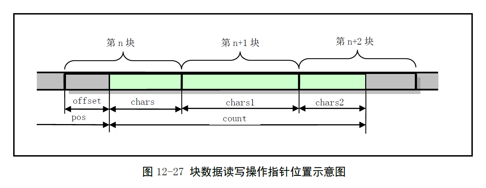

# Chapter 12.9 - block_dev.c 程序

Created by : Mr Dk.

2019 / 09 / 09 20:51

Nanjing, Jiangsu, China

---

接下来的部分是文件系统的数据访问操作，即系统调用 `sys_write()` 和 `sys_read()`，以及不同设备的低层支持函数：

- 访问正规文件：`file_write()` / `file_read()`
- 访问管道文件：`pipe_write()` / `pipe_read()`
- 访问块设备文件：`block_write()` / `block_read()`
- 访问字符设备文件：`rw_char()`

在系统调用中，根据参数提供的文件描述符的属性，判断出文件属于哪种类型，分别调用相应的处理函数，并进入对应的驱动程序中。

## 12.9 block_dev.c 程序

### 12.9.1 功能描述

`block_read()` 和 `block_write()` 两个函数分别用于读写块设备上的原始数据。由于块设备对磁盘的读写是以盘块为单位的，因此函数中，首先需要把参数中的文件指针映射为 **数据块号** 和 **块内偏移**，然后将对应的块读入缓冲区中，并从指定的块内偏移开始处理数据。若还有数据，则继续读取下一块，之后块内偏移总是为 0。原理如图所示：



### 12.9.2 代码注释

#### block_write() - 数据块写函数

将 buf 中长度为 count 的数据写到设备 dev 上 pos 开始的位置上。从内核的角度来说，只需要将数据写入缓冲区即可，由块设备驱动程序负责将缓冲区中的数据同步到块设备上。

```c
int block_write(int dev, long * pos, char * buf, int count)
{
    int block = *pos >> BLOCK_SIZE_BITS; // pos 所在的数据块号
    int offset = *pos & (BLOCK_SIZE - 1); // 块内偏移
    int chars;
    int written = 0; // 累计写入字节数
    int size;
    struct buffer_head * bh;
    register char * p;
    
    // 设备允许的最大数据块总数
    if (blk_size[MAJOR(dev)])
        size = blk_size[MAJOR(dev)][MINOR(dev)];
    else
        size = 0x7fffffff;
    
    // 仍有字节需要被写
    while (count > 0) {
        // 要写的数据块不能超过设备容许的最大数据块数
        if (block >= size)
            return written ? written : -EIO;
        chars = BLOCK_SIZE - offset; // 本数据块可写入的字节数
        if (chars > count)
            // 只需要写 count 即可
            chars = count;
        if (chars == BLOCK_SIZE)
            // 恰好需要写一整块，直接申请
            bh = getblk(dev, block);
        else
            // 读入当前块，并预读下两块
            bh = breada(dev, block, block + 1, block + 2, -1);
        block++; // 下一块
        if (!bh)
            return written ? written : -EIO;
        p = bh->b_data + offset; // p 指向缓冲区中待写位置
        offset = 0; // 除了第一块，之后 offset 都为 0
        
        *pos += chars;
        written += chars;
        count -= chars;
        
        // 从用户空间写入缓冲区
        while (chars-- > 0)
            *(p++) = get_fs_byte(buf++);
        
        bh->b_dirt = 1;
        brelse(bh); // 释放缓冲区
    }
    
    return written; // 返回已写入字节数
}
```

#### block_read() - 数据块读函数

从设备 dev 的 pos 位置，将 count 字节的数据读入用户缓冲区 buf 中。

```c
int block_read(int dev, unsigned long * pos, char * buf, int count)
{
    int block = *pos >> BLOCK_SIZE_BITS; // 数据块号
    int offset = *pos & (BLOCK_SIZE - 1); // 块内偏移
    int chars;
    int size;
    int read = 0; // 累积读入字节数
    struct buffer_head * bh;
    register char * p;
    
    if (blk_size[MAJOR(dev)])
        size = blk_size[MAJOR(dev)][MINOR(dev)];
    else
        size = 0x7fffffff;
    
    // 仍有字节需要读取
    while (count > 0) {
        if (block >= size)
            // 当前读入块号已经大于等于设备上的总块数
            return read ? read : -EIO;
        chars = BLOCK_SIZE - offset; // 本块中需要读取的字节数
        
        if (chars > count)
            // 要读取的字节数不满一块
            chars = count;
        if (!(bh = breada(dev, block, block + 1, block + 2, -1)))
            // 读入需要读取的数据块，并预读后两块
            return read ? read : -EIO;
        block++;
        
        p = bh->b_data + offset; // p 指向缓冲区读取位置开始处
        offset = 0; // 除第一块以外，之后块内偏移都为 0
        
        *pos += chars;
        read += chars;
        count -= chars;
        
        while (chars-- > 0)
            put_fs_byte(*(p++), buf++);
        
        brelse(bh);
    }
}
```

