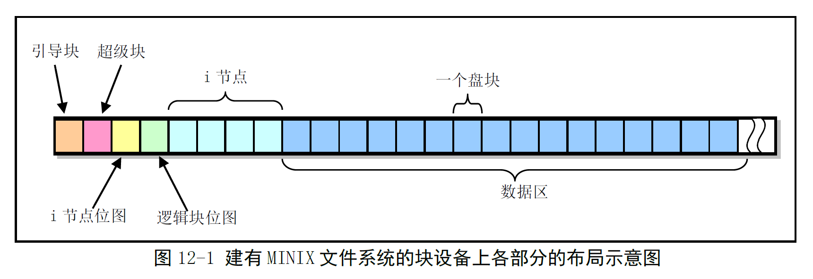
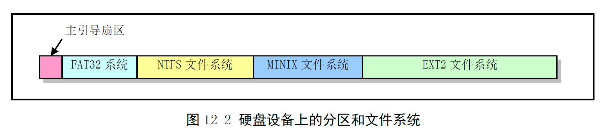

# Chapter 12.1 - 文件系统 总体功能

Created by : Mr Dk.

2019 / 08 / 31 19:52

Ningbo, Zhejiang, China

---

## 12.1 总体功能

文件系统 (File System, FS) 是 OS 的重要组成部分

是 OS 长期存储大量程序和数据的地方

* 系统加载执行程序时，需要快速从文件系统中读取到内存中运行
* 系统运行产生的临时文件也需要动态地保存在文件系统中

文件系统需要使用高速设备来存储程序和数据 - 块设备

另外，UNIX 类 OS 通常通过设备文件来访问设备

### 12.1.1 MINIX 文件系统

MINIX 文件系统 1.0 版本

MINIX 文件系统与标准 UNIX 的文件系统基本相同：

1. 引导块
2. 超级块
3. inode bitmap
4. 逻辑块 bitmap
5. inode
6. 数据区 (盘块)

整个块设备被划分为以 __1KB__ 为单位的 __磁盘块__

在 MINIX 1.0 文件系统中，__磁盘块__ 与 __逻辑块__ 的大小正好相同



#### 引导块

__引导块__ 是计算机上电时，由 ROM BIOS 自动读入的执行代码和数据盘块

* 并非系统中的所有设备都用于作引导设备，所以这一盘块可以没有代码
* 但每个盘块设备必须含有引导块的空间，保证文件系统格式的统一

对于容量巨大的设备，通常会划分出几个分区

每个分区中可以存放一个不同的完整文件系统

硬盘的 __第一个扇区__ 是 __主引导扇区__，存放

* 硬盘引导程序
* 分区表
  * 每个分区的类型
  * 在硬盘中起始位置的参数和结束位置的参数
  * 占用的扇区总数



#### 超级块

__超级块__ 用于存放设备上文件系统的结构信息，并说明各部分的大小

* s_ninodes - inode 总数
* s_nzones - 逻辑块总数
* s_imap_blocks - inode bitmap 占用的磁盘块数
* s_firstdatazone - 数据区开始处占用的第一个逻辑块号
* s_log_zone_size - 2 为底的对数表示的每个逻辑块包含的磁盘块数
  * `0` 代表每个逻辑块包含 1 个磁盘块，即逻辑块大小 == 磁盘块大小
* s_max_size - 最大文件长度 (字节)
* s_magic - 指明文件系统的类型
  * MINIX 1.0 - `0x137f`

在 Linux 0.12 中，被加载的超级块存在数组 `super_block[]` 中

* 该表共有 8 项 - Linux 0.12 最多同时加载八个文件系统

#### 逻辑块 bitmap

描述盘上每个数据盘块的使用情况

除了 bit 0 以外，其余每个 __bit__ 代表数据区中的一个 __逻辑块__

若逻辑块被占用，则 bitmap 中的相应的 bit 被置位

* 当所有数据盘块被占用时，查找盘块的函数会返回 0 值 - 闲置不用的 bit 0 被初始化为 1

逻辑块位图最多使用 8 个 __缓冲块__

* 每个缓冲块 1024 B
* 总共可用于表示 1024B × 8bit × 8 = 65536 个盘块
* 因此文件系统的最大块设备容量为 65536 × 1KB = 64MB

#### inode bitmap

inode 用于存放盘设备上每个文件和目录名的索引信息

inode bitmap 用于说明 inode 是否被使用

每个 bit 代表一个 inode - 一个盘块可表示 8K 个 inode 的使用状态

inode bitmap 中的 bit 0 和 inode 0 都闲置不用

#### inode

inode 结构使用 32 个字节

每个文件或目录都有一个 inode

存放文件或目录的相关信息：

* 文件的宿主 id
* 文件所属组的 gid
* 文件长度
* 访问修改时间
* 文件数据块在盘上的位置
* 文件被链接数
* ...

`i_mode` 字段保存文件的 __类型__ 和 __访问权限属性__

文件中的数据存放在数据区中

数据区盘块的号码存放在 `i_zone[]` 数组中

* `i_zone[0]` - `i_zone[6]` 用于存放文件开始的 7 个磁盘块号 - __直接块__
* `i_zone[7]` 用于寻找 ＞ 7K 的文件内容 - __一次间接盘块__
  * 在这个盘块中，存放着附加的盘块号
  * 盘块大小为 1K，盘块号为 `short` 类型，占 2B - 最多寻址 512 个盘块
* `i_zone[8]` 用于寻找更大文件的其它盘块 - __二次间接盘块__
  * 用于寻址 512 个 __一次间接盘块__
  * 共能寻址 512 × 512 个盘块

因此，MINIX 1.0 中文件的最大长度 = (7 + 512 + 512 × 512) × 1KB = 262663 KB


另外，对于 `/dev` 目录下的设备文件来说

* 不占用数据区的逻辑块 - 文件长度为 0
* inode 仅保存设备属性和设备号
* 设备号存放在 inode 的 `i_zone[0]` 中

### 12.1.2 文件类型、属性和目录项

#### 12.1.2.1 文件的类型和属性

UNIX 类 OS 中的文件通常可分为 6 类：

1. 正规文件
2. 目录名
3. 符号链接文件
4. 命令管道文件
5. 字符设备文件
6. 块设备文件

在 Linux 内核中，文件的类型信息保存在对应 inode 的 `i_mode` 字段中

#### 12.1.2.2 文件系统目录项结构

在文件系统的目录中

所有下属文件的目录项存储在 __该目录文件的数据块中__

目录项结构体的格式：

```c
#define NAME_LEN 14 // 文件名长度
#define ROOT_INO 1  // root inode number

struct dir_entry {
    unsigned short inode; // inode number
    char name[NAME_LEN];  // 文件名
}
```

因此一个逻辑块中可以存放 1024 ÷ 16 = 64 个目录项

打开文件时，文件系统根据给定的文件名找到 inode 号

再根据其 inode 找到文件对应的磁盘块

每个 inode 中都有链接计数字段 `i_nlinks`

记录了指向该 inode 的目录项数，即 __硬链接__ 数

删除文件时，只有该值为 0 时，内核才会真正删除磁盘上该文件的数据

由于 inode 仅适用于当前文件系统中，因此 __硬链接不能跨越文件系统__

而符号链接类型的文件名并不直接指向对应的 inode

* 符号链接会在对应文件的数据块中存放某一个文件的 __路径名字符串__
* 当访问符号链接时，内核读取该文件中的内容，根据其中的字符串访问指定文件
* 因此符号链接可以不局限在一个文件系统中

在每个目录中还包含两个特殊的文件目录项

* `.` - 指向当前目录的 inode
* `..` - 指向当前目录父目录的 inode

对于每个目录文件，链接计数值起码为 2

* 当前目录对自身 inode 的引用
* 当前目录的父目录对当前目录 inode 的引用

### 12.1.3 高速缓冲区

高速缓冲区是文件系统访问 __块设备__ 数据的必经要道

为提高每次 I/O 操作的性能

内核在内存的内核代码区与主内存区之间开辟了高速缓冲区

高速缓冲区被划分为与磁盘数据块大小相等的 __缓冲块__

* 存放着最近被使用过的块设备数据块
* 需要从块设备读取数据时，缓冲区管理程序首先在高速缓冲中寻找
* 若已在缓冲区，就不需要再从设备上读
* 若不在缓冲区，则申请空闲缓冲块，并读取数据

把数据真正写到设备中 - 由设备数据同步实现

### 12.1.4 文件系统底层函数

* `bitmap.c` - 对 inode bitmap 和逻辑块 bitmap 进行释放和占用
* `truncate.c` - 将文件长度截断为 0，并释放文件占用的设备逻辑块
* `inode.c` - 分配和释放内存中的 inode
* `namei.c` - 将给定的文件路径名映射到其 inode
* `super.c` - 处理文件系统超级块

### 12.1.5 文件中数据的访问操作

* 块设备 - `block_read()` / `block_write()`
* 字符设备 - `rw_char()`
* 管道设备 - `read_pipe()` / `write_pipe()`
* 普通文件 - `file_read()` / `file_write()`

这些函数共同实现了 `read()` 和 `write()` 系统调用

内核通过文件结构 file、文件表 file_talbe[] 和内存中的 inode 表 inode_table[] 管理对文件的操作

```c
struct file {
    unsigned short f_mode;    // 文件操作模式
    unsigned short f_flags;   // 文件打开和控制标志
    unsigned short f_count;   // 文件句柄引用次数
    struct m_inode * f_inode; // 指向内存中对应的 inode
    off_t f_pos; // 文件当前读写指针的位置
};
struct file file_table[NR_FILE];
```

文件表是内核中文件结构体组成的数组

在 Linux 0.12 内核中，最多可有 64 项

因此整个系统最多同时打开 64 个文件

在进程的 PCB 中有一个 filp[NR_OPEN]

* 表示本进程打开的文件
* 数组下标对应文件描述符的值
* 数组中的项对应指向文件表中打开的文件项

比如，filp[0] 就是进程的 0 号文件描述符，指向文件表中对应的文件结构体

内核中的 inode_table[NR_INODE] 是由内存 inode 结构体组成的数组

* 内核中同时只能保存最多 32 个 inode 的信息

### 12.1.6 文件和目录管理系统调用

用户操作和访问文件系统中的文件均通过内核提供的系统调用实现

* `open.c` - 实现文件操作相关的系统调用：创建、打开、关闭等
* `exec.c` - 实现对二进制可执行文件和 shell 脚本的加载与执行
* `fcntl.c` - 实现了文件控制操作的系统调用 `fcntl()` 和两个文件描述符复制的系统调用 `dup()` 和 `dup2()`
* `ioctl.c` - 实现了 I/O 控制系统调用 `ioctl()`
* `stat.c` - 用于实现取得文件状态信息的系统调用 `stat()` 和 `fstat()`

---

