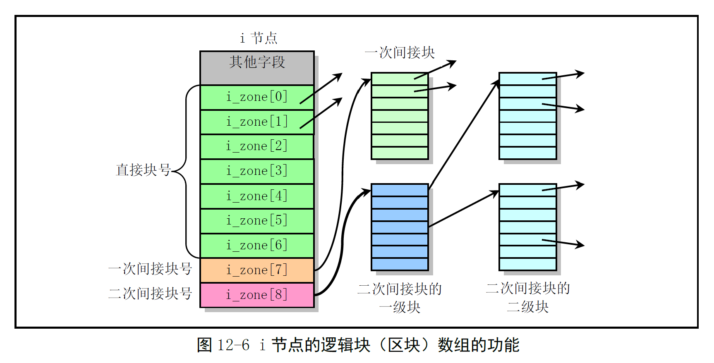

# Chapter 12.4 - truncate.c 程序

Created by : Mr Dk.

2019 / 09 / 03 17:29

Nanjing, Jiangsu, China

---

## 12.4 truncate.c 程序

### 12.4.1 功能描述

释放指定 inode 在设备上占用的所有逻辑块：

* 直接块
* 一次间接块
* 二次间接块



效果是将文件的长度截为 0，释放设备空间

### 12.4.2 代码注释

#### 释放所有的一次间接块 (内部函数) - free_ind()

```c
static int free_ind(int dev, int block)
{
    struct buffer_head * bh;
    unsigned short * p;
    int i;
    int block_busy; // 有逻辑块没有被释放的标志
    
    // 逻辑块号不能为 0
    if (!block)
        return 1;
    
    block_busy = 0;
    if (bh = bread(dev, block)) {
        // bh 指向一次间接块的缓冲块
        p = (unsigned short *) bh->b_data; // 指向缓冲块数据区
        for (i = 0; i < 512; i++, p++)
            if (*p)
                if (free_block(dev, *p)) {
                    // 释放编号为 *p 的 inode 对应的逻辑块
                    *p = 0;
                    bh->b_dirt = 1;
                } else
                    block_busy = 1; // 该逻辑块没有被释放
        brelse(bh); // 释放一次间接块占用的缓冲块
    }
    
    if (block_busy)
        return 0;
    else
        return free_block(dev, block); // 释放设备上的一次间接块
}
```

#### 释放所有的二次间接块 (内部函数) - free_dind()

```c
static int free_dind(int dev, int block)
{
    struct buffer_head * bh;
    unsigned short * p;
    int i;
    int block_busy;
    
    // 逻辑块号不能为 0
    if (!block)
        return 1;
    block_busy = 0;
    if (bh = bread(dev, block)) {
        p = (unsigned short *) bh->b_data; // 二次间接块缓冲块数据区
        for (i = 0; i < 512; i++, p++)
            // 每一个一次间接块
            if (*p)
                if (free_ind(dev, *p)) {
                    *p = 0;
                    bh->b_dirt = 1;
                } else
                    block_busy = 1;
        brelse(bh); // 释放二次间接块占用的缓冲块
    }
    if (block_busy)
        return 0;
    else
        return free_block(dev, block); // 释放设备上的二次间接块
}
```

#### 截断文件数据函数 - truncate()

```c
void truncate(struct m_inode * inode)
{
    int i;
    int block_busy;
    
    // 判断 inode 的有效性
    // 必须是常规文件 | 目录文件 | 链接
    if (!(S_ISREG(inode->i_mode) ||
          S_ISDIR(inode->i_mode) ||
          S_ISLNK(inode->i_mode)))
        return;
repeat:
    block_busy = 0;
    for (i = 0; i < 7; i++)
        // 直接块
        // 逻辑块号不为 0
        if (inode->i_zone[i]) {
            if (free_block(inode->i_dev, inode->i_zone[i]))
                inode->i_zone[i] = 0;
            else
                block_busy = 1;
        }
    // 释放一次间接块
    if (free_ind(inode->i_dev, inode->i_zone[7]))
        inode->i_zone[7] = 0;
    else
        block_busy = 1;
    // 释放二次间接块
    if (free_dind(inode->i_dev, inode->i_zone[8]))
        inode->i_zone[8] = 0;
    else
        block_busy = 1;
    
    inode->i_dirt = 1; // inode 已被修改
    if (block_busy) {
        // 先切换到其它进程运行
        // 过会儿再重新执行释放操作
        current->counter = 0;
        schedule();
        goto repeat;
    }
    
    // 修改 inode 的大小和时间
    inode->i_size = 0;
    inode->i_mtime = inode->i_ctime = CURRENT_TIME;
}
```

---

## Summary

收回逻辑块时

不仅要收回设备上的逻辑块

还需要收回内存高速缓冲区中，逻辑块的映像

---

