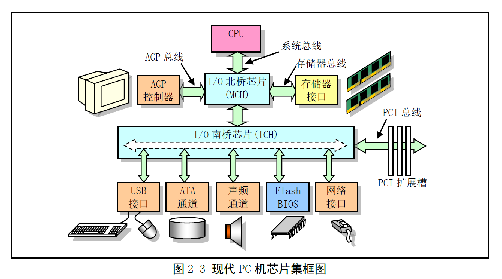
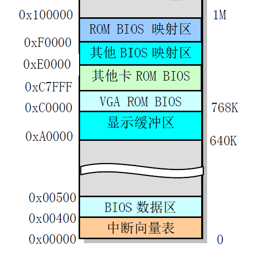
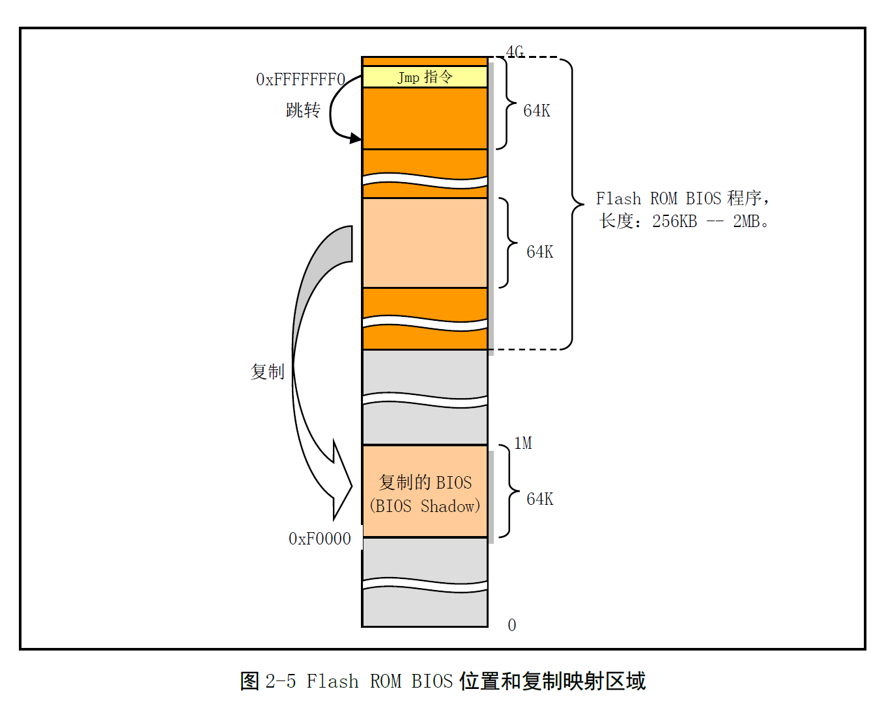

# Chapter 2 - 微型计算机组成结构

Created by : Mr Dk.

2019 / 07 / 17 17:49

Nanjing, Jiangsu, China

---

任何一个系统都可被认为由四部分组成：

* 输入
* 输出
* 处理中心 - 加工输入，得到输出
* 能源部分 - 为整个系统提供能源供给

对于计算机系统来说，由于输入和输出的大部分通道都是共享使用的：

* 输入/输出 (I/O)
* 处理中心
* 能源

---

## 2.1 微型计算机组成原理

CPU 通过 __地址线、数据线、控制线__ 组成的本地总线 (内部总线) 与系统其它部分进行通信

* 地址线提供内存或 I/O 设备的地址
* 数据线负责数据传输
* 控制线负责指挥具体的读 / 写操作

现代 PC 主板由两个超大规模芯片组成 chipset：

* 北桥 (Northbridge) 芯片 - _Intel: MCH (Memory Controller Hub)_
  * 拥有很高的传输速率
  * 连接 CPU、内存、AGP 视频接口
* 南桥 (Southbridge) 芯片 - _Intel: ICH (I/O Controller Hub)_
  * 管理中、低速的硬件
  * PCI 总线、硬盘接口、USB 接口等

---

## 2.2 I/O 端口寻址和访问控制方式

### 2.2.1 I/O 端口和寻址

CPU 需要访问 I/O 接口控制器或控制卡上的数据和状态信息，首先需要制定它们的地址

* I/O 端口地址 / 端口

通常 I/O 控制器包含：

* 数据端口
* 命令端口
* 状态端口

端口地址的设置方法：

* 统一编址
  * 将 I/O 控制器的端口地址归入存储器寻址地址空间范围内
  * 使用内存访问指令可以访问 I/O
* 独立编址
  * 将 I/O 控制器和控制卡的寻址空间单独作为一个独立的地址空间对待
  * 使用专用的 I/O 指令来访问端口

### 2.2.2 接口访问控制

* 循环查询方式
  * CPU 在程序中循环查询设备控制器中的状态，判断是否可以进行数据交换
  * 不需要硬件支持、简单
  * 耗费 CPU 的时间
* 中断处理控制方式
  * 需要中断控制器的支持
  * I/O 设备向 CPU 提出中断请求
* 直接存储器访问 (_DMA, Direct Memory Access_) 方式
  * 用于 I/O 设备与系统内存之间进行批量数据传送
  * 由专门的 DMA 控制器控制，不需要 CPU 插手
  * 无需软件介入

---

## 2.3 主存储器、BIOS 和 CMOS 存储器

### 2.3.1 主存储器

早期 8088/8086 CPU 只有 20 根地址线

* 因此内存寻址范围最高为 1 MB

Intel 32 位 CPU 可寻址 4 GB 的地址

* 并通过 CPU 上的新特性，可以寻址 64 GB 的物理内存

但为了与原来的 PC 在 __软件__ 上兼容

1 MB 以下的物理内存使用分配依旧与最早期的使用方式一致

### 2.3.2 基本输入/输出程序 BIOS

#### 8088/8086 (20 bit 地址线) 启动方式

20 根地址线只能寻址 `0x00000` - `0xFFFFF` 共 1 MB 的地址空间

其中，ROM (BIOS) 和 RAM 统一编制

* RAM 占据低端地址 768 KB
  * 其中基本内存为 `0x00000` - `0x9FFFF` 共 640 KB
  * 显示内存缓冲区为 `0xA0000` - `0xBFFFF` 共 128 KB
* ROM 占据从 `0xC0000` - `0xFFFFF` 开始的高端地址 256 KB
  * 其中，系统 BIOS 占用最后的 64 KB 或更多 (`0xF0000` - `0xFFFFF`)

CPU 复位时，`CS` 寄存器设为 `0xFFFF`，`IP` 寄存器设为 `0x0000` - 地址指向 `0xFFFF0`

* 即 ROM BIOS 中的最后 16 B 处

此处放置了一条 `JMP` 指令，指向 BIOS 程序的真正入口地址

此时，CPU 控制权被 BIOS 获得：

* BIOS 首先执行系统自检 POST (Power-On-Self-Test)
* 并在 RAM 最低端建立中断向量表等 OS 需要使用的配置表
* 初始化硬件 - 首先初始化显卡，并将后续硬件信息显示在 (显示缓冲区)
* 按照 CMOS 设定的启动顺序，依次寻找主引导记录
* 将主引导记录加载到 `0x7C00` 的位置 - 512 B
* 检测 MBR 最后两个字节是否为 `0x55` 和 `0xAA`，如果是，则可以启动
* 跳转到引导程序的入口，将控制权交由引导程序

#### 80386 (32 bit 地址线) 启动方式

32 位地址线可以寻址 `0x00000000` - `0xFFFFFFFF` 共 4 G 的地址空间

* ROM (Flash Memory) 被编址在了 4 G 内存的最高端
  * Flash Memory 的大小可以为 256 KB - 2 MB
* 32-bit CPU 复位后，通过硬件机制，使其访问的第一条指令位于 `0xFFFFFFF0`，即最后 16 B 处
* 同样，这里也有一条 `JMP` 指令，跳转到 BIOS 真正的入口
* 在完成硬件自检和初始化操作后，BIOS 会将与原先兼容的 64 KB 系统 BIOS 拷贝到内存低端 1 M 的最后 64 KB 处，并跳转到该处，使 CPU 真正运行在实地址模式下
* BIOS 寻找引导程序并加载至 `0x7C00` 处

> 个人理解，首先，ROM 和 RAM 的编址应当是连续的
>
> 如果再将 1 M 地址空间中的高 256 KB 分配给 ROM，RAM 的地址将不再连续
>
> 所以永远将 ROM 编址在内存最高端
>
> 为了兼容，因此 BIOS 需要将兼容的一段 BIOS 复制到 RAM 中对应原先 ROM 的地址处
>
> * 因此，这一段 RAM 称为 _BIOS Shadow_
>
> 然后跳转到 BIOS Shadow 的程序入口
>
> 这样，启动的过程就与原先兼容
>
> 总之：
>
> 1. ROM 永远编址在内存最高端
> 2. CPU 复位后访问的第一条指令总位于内存最高端的最后 16 B 处
> 3. 不管 BIOS 中有多少新特性，Flash ROM 总体大小有多大，最终 BIOS 总需要将兼容程序拷贝到 1 M 空间最后 64 KB，并跳转过去，使 CPU 在实地址模式下启动

### 2.3.3 CMOS 存储器

_Complementary Metal Oxide Semiconductor，互补金属氧化物半导体_

存储容量很小 - 64/128 B

存放：

* 实时时钟信息
* 系统硬件配置信息

CMOS 的地址空间在基本内存地址空间之外 - 需要使用 I/O 指令访问

---

## 2.4 控制器和控制卡

