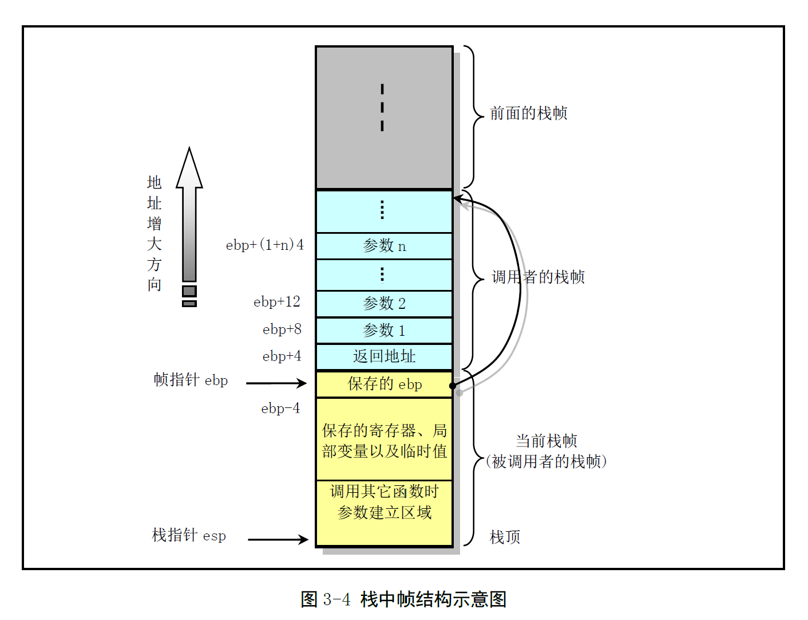

# Chapter 3 - 内核编程语言和环境

Created by : Mr Dk.

2019 / 07 / 18 15:53

Nanjing, Jiangsu, China

---

## 3.1 as86 汇编器

Linux 0.1x 系统中使用了两种汇编器：

* 产生 16 位代码的 as86 汇编器，配套 ld86 链接器
* GNU 汇编器 gas (as)，配套 GNU ld 链接器

Linux 仅用 as86 创建两个程序：

* 启动引导扇区程序 `boot/bootsect.s`
* 实模式下初始设置程序 `boot/setup.s`

使用了 Intel 汇编语法。

### 3.1.1 as86 汇编语言语法

一条汇编语句的组成：

1. 标号 (可选) - 编译时由汇编器用当前位置计数器赋值
2. 指令助记符 (指令名)
3. 操作数

汇编器产生的目标文件起码包含三个 section：

1. `.text` - 正文段 - 包含程序代码和只读数据
2. `.data` - 数据段 - 已初始化后的段，包含可读写数据
3. `.bss` - 未初始化数据段

---

## 3.2 GNU as 汇编

除了上述提到的两个文件，内核中其余所有汇编程序 (包括 C 语言产生的汇编程序) 均用 gas 编译，并与 C 语言编译产生的模块链接。OS 中的部分关键代码需要很高的执行效率，这部分代码由汇编完成，通常占 10% 左右。

### 3.2.1 编译 as 汇编语言程序

### 3.2.2 as 汇编语法

为了维持与 gcc 输出汇编程序的兼容性，as 汇编器使用 AT&T 系统 V 的汇编语法。

### 3.2.4 区与重定位

as 汇编器输出一个目标文件时，目标文件中的代码被默认设置成从地址 0 开始。ld 会在链接过程中为不同目标文件中的各部分分配不同的最终地址。这些部分是以块作为固定单元进行移动的，长度和字节次序都不会改变，这种固定的块被称为 section。为 section 分配运行时刻地址的操作被称为重定位 (Relocation)。

---

## 3.3 C 语言程序

### 3.3.1 C 程序编译和链接

C 程序 → 预处理 → 纯 C 程序 → 编译器 → 汇编程序 `.s` → 汇编器 → 目标文件 `.o` → 链接器 → 可执行文件

### 3.3.2 嵌入汇编

在 C 程序中内联汇编语言

```c
asm("汇编语句"
    : 输出寄存器
    : 输入寄存器
    : 会被修改的寄存器
);
```

例子：

```c
#define get_seg_byte(seg, addr) \
({ \
register char __res; \
__asm__("push %%fs; \
         mov %%ax, %%fs; \
         movb %%fs:%2, %%a1; \
         pop %%fs" \
         :"=a" (__res) \
         :"0" (seg), "m" (*(addr)) \
       ); \
       __res; \
})
```

* 宏语句需要执行在一行上，因此使用 `\` 续行
* `({})` 作为一个表达式使用，最后的 `__res` 作为表达式的输出值
* 用 `register` 定义一个寄存器变量，该变量将被保存在寄存器中
* `=a` 中的 `a` 称为加载代码，`=` 表示这是输出寄存器
* 将 `eax` 寄存器中的内容输出到 `__res` 中

功能：从某段的某地址处取一个字节。在执行代码时，如果不希望汇编被 gcc 优化修改，在 asm 符号后添加关键词 volatile：

```c
__asm__ __volatile__ (...);
```

该关键词也可以放在函数名前用于修饰函数，通知 gcc 编译器该函数不会返回 - 便于使 gcc 产生更好的代码。

### 3.3.3 圆括号中的组合语句

形如 `({...})` 的语句，可以在 GNU C 中用作一个表达式使用。其中最后一条语句必须是一个以 `;` 结尾的 **表达式**，作为该组合语句的返回值。如果不是表达式，则整个表达式就是 `void` 类型。这种语句通常用于定义宏。

### 3.3.4 寄存器变量

GNU 对 C 的另一个扩充 - 允许把变量放到 CPU 寄存器中：

* 全局寄存器变量 - 在程序运行过程中保留寄存器专门用于存放全局变量
* 局部寄存器变量 - 不会保留指定的寄存器，仅在内联汇编输入输出时使用专门的寄存器

gcc 编译器的数据流分析有能力确定寄存器何时含有正在使用的值。Linux 内核中通常只使用局部寄存器变量。

### 3.3.5 内联函数

让 gcc 把函数代码集成到调用该函数的代码中去，省掉了函数调用时进入 / 退出的时间开销。内联函数是一种优化操作，只有在编译时指定 `-O` 选项才执行代码嵌入处理。函数中的某些语句用法可能会使得内联函数的替换无法进行，或不适合进行：可变参数、内存分配函数、可变长度数据类型、递归函数。

---

## 3.4 C 与汇编程序的相互调用

### 3.4.1 C 函数调用机制

函数调用包含代码块之间的 **双向数据传递** 和 **执行控制转移**。数据传递通过函数参数和返回值进行，进入函数后，还需要为局部变量分配空间；退出函数时，需要回收空间。CPU 提供了简单的指令进行控制转移。

#### 3.4.1.1 栈帧结构和控制转移方式

**栈** 被用于传递函数参数、存储返回信息、临时保存寄存器现场、存储局部数据。单个函数调用操作使用的栈部分 - *栈帧，Stack Frame*。栈帧结构的两端由两个指针决定：

* `ebp` 寄存器作为帧指针 (frame pointer) - 地址较高，作为一个栈帧的固定端
* `esp` 寄存器作为栈指针 (strack pointer) - 地址较低，作为一个栈帧的活动端
* 栈指针会随着数据入栈出栈而移动，因此数据访问基于固定的帧指针进行

`A()` 调用 `B()` 时：

* `B()` 返回后 `A()` 中的下一条指令地址被压入栈中 (返回地址)
* 随后部分是 `B()` 的栈帧
  * 在 `esp` 指向的位置 (`B()` 栈帧的底部) 存放 `ebp` 的地址 (`A()` 的帧指针位置)
  * 将 `ebp` 赋值为 `esp` 地址，此时帧指针指向 `B()` 栈帧的底部
  * 栈指针开始活动
  * 函数结束后，将 `ebp` 恢复为 `ebp` 指向的单元中保存在 `A()` 的帧指针位置，此时 `ebp` 指向了 `A()` 栈帧的底部
  * 从栈中弹出保存的返回地址，跳转，继续执行 `A()`



* `CALL` 指令保存 `CALL` 之后的指令地址并跳转到子函数入口
* `RET` 指令弹出返回地址，并跳转到返回地址

### 3.4.2 在汇编程序中调用 C 函数

程序首先需要按照参数列表逆向顺序将参数压入栈中，然后执行 `CALL` 指令去执行被调用的函数。函数返回后，程序需要把之前入栈的参数清除。如果调用涉及到代码特权级变化，CPU 会进行堆栈切换，将必要参数压入新堆栈中。

汇编中调用 C 较为自由，如果没有专门为调用函数压入参数，之前栈中的值也会被作为参数使用。`fork()` 的实现就用了这一特性。

### 3.4.3 在 C 程序中调用汇编函数

Linux 内核中不常使用。

---

## 3.5 Linux 0.12 目标文件格式

目标文件和可执行文件都用了 UNIX 传统的 `a.out` 格式：汇编与链接输出格式 (*Assembly & Linker editor output*)。分为七个区：

* 执行头部分 (exec header) - 目标文件的整体结构信息
* 代码区 (text segment)
* 数据区 (data segment)
* 代码重定位部分 (text relocations)
* 数据重定位部分 (data relocations)
* 符号表部分 (symbol table) - 供链接程序使用
* 字符串表部分 (string table) - 用于调试目标代码，与链接过程无关

