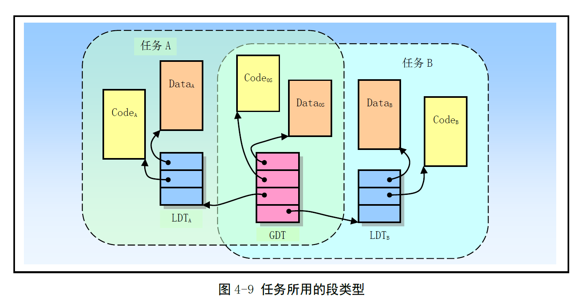
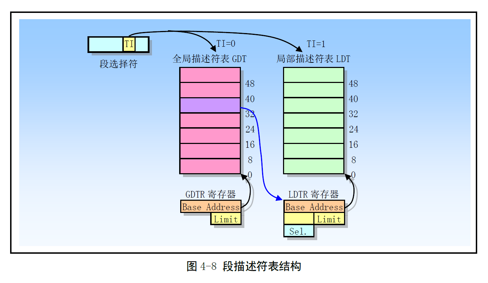
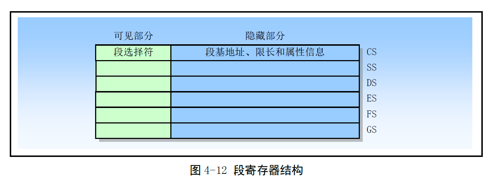

# Chapter 4.3 - 分段机制

Created by : Mr Dk.

2019 / 07 / 24 21:47

Nanjing, Jiangsu, China

---

## 4.3 分段机制

### 4.3.1 段的定义

线性地址空间 - CPU 可寻址的地址空间

* 32-bit 对应 4GB 线性地址空间 - `0x00000000 - 0xffffffff`
* 这些空间被映射到 RAM、ROM、I/O 上

每个段由三个参数定义：

1. 段基地址 - 段在 __线性地址空间__ 中的起始地址
2. 段长度 - 虚拟地址空间中，段内最大可用偏移
3. 段属性 - 段是否可读、可写；段的特权级等

可能导致的异常：

* 偏移量大于段长度
* 访问段的特权级不够

多个段映射到线性地址中的范围可以部分重叠或覆盖，甚至完全重叠

> 这句话我至今似懂非懂 🤔

段的以上三个参数定义在 __段描述符 (Segment Descriptor) __ 中

段描述符保存在 __段描述符表__ 中 - 一个包含段描述符的数组

* 段选择符通过制定表中的某个描述符来指定对应的段

线性地址转换过程：

1. 段选择符中的 14-bit 索引在 GDT 或 LDT 中找到对应的段描述符
2. 校验段描述符中的访问权限和访问范围，确保段可访问，且偏移量位于段内
3. 在段描述符表中取得段基地址，与偏移量相加，形成线性地址

### 4.3.2 段描述符表

段选择符中：

* TI 位用于选择访问 GDT 还是 LDT
* 高 13 位用于选择对应段描述符表中的描述符偏移个数
  * 因此段描述符最多可以包含 `2^13` 个 8 B 的段描述符

描述符表存储在由 OS 维护的特殊数据结构中

由 OS 保护在仅能由 OS 访问的内存区域中

由 CPU 的内存管理硬件引用

虚拟地址空间 ( `2^14` 个段 ) 被切分为大小相等的两半：

* `2^13` 个段是由 GDT 映射的全局虚拟地址空间
* `2^13` 个段是由 LDT 映射的局部虚拟地址空间

发生任务切换时，LDT 会被切换为新任务的 LDT，而 GDT 不会改变

* 因此，GDT 映射的部分是各个任务共有的
* LDT 所映射的部分会随任务切换而改变
* LDT 段也由 GDT 来映射

书中给出的这张图太好了：

GDT 的基地址位于 GDTR 中，并在内存中 8 B 对齐

GDT 的长度应当总是 `8N - 1`，因为段描述符总是 8 B

CPU 不使用 GDT 的第一个描述符 - 空描述符

* 若使用了空描述符访问内存对触发保护性异常

LDT 表存放在 LDT 类型的系统段中

* 每个 LDT 的 __段选择符__ 和 __段描述符__ 都必须在 GDT 中

访问 LDT 也需要段选择符

为了减少访问 LDT 时的地址转换次数

将 GDT 中 LDT 的段选择符、基地址、段长度、访问权限缓存在 LDTR 中

### 4.3.3 段选择符

段选择符 (段选择子) 是一个 16-bit 标识符

* 高 13-bit - 段在描述符表中的 index
* TI - GDT / LDT
* RPL (Requested Privilege Level) - 请求特权级，提供段保护信息

对于应用程序来说，段选择符是指针的一部分

但选择符的值通常由链接加载程序修改

CPU 提供存放 6 个段选择符的寄存器，即段寄存器

* 即最多同时有 6 个段可供立即访问
* 若要访问其它段，就需要加载段选择符

为避免每次访问内存都使用 __段选择符__ 去查找 __段描述符表__ 中的 __段描述符__

每个段寄存器包含可见部分 + 隐藏部分 (描述符缓冲 / 影子寄存器)

* 当段选择符被加载到段寄存器中时，自动加载对应段描述符中的基地址、段长度、权限等信息到隐藏部分
* 即，__影子寄存器中含有对应段描述符信息的一个拷贝__
* OS 需要确保对段描述符的改动反应在影子寄存器中
  * 一旦段描述符被修改，立刻重新加载六个段寄存器

### 4.3.4 段描述符

段描述符是 GDT 和 LDT 中的一个数据结构项，8 字节长

包含段基地址、段长度、段属性三个主要字段

段描述符由编译器、链接器、加载器或 OS 创建

* LIMIT - Segment Limit Field
  * 20-bit 段长度
  * 由 G 为来指定粒度 - 1B / 4KB
* BASE - Base Address Field
  * 32-bit 段基地址
  * 最好对齐 16 B 边界
* TYPE - Type Field
  * 段或门类型
  * 段的访问种类和扩展方向
* S - Descriptor Type Flag
  * 描述符类型 - 系统段描述符 / 应用 (代码/数据) 段描述符
* DPL - Descriptor Privilege Level
  * 描述符特权级，控制对段的访问
* P - Segment Present
  * 段是否在内存中
* G - Granularity
  * 颗粒度标志 - 确定 LIMIT 值得单位 - 1B / 4KB

### 4.3.5 代码和数据段描述符类型

### 4.3.6 系统描述符类型

* 局部描述符表 LDT 段描述符
* 任务状态段 TSS 段描述符
* 调用门描述符
* 中断门描述符
* 陷阱门描述符
* 任务门描述符

分为两大类：

1. 系统段描述符 - 指向系统段
2. 门描述符 - 含有对应段的 __段选择符__ 和 __段中程序入口点指针__

---

## Summary

还是脑补不出来分段的保护作用

尤其是所谓的段可以重叠

这样不就和分页的思想类似了吗？

没懂 😧

---

