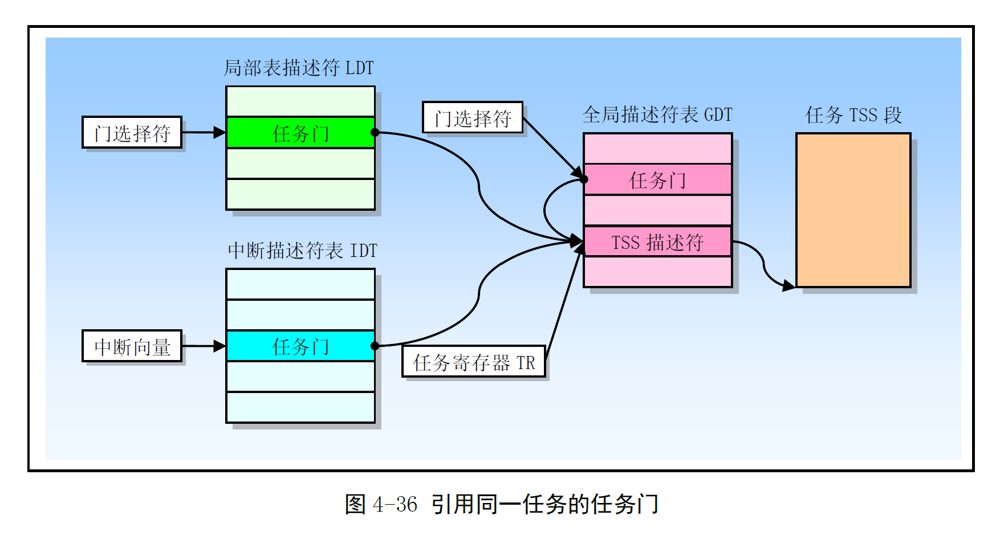

# Chapter 4.7 - 任务管理

Created by : Mr Dk.

2019 / 07 / 31 11:31

Nanjing, Jiangsu, China

---

## 4.7 任务管理

任务 (Task) 是 CPU 可以分配、调度、执行和挂起的工作单元

可用于执行：

* 程序
* 任务
* 进程
* OS 服务
* 中断或异常处理
* 内核代码

80X86 提供了一种机制，可用于：

1. 保存任务的状态
2. 分派任务执行
3. 从一个任务切换到另一个任务

保护模式下，处理器全部运行在任务中

80X86 提供了多任务的硬件支持

* 任务状态段 (TSS) 段描述符
* 任务门

当执行权传给这两类描述符时，都会造成任务切换

任务切换时，要求 CPU 保存几乎所有寄存器中的当前内容

CPU 的状态信息保存在 TSS 段的数据结构中

### 4.7.1 任务的结构和状态

一个任务由两部分组成：

* 任务执行空间
  * 代码段、堆栈段、数据段
  * 如果使用了特权级保护，需要为每个特权级提供独立堆栈空间
* 任务状态段 TSS
  * 指定了构成任务执行空间的各个段
  * 为任务状态信息提供存储空间
  * 任务之间的链接

一个任务使用指向其 TSS 的段选择符指定

当一个任务被加载进 CPU 进行执行时

以下属性会被加载进任务寄存器 TR 中：

* 任务的段选择符
* 基地址
* 段限长
* TSS 段描述符属性

如果使用了分页机制

任务使用的页目录表基地址会被加载进 CR3 中

当前执行任务的状态由 CPU 中以下内容组成：

* 所有通用寄存器和段寄存器
* 标志寄存器 EFLAGS、EIP、CR3、TR、LDTR
* 段寄存器指定的任务当前执行空间
* TSS 中：
  * I/O bitmap 基地址和 I/O bitmap
  * 特权级 0、1、2 的堆栈指针
  * 链接至前一个任务的链指针

### 4.7.2 任务的执行

以下方法可用于调度执行一个任务：

* 使用 CALL 指令明确调用任务
* 使用 JMP 指令明确跳转到一个任务 (Linux 内核使用的方式)
* 由 CPU 隐含地调用一个中断处理任务
* 隐含地调用一个异常处理任务

所有这些调度方法都使用指向 __任务门__ 或 __任务 TSS 段__ 的选择符来确定一个任务

在调度一个任务执行时，当前正在运行的任务和调度任务之间会自动发生任务切换操作

* 当前运行任务的上下文会被保存到它的 TSS 中，并暂停执行
* 新调度任务的上下文会被加载进寄存器中
* 从加载的 EIP 位置开始执行新任务

如果是当前执行任务调用了被调度的任务

那么调用者的 TSS 段选择符会被保存在被调用者的 TSS 中

从而提供了返回调用者任务的链接

在 80X86 处理器中，任务不可递归调用 (不能自己调用或跳转到自己)

中断或异常可以通过切换到一个任务来处理

* CPU 能够执行任务切换来处理中断和异常
* 在处理任务返回时能够自动切换回被中断的任务中

在任务切换时，CPU 会切换到另一个 LDT

* 允许了每个任务对基于 LDT 的段具有不同的逻辑到物理地址的映射

CR3 在任务切换时也会被重新加载

* 每个任务都可以有自己的一套页表

这些保护措施能够用来隔绝各个任务并且防止它们互相干扰

> 使用 CPU 的任务管理功能是可选的
>
> 也可以使用软件来实现多任务，使每个软件定义的任务在一个 80X86 的任务上下文中运行

### 4.7.3 任务管理数据结构

CPU 定义了以下用于支持多任务的寄存器和数据结构：

* 任务状态段 TSS
* TSS 描述符
* 任务寄存器 TR
* 任务门描述符
* EFLAGS 中的 NT 标志

使用这些数据结构，CPU 可以从一个任务切换到另一个任务，同时保存原任务的上下文

#### 4.7.3.1 任务状态段

用于恢复一个任务执行的 CPU 状态信息

* 动态字段 - 当任务被挂起时，CPU 会更新动态字段中的内容
  * 通用寄存器
  * 段寄存器
  * 标志寄存器 EFLAGS
  * EIP
  * 先前任务连接字段
* 静态字段 - CPU 会读取静态字段中的内容，但通常不会改变它们 - 字段内容是在任务被创建时设置的
  * LDT 段选择符
  * CR3 控制寄存器
  * 特权级 0、1、2 的堆栈指针
  * 调试陷阱 T 标志
  * I/O bitmap 基地址

以上所有字段最少占据 104 B

如果使用了分页机制

任务切换期间应避免 CPU 操作的 TSS 段中 (前 104 B) 含有内存页边界

如果包含页边界，则边界两边的页面必须同时并且连续存在于内存中

#### 4.7.3.2 TSS 描述符

TSS 描述符只能放在 GDT 中

* TYPE 中的 B 标志指明任务是否处于忙状态
  * 忙 - 当前正在执行的任务或等待执行的任务
* 基地址、段限长、DPL、颗粒度 G 和 存在位 P 与数据段描述符相同
  * 其中，G = 0 时，段限长必须 ≥ 103
  * TSS 的段长度可能会大一些
* 访问 TSS 描述符的程序，CPL ≤ TSS 描述符的 DPL
  * 大多数系统中，TSS 描述符的 DPL 应当设置为 ＜ 3 - 只有具有特权的软件才能切换任务

#### 4.7.3.3 任务寄存器

TR 存放 16-bit 的段选择符和当前 TSS 段的整个描述符 (隐藏部分)

* 整个描述符是从 GDT 中复制过来的，用作缓冲

在系统运行期间，TR 的内容会在任务切换时自动被改变

#### 4.7.3.4 任务门描述符

任务门描述符提供对一个任务简介、受保护的引用

任务门描述符可以被存放在 GDT、LDT 或 IDT 中

任务门描述符中的 __TSS 选择符__ 字段指向 GDT 中的一个 TSS 段描述符

任务门描述符的 DPL 用于在任务切换时控制对 TSS 段的访问

* 若程序试图通过任务门跳转到另一个任务
* CPL 以及指向任务门选择符的 RPL 应当 ≤ 任务门描述符中的 DPL

如图，LDT、GDT、IDT 中的任务门都可以指向同一个任务：

### 4.7.4 任务切换

CPU 可以通过以下四种方式之一执行任务切换：

1. 当前任务对 GDT 中的 TSS 描述符执行 JMP 或 CALL 指令
2. 当前任务对 GDT 或 LDT 中的任务门描述符执行 JMP 或 CALL 指令
3. 中断或异常向量指向 IDT 中的任务门描述符
4. EFLAGS 中的 NT 标志置位时，当前任务执行 IRET 指令

为了进行任务切换，JMP 或 CALL 指令能够把控制转移到 TSS 描述符或任务门上

* 都会导致 CPU 把控制转移到指定的任务中

中断或异常向量索引的是 IDT 中的一个任务门时

* 发生中断或异常就会造成任务切换

中断服务处理逻辑总是把执行权返回到被中断的过程中

* 被中断的过程可能在另一个任务中
* 如果 NT (Nested Task) 标志处于复位，则执行一般返回处理
* 如果 NT 置位，则返回操作会产生任务切换
* 切换到的任务由当前 TSS 中的前一任务链接字段指定

当切换到一个新任务时，CPU 会做些什么？

1. 从 操作数 / 任务门 / 前一任务链接字段 中，取得新任务的 TSS 段选择符
2. 特权级检查
3. 检查新任务的 TSS 描述符，查看该段是否存在；且 TSS 段长度有效
4. 如果任务切换来自 JMP 或 IRET，则当前任务 TSS 描述符中的 B 标志复位；如果任务切换由 CALL 指令、异常或中断产生，则 B 标志不动
5. 如果任务切换由 IRET 产生，则将临时保存的 EFLAGS 中的 NT 复位
6. CPU 从 TR 中取得当前 TSS 段的基地址，将当前任务状态保存至当前任务的 TSS 中
7. 如果任务切换由 CALL、异常或中断产生，CPU 会将新任务的 EFLAGS 中的 NT 置位
8. 如果任务切换由 CALL、JMP、或异常和中断产生，CPU 会设置新任务 TSS 描述符中的 B 标志；IRET 则不会
9. 使用新任务的 TSS 选择符和 TSS 描述符加载 TR，设置 CR0 的 TS 标志
10. 将新任务的 TSS 段中的状态加载进 CPU，包含：
    * LDTR、CR3、EFLAGS、EIP、通用寄存器、段寄存器
11. 开始执行新任务

成功进行任务切换操作后，当前任务的执行状态总是会被保存起来

新任务和原任务的特权级没有任何关系

新任务的 CS 寄存器在 CPL 指定的特权级上开始运行

各个任务通过各自独立的地址空间相互隔绝

且特权级规则已经控制了对 TSS 的访问

因此任务切换时，软件不需要再进行特权级检查

每次任务切换都会设置 CR0 中的任务切换标志 TS

* 用于系统软件协调处理器与协处理器之间的操作
* 表明协处理器上下文可能与当前任务不一致

### 4.7.5 任务链

TSS 段中的前一任务链接字段 (Backlink) 以及 EFLAGS 中的 NT 标志用于返回前一个任务操作中

* NT 指出当前任务是否嵌套在另一个任务中执行
* 如果有的话，则 backlink 中存放着嵌套层更高的任务 TSS 选择符

当 CALL、中断或异常造成任务切换时

CPU 会将当前 TSS 段的选择符复制到新任务 TSS 段的 Backlink 中

并设置 EFLAGS 中的 NT 标志，表示该任务是嵌套任务

如果在嵌套任务中，使用 IRET 指令

CPU 就会使用 Backlink 和 NT 标志返回到前一个任务

> 如果任务切换是由 JMP 指令造成的，那么新任务就不是嵌套的

### 4.7.6 任务地址空间

任务的地址空间由任务能访问的段构成

* 这些段被映射到 CPU 的线性地址空间中
* 随后被直接或间接地映射到处理器的物理地址空间中

TSS 中的 LDT 可以用于给出每个任务自己的 LDT

* 把与任务相关的所有段描述符放入 LDT 中，任务的地址空间可以与其它任务隔绝开来

几个任务也可以使用同一个 LDT

* 允许某些任务互相通信或控制

由于所有任务都可以访问 GDT，同样也可以创建通过 GDT 访问的共享段

如果开启分页机制，CR3 可以使每个任务由自己的页表，或几个任务能够共享页表集

#### 4.7.6.1 把任务映射到线性和物理地址空间

* 所有任务共享一个线性到物理地址空间的映射
  * 不开启分页机制，就只能这样
* 每个任务有自己的线性地址空间，并映射到物理地址空间
  * 每个任务使用不同的页目录
  * 每次任务切换需要加载 CR3
  * 如果不同的页目录条目指向不同的页表，且页表也指向物理地址的不同页面，那么各个任务就不会共享任何物理地址
* 所有任务的 TSS 必须存放在共享的物理地址空间区域中，且所有任务都能访问这个区域
  * 为了让 CPU 在执行任务切换时读取或更新 TSS，TSS 地址的映射不会改变
* GDT 映射的线性地址空间也应该映射到共享的物理地址空间中 (否则丧失了 GDT 的作用)

#### 4.7.6.2 任务逻辑地址空间

1. 通过 GDT 中的段描述符
   * 所有任务都能访问 GDT 中的描述符
   * 如果 GDT 中的某些描述符指向线性地址空间中的一些段
   * 且这些段被映射到所有任务共享的物理地址空间中
   * 那么所有任务可以共享这些段中的代码和数据
2. 通过共享 LDT
   * 两个或多个任务可以使用相同的 LDT
   * TSS 中的 LDT 指向同一个 LDT
   * 如果共享 LDT 中的段描述符指向映射到物理地址空间公共区域的段
   * 那么共享 LDT 的所有任务可以共享这些段中的代码和数据
   * 比上一种方式好，把共享局限于一些指定的任务中
3. 通过映射到线性地址空间公共区域的不同 LDT 中的描述符
   * 如果线性地址空间中的公共区域对每个任务都映射到物理地址空间的相同区域
   * 那么这些段描述符就允许任务共享这些段 - 别名段
   * 这种方式更好，LDT 中的其它描述符可以指向独立的未共享线性地址区域

---

