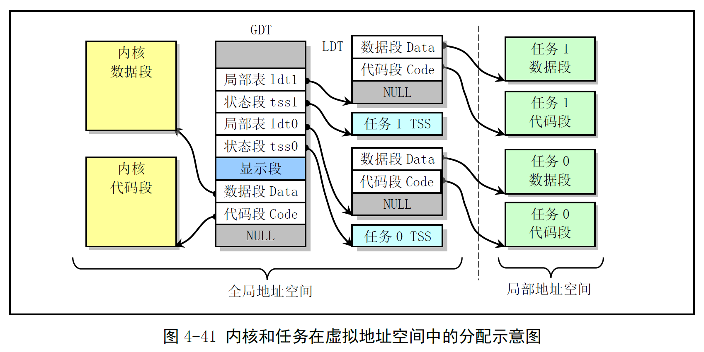
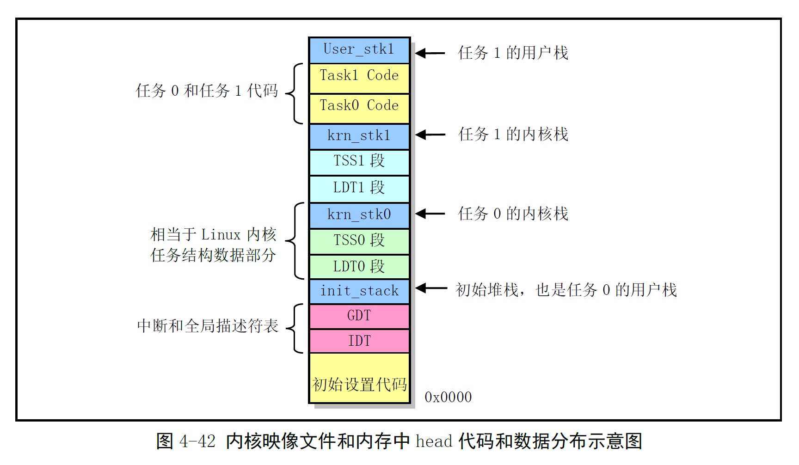

# Chapter 4.9 - 一个简单的多任务内核实例

Created by : Mr Dk.

2019 / 08 / 01 21:54

Nanjing, Jiangsu, China

---

## 4.9 一个简单的多任务内核实例

### 4.9.1 多任务程序结构和工作原理

内核实例由两个程序构成：

* 引导启动程序 `boot.s`
  * 系统上电时，从启动盘上把内核代码加载到内存中
* 内核程序 `head.s`
  * 两个在特权级 3 上运行的任务
  * 在屏幕上显示字符的系统调用

`boot.s` 编译出的代码共 512B

存盘在软盘映像文件的第一个扇区中

* ROM BIOS 会将启动盘第一扇区加载到物理内存 `0x7c00` 处
* 把执行权转移到此处，开始运行 boot 程序代码

boot 程序的主要功能：

* 利用 ROM BIOS 中断 int 0x13 将 head 代码读入内存 `0x10000` (64KB) 处

* 将这段代码移动到内存 0 处

  > 不能直接将 head 代码读到内存 0 处
  >
  > 因为加载操作需要用到 ROM BIOS 的中断
  >
  > 而中断向量表正好位于内存 0 处
  >
  > 且内存 1KB 开始处是 BIOS 程序使用的数据区

* 设置好临时 GDT 表，设置 CR0 PE 进入保护模式

* 跳转到内存 0 处开始执行 head 代码

head 程序运行在 32-bit 保护模式下，包含：

* 初始化代码
  * 重新设置 GDT
  * 设置系统定时器芯片
  * 重新设置 IDT 表，并设置时钟和系统调用的中断门
  * 跳转到任务 A 中
* 时钟中断 int 0x08 的处理程序
* 系统调用中断 int 0x80 的处理程序
* 任务 A 和任务 B 的代码数据

虚拟地址空间分配：

最终的映像文件组织方式：

在初始化结束后，利用 `IRET` 指令来启动运行第一个任务

* 因为控制权不能从特权级 0 的代码直接转移到特权级 3 的代码中

在初始堆栈中人工设置一个返回环境

* 将任务 0 的 TSS 段选择符加载到 TR，LDT 段选择符加载到 LDTR 中
* 将任务 0 的用户栈指针、代码指针、EFLAGS 压入栈中
* 执行 IRET
* 弹出堆栈上的堆栈指针作为任务 0 的用户栈指针
* 恢复任务 0 的 EFLAGS
* 弹出 CS:EIP 从而开始执行任务 0 的代码

为了每隔 10ms 切换正在运行的任务：

* 将 8253 的通道 0 设置为每经过 10ms 向 8259 发送时钟中断信号
* ROM BIOS 开机时已经在 8259 中将时钟中断请求号设置为 8
* 在中断 8 的处理函数中执行任务切换操作
* 查看 current 变量中的任务号，如果是 0，就利用任务 1 的 TSS 选择符远跳转到任务 1；反之亦然
* 每个任务中，将字符的 ASCII 放入寄存器 AL，调用系统调用中断 int 0x80
* 中断处理程序调用一个字符写屏子程序，将 AL 中的字符显示在屏幕上，同时记录字符显示的下一个位置
* 使用循环语句延迟一段时间，继续循环执行，直到 10ms 时间片用尽

任务 0 的字符始终为 `A`，任务 1 的字符始终为 `B`

---

### 4.9.2 引导启动程序 boot.s

### 4.9.3 多任务内核程序 head.s

---

## Summary

主要还是对于地址空间那一块不太懂

实在是太抽象了

多任务的大致思路稍微有一点了

不过这汇编也太恶心了就不看了叭... 😅

---

