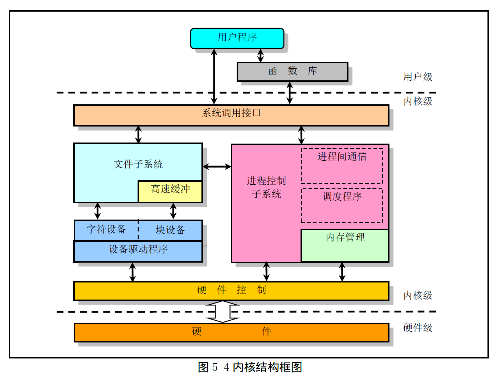

# Chapter 5.1-5.2 - Linux 内核模式 & 体系结构

Created by : Mr Dk.

2019 / 08 / 02 19:32

Nanjing, Jiangsu, China

---

一个完整的 OS 可由四部分组成：

* 硬件
* OS 内核：对硬件资源进行抽象，对所有系统资源进行调度管理
* OS 服务：向用户提供的服务，被看作是 OS 部分功能的程序 - shell、内核编程接口等
* 用户应用程序

---

## 5.1 Linux 内核模式

OS 内核的结构模式可分为：

* 整体式单内核模式
* 层次式微内核模式

Linux 0.12 内核采用的是 **单内核模式**。

OS 提供服务的流程为：

* 应用程序使用指定的参数执行系统调用指令 `INT 0x80`
* CPU 用用户态切换到核心态
* OS 根据具体的参数值调用特定的系统调用服务程序
* 服务程序根据需要再调用底层的支持函数完成特定的功能
* CPU 从核心态切换回用户态，返回到应用程序中

三个层次：

1. 主程序层
2. 服务层
3. 底层函数

单内核模式的优点：内核代码结构紧凑，执行速度快；不足：层次结构性不强。

对于微内核结构模式，主要特点：

* 系统功能模块化
* 消息传递

系统核心提供最基本的硬件抽象管理层和关键系统服务功能

* 进程/线程间通信服务
* 虚拟内存管理
* 进程调度
* ...

其余功能以各种模块化的形式在用户空间运行。

优点：

* 系统服务耦合度低
* 便于系统的改进、扩展、移植

缺点：

* 消息传递 - 微核心和系统各服务进程之间进行大量消息传递和同步操作
* 造成通信资源耗费和时间上的延迟

---

## 5.2 Linux 内核系统体系结构

Linux 内核主要由 5 个模块构成：

* 进程调度模块：控制进程对 CPU 资源的使用
* 内存管理模块：确保所有进程能够安全地共享机器主存区，支持虚拟内存管理方式
* 文件系统模块：支持对外部设备的驱动和存储，虚拟文件系统向所有外部存储设备提供一个通用的文件接口
* 进程间通信模块：提供多种进程间的信息交换方式
* 网络接口模块：对多种网络通信标准的访问，支持许多网络硬件

所有模块都与进程调度模块存在依赖关系，因为它们都需要依靠进程调度来挂起或重新运行。

