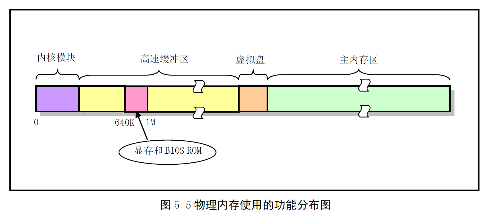
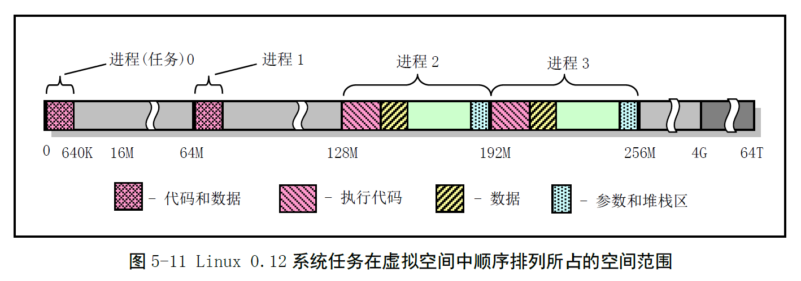
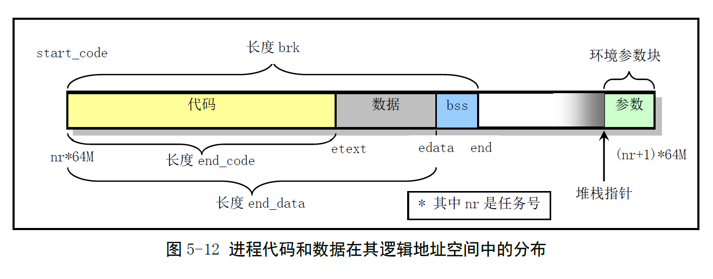
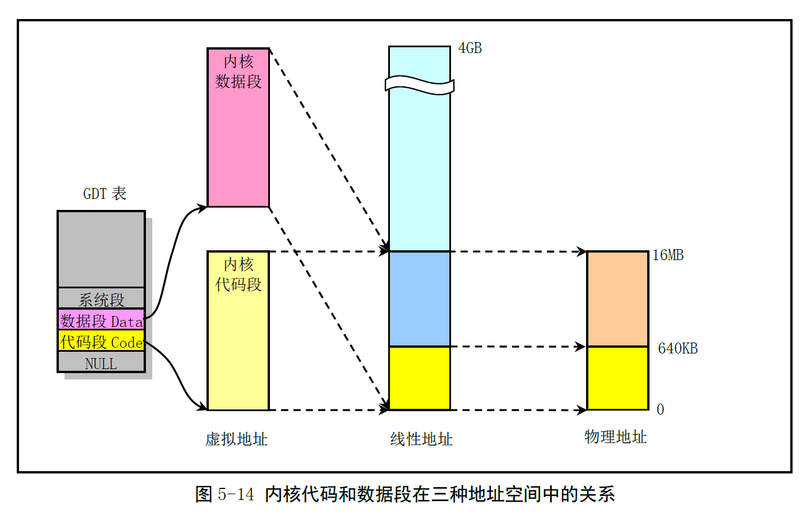

# Chapter 5.3 - Linux 内核对内存的管理和使用

Created by : Mr Dk.

2019 / 08 / 02 21:07

Nanjing, Jiangsu, China

---

## 5.3 Linux 内核对内存的管理和使用

### 5.3.1 物理内存

* Linux 内核占据物理内存开始的部分
* 紧接着是供块设备使用的高速缓冲区 (不含显存和 ROM BIOS 的 640KB - 1MB)，用于读写块设备时的缓冲
* 供虚拟盘存放数据的虚拟盘区
* 其余是供所有程序可以随时申请和使用的主内存区

Linux 系统同时采用了内存分段和分页管理机制。

### 5.3.2 内存地址空间概念

* 虚拟地址：由程序产生的，由段选择符和段内偏移地址两个部分组成的地址，由 GDT 映射的全局地址空间和 LDT 映射的局部地址空间组成
* 线性地址：虚拟地址到物理地址的中间层，是 CPU 可寻址的内存空间中的地址，程序代码产生段中偏移地址，加上相应段的基地址，形成线性地址
* 物理地址：CPU 外部地址总线上寻址物理内存的地址信号

虚拟内存 - 计算机呈现出要比实际拥有的内存大得多的内存量：

> 比如，让一列火车从上海开到北京，只需要足够长的一段铁轨就能完成，将后面的铁轨立刻铺到火车前面，只要操作足够快，列车就像在一条完整的轨道上运行。

在 Linux 0.12 中，给每个进程分配了 64MB 的虚拟内存空间 - 逻辑地址范围：`0x00000000` - `0x04000000`。

### 5.3.3 内存分段机制

实地址模式下，寻址内存需要：

* 段
* 偏移值

段的值存放在段寄存器中。段的长度被固定为 64KB。在保护模式下，段寄存器存放的是段描述符表某一描述符项的索引，段的长度可变。

> 在保护模式下访问一个内存段的信息较多，16-bit 的段寄存器放不下这么多内容。因此保护模式下，寻址需要使用段描述符表。

如果不在段描述符中定义对应的线性地址空间，那么该地址区域完全不能被寻址。

描述符表有三种类型：

* GDT 可被所有程序用于引用访问一个内存段
* IDT 保存定义中断或异常处理函数的段描述符 - 直接替代 8086 系统中的中断向量表
* LDT 用于多任务系统 - 为对应任务提供了更多的可用描述符项

每个任务的 LDT 本身也是由 GDT 中的描述符定义的一个段。因此 LDT 段很短，TSS 段也是如此。IDT 保存在内核代码段中。在 Linux 0.12 内核中，内核的代码段和数据段是重叠的，各任务的代码段和数据段也是重叠的。

### 5.3.4 内存分页管理

分页机制允许重新定向每次内存引用。基本原理：将线性内存空间划分为 4KB 为 1 页的内存页面，程序申请使用内存时，系统以页为单位进行分配。在分页机制下，可以将线性地址映射到容量相对很小的物理内存空间上。

OS 使用页目录和页表来完成分页机制。页目录项和页表项都占用 4B，最多占用 1 页，因此一页中最多由 1K 个项；一个页表最多可以映射 4KB 的页 × 1024 个页表项 = 4MB 内存；一个页目录最多可以映射 4MB 的页表空间 × 1024 个页目录项 = 4GB 内存。

Linux 0.1x 系统中内核和所有任务共用同一个页目录表。任何时刻，CPU 从线性地址空间到物理地址空间的映射函数都一样。为了让内核和所有任务互不干扰，需要从虚拟地址空间映射到线性地址空间的不同位置。

Intel 80386 系统，CPU 可以寻址 4G 的线性地址空间。每个进程的线性地址通过二级地址变换动态映射到主存的不同物理内存页上。Linux 0.12 中每个进程最大可用的虚拟地址空间定义为 64MB。每个进程的逻辑地址 + 任务号 × 64MB 即可转换为线性地址。

内核设置 GDT 中段描述符最大为 256 项，其中：

* 2 项空闲
* 2 项系统使用
* 每个进程使用两项
* 系统最多同时容纳 (256 - 2 - 2) / 2 = 126 个任务

但内核中人工定义了最大任务数 `NR_TASKS = 64`。每个任务的逻辑地址范围为 64M，各个任务的线性地址起始位置是 任务号 × 64MB。因此全部任务所使用的线性地址空间范围是 64 × 64MB = 4G。

Linux 0.12 中所有任务的指令空间和数据空间合用一块内存，一个进程的所有代码、数据和堆栈部分处于同一内存段中。

> ？？？？？？

进程逻辑地址空间中的代码段和数据段与 CPU 分段机制中的代码段和数据段不是同一个概念。CPU 分段机制中的段可以设置在 4GB 线性地址空间中的任何地方，可以相互独立，也可以完全重叠或部分重叠。

而进程在逻辑地址空间中的代码段和数据段是由编译器和 OS 加载程序时规定的顺序排列的代码区域、初始化和未初始化的数据区域以及堆栈区域。

> 这啥啊？还是没明白 😥

### 5.3.5 CPU 多任务和保护方式

Linux 0.12 OS 使用了 CPU 的 0 和 3 两个保护级，内核代码和数据由所有任务共享，因此保存在全局地址空间中。每个任务自己的代码和数据区保存于局部地址空间，其它任务不可访问。每个进程都有内核栈和用户栈：

* 陷入内核执行时，使用当前进程的内核栈，进程处于内核态
* 返回用户空间时，使用当前进程的用户栈，进程处于用户态

### 5.3.6 虚拟地址、线性地址和物理地址之间的关系

#### 内核代码和数据的地址

在 Linux 0.12 中，`head.s` 程序在初始化时将内核代码段和数据段设置为 16MB 的段。在线性地址空间中，这两个段的范围重叠：`0 - 0xFFFFFF` 共 16 MB。包含：

* 内核所有代码
* 内核段表 GDT、IDT、TSS
* 页目录表和二级页表
* 内核局部数据和内核临时堆栈

其中，页目录表和二级页表已将 0 - 16MB 的线性地址对应映射到了物理地址上，占用了 4 个页目录项，4 个页表。线性地址可被直接看作是物理地址。

Linux 0.12 内核最多可管理 16 MB 的物理内存 - 每个页面 4KB，共 4096 个页面：

1. 内核代码段和数据段在线性地址空间和物理地址空间中是一样的，大大简化内核初始化操作
2. GDT 和 IDT 在内核数据段中，进入保护模式后，`head.s` 中需要重新设置这两个表
3. 除任务 0 外，其它任务使用的物理页面与线性地址中的页面有部分不同，内核需要动态在主存区中为它们建立映射

机器在只需要 4MB 的物理内存中就可以完全运行，由虚拟内存支持。16MB 以上的内存区域将不会用到。

#### 任务 0 的地址对应关系

任务 0 是系统中人工启动的第一个任务，代码段和数据段长度被设置为 640KB，代码和数据直接包含在内核代码和数据中。对应的任务状态段 TSS 也是手工预设置好的。

#### 任务 1 的地址对应关系

任务 1 也是一个特殊的任务，代码位于内核代码区域中。系统使用 `fork` 创建任务 1 (init 进程) 时，为存放任务 1 的二级页表，在主存区申请了一页内存，复制了父进程的页目录项和二级页表项。将任务 1 占用的线性空间映射到了物理地址 0 - 640KB 处。

另外，系统还会为任务 1 在主内存区中申请一页内存用于存放 TSS 数据结构和用作内核堆栈空间，任务 1 的用户堆栈空间将直接共享使用处于内核代码和数据区的任务 0 的用户堆栈空间。

#### 其它任务的地址对应关系

从任务 2 起，父进程都是 init (任务 1) 进程。Linux 0.12 中最多可以有 64 个进程同时存在，从任务 2 开始，任务在线性地址空间中的起始位置被设定于 任务号 × 64MB 处，占用 16 个页目录项。虚拟空间中任务代码段和数据段被映射到线性地址空间中相同的范围。任务 2 在创建后，将调用 `execve()` 函数执行 shell。该系统调用会释放从任务 1 复制的页目录和页表项以及相应内存页面，为新执行的程序重新设置相关页目录和页表表项。

内核不会立刻为其分配和映射物理内存，而是等任务 2 开始执行并发生缺页异常后，才由内存管理程序分配并映射一页内存：需求加载 - Load on demand。从 Linux 0.99 之后，每个进程可以单独享用 4G 的地址空间。

### 5.3.7 用户申请内存的动态分配

用户应用程序使用 `malloc()` 申请内存时，内存本身不会插手管理。因为内核已经为每个进程分配了 64MB 的空间，只要进程寻址范围在 64MB 内，内核就会为地址进行映射。

内核会为进程使用的代码和数据空间维护 `brk` - 当前位置：保存在每个进程的数据结构中，指出进程代码和数据在进程空间中的末端位置。使用 `malloc()` 时，系统调用 `brk()` 会把程序要求新增的空间长度通知内核。内核代码根据 `malloc()` 提供的值更新 brk 的值，但并不为新申请的空间映射物理页面。只有当程序寻址到某个不存在的物理页面时，内核才进行对应的映射操作。

只有当寻址所在页面不存在，页面所处位置属于进程堆范围时，CPU 产生缺页异常，在异常处理程序中为指定页面分配并映射物理页面。

用户申请的字节长度数量和在对应物理页面中的具体位置，由 `malloc()` 负责管理。内核以页为单位分配和映射物理内存，而该函数负责具体记录用户程序使用了一页内存的多少字节：剩余容量保留给程序再次申请内存时使用。

用户使用 `free()` 时，内存管理函数会把所有的内存块标记为空闲，以备程序再次申请内存时使用。内核为该进程分配的物理页面不会被释放，只有当进程最终结束时，内核才会全面收回分配和映射到该内存的所有物理页面。

