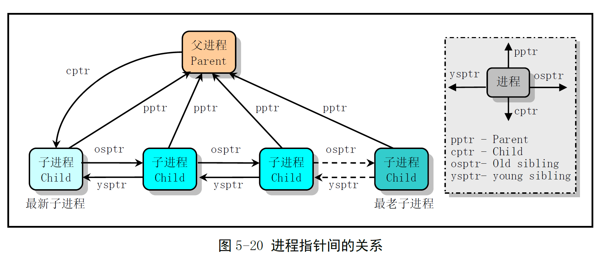
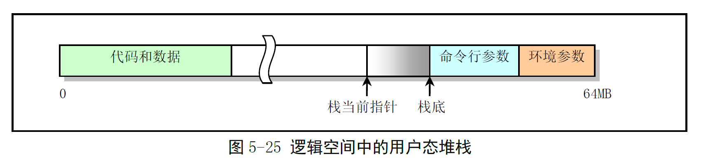
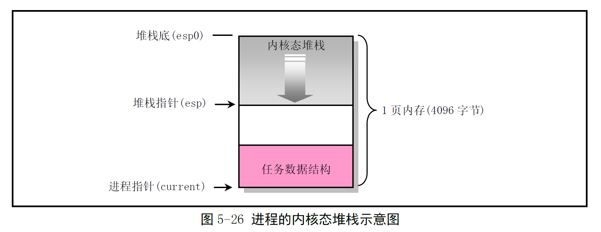

# Chapter 5.7-5.9 - Linux 进程控制 & 堆栈使用 & 文件系统

Created by : Mr Dk.

2019 / 08 / 06 16:09

Nanjing, Jiangsu, China

---

## 5.7 Linux 进程控制

__进程__ 是一个执行中的程序实例

利用分时技术，在 Linux 上可以同时运行多个进程

* 将 CPU 的运行时间划分成一个个规定长度的时间片

对于单 CPU 的机器来说，每个时刻只有一个进程在运行

但由于每个时间片很短，表面上看，好像所有进程在同时运行

在 Linux 0.12 中，系统最多可有 64 个进程同时存在

* 除第一个进程是人工建立
* 其余进程都是现有进程调用 `fork()` 后创建的新进程

内核使用 pid 来标识每个进程，每个进程包含：

* 可执行的指令代码、数据和堆栈区
* 每个进程只能执行自己的代码和访问自己的数据和堆栈区

Linux 系统中的进程可以在 __内核态__ 或 __用户态__ 下执行

* 各自使用独立的内核态堆栈和用户态堆栈

在 Linux 内核中，进程被称作任务，运行在用户空间的程序称作进程

### 5.7.1 任务数据结构

内核通过进程表对进程进行管理

* 每个进程在进程表中占有一项
* 每项是一个 `task_struct` 任务结构体指针

任务数据结构被称为 __进程控制块 PCB (Process Control Block)__

或 __进程描述符 PD (Processor Descriptor)__

* 保存用于控制和管理进程的所有信息
  * 进程当前运行状态、信号、进程号、父进程号
  * 运行累计时间、正在使用的文件、局部描述符、TSS 信息等

```c
struct task_struct {
    long state; // 任务运行状态
    long counter; // 运行时间片计数 (递减)
    long priority; // 优先级 (优先级越高，时间片越长)
    long signal; // 信号 bitmap
    struct sigaction sigaction[32]; // 信号执行属性结构
    long blocked; // 进程信号屏蔽码
    int exit_code; // 任务停止执行后的退出码 (父进程会来取)
    unsigned long start_code; // 代码段地址
    unsigned long end_code; // 代码字节长度
    unsigned long end_data; // 代码 + 数据字节长度
    unsigned long brk; // 总字节长度
    unsigned long start_stack; // 堆栈段地址
    long pid; // 进程标识
    long pgrp; // 进程组号
    long session; // 会话号
    long leader; // 会话首领
    int groups[NGROUPS]; // 进程所属组号
    task_struct *p_pptr; // 指向父进程的指针
    task_struct *p_cptr; // 指向最新子进程的指针
    task_struct *p_ysptr; // 指向比自己后创建的相邻进程的指针
    task_struct *p_osptr; // 指向比自己早创建的相邻进程的指针
    unsigned short uid; // 用户标识
    unsigned short euid; // 有效用户标识
    unsigned short suid; // 保存的用户标识
    unsigned short gid; // 组id
    unsigned short egid; // 有效组id
    unsigned short sgid; // 保存的组id
    long timeout; // 内核定时器超时值
    long alarm; // 报警定时值
    long utime; // 用户态运行时间
    long stime; // 系统态运行时间
    long cutime; // 子进程用户态运行时间
    long cstime; // 子进程系统态运行时间
    long start_time; // 进程开始运行时刻
    struct rlimit rlim[RLIM_NLIMITS]; // 进程资源使用统计数组
    unsigned int flags; // 进程标志
    unsigned short used_math; // 是否使用了协处理器
    int tty; // 进程使用 tty 终端的子设备号
    unsigned short umask; // 文件创建属性屏蔽位
    struct m_inode *pwd; // 当前工作目录的 inode 指针
    struct m_inode *root; // 根目录 inode 指针
    struct m_inode *executable; // 执行文件的 inode 指针
    struct m_inode *library; // 被加载库文件的 inode 指针
    unsigned long close_on_exec; // 执行时关闭文件句柄 bitmap 标志
    struct file *filp[NR_OPEN]; // 文件结构指针 - 最多 32 项
    struct desc_struct ldt[3]; // 局部描述符表
    struct tss_struct tss; // 进程的任务状态段信息结构
}
```

* long state - 进程的当前状态号，一个进程可处于五种状态之一：
  * `TASK_RUNNING`
  * `TASK_INTERRUPTIBLE`
  * `TASK_UNINTERRUPTIBLE`
  * `TASK_ZOMBIE`
  * `TASK_STOPPED`
* long counter - 进程被切换之前还能执行的系统滴答数 (系统周期数)
  * 动态变化
  * 被调度程序使用，用于选择下一个执行的进程
  * 进程被创建时，初始值 == priority
* long priority
  * counter 的初值 - 15 个系统时钟周期
* long signal - 进程当前收到信号的 bitmap
  * 共 32-bit，每位代表一种信号
* struct sigaction sigaction[32] - 保存各信号使用的操作和属性
* long blocked - 进程当前不想处理的信号 bitmap
* int exit_code
  * 保存程序终止时的退出码
  * 子进程结束后，父进程可以查询子进程的退出码
* unsigned long start_code
  * 进程代码在线性地址空间中的开始地址 (n × 64MB)
* unsigned long end_code - 进程代码的字节长度
* unsigned long end_data - 进程的代码长度 + 数据长度的总字节长度
* unsigned long brk
  * 也是进程代码长度 + 数据长度的总字节长度，还包含未初始化的数据区 bss
  * 修改该指针，内核可以为进程动态添加和释放内存
* unsigned long start_stack - 指向进程逻辑地址空间中堆栈的起始处
* long pid - 唯一标识进程
* long pgrp - 进程所属进程组号
* long session - 进程会话号
* long leader - 会话首进程号
* int groups[NGROUPS] - 进程所属各个组的组号数组
* task_struct *p_pptr - 指向父进程任务结构的指针
* task_struct *p_cptr - 指向最新子进程任务结构的指针
* task_struct *p_ysptr - 指向比自己后创建的相邻进程的指针
* task_struct *p_osptr - 指向比自己早创建的相邻进程的指针



* unsigned short uid - 拥有该进程的用户 id
* unsigned short euid - 有效用户 id
* unsigned short suid - 保存的用户 id
* unsigned short gid - 用户所属组 id
* unsigned short egit - 有效组 id
* unsigned short sgid - 保存的组 id
* long timeout - 内核定时超时值
* long alarm - 进程的报警定时值
  * 使用系统调用 `alarm()` 设置该字段
  * 当系统时间滴答值超过该字段，内核向进程发送 `SIGALRM` 信号
  * 默认该信号终止程序执行
* long utime - 累计进程在用户态下运行的滴答数
* long stime - 累计进程在内核态下运行的滴答数
* long cutime - 累计进程的子进程在用户态下运行的滴答数
* long cstime - 累计进程的子进程在内核态下运行的滴答数
* long start_time - 进程开始运行的时刻
* struct rlimit rlim[RLIM_NLIMITS] - 进程资源使用统计数组
* unsigned int flags - 进程标志
* unsigned short used_math - 进程是否使用协处理器的标志
* int tty - 进程使用的 tty 终端的子设备号，`-1` 表示没有使用
* unsigned short umask - 创建新文件时使用的 16-bit 属性屏蔽字
* struct m_inode *pwd - 进程当前工作目录的 inode
  * 每个进程都有一个当前工作目录，用于解析 __相对路径__
  * 使用系统调用 `chdir()` 来改变
* struct m_inode *root - 进程的根目录 inode
  * 用于解析绝对路径
  * 只有 super user 可以通过系统调用 `chroot` 来修改根目录
* struct m_inode *executable - 进程运行的执行文件在内存中的 inode
  * 判断系统中是否还有另一个进程在运行该文件
  * 如果有，则 inode 的引用计数会 ＞ 1
* struct m_inode *library - 被加载的库文件的 inode
* unsigned long close_on_exec - 进程文件描述符的 bitmap
  * 用于在执行 `exec` 类系统调用时，关闭已经打开的文件描述符
* struct file *filp[NR_OPEN] - 打开的文件结构指针表，最多 32 项
* struct desc_struct ldt[3] - 局部描述符表
  * [0] - 空
  * [1] - 代码段描述符
  * [2] - 数据段和堆栈段描述符
* struct tss_struct tss - 进程 TSS 信息结构
  * 切换任务时，保存了 CPU 所有的寄存器

在 Linux 中，当前进程的上下文均保存在任务数据结构中

### 5.7.2 进程运行状态

```c
#define TASK_RUNNING            0 // 正在运行或准备就绪
#define TASK_INTERRUPTIBLE      1 // 可中断等待 
#define TASK_UNINTERRUPTIBLE    2 // 不可中断等待
#define TASK_ZOMBIE             3 // 僵死，已经停止运行，但父进程还没发信号
#define TASK_STOPPED            4 // 停止
```

* 状态 0
  * 正被 CPU 执行，或随时可由调度程序执行 (就绪状态)
  * 进程在内核代码中运行，称为内核态；进程执行自己的用户态代码，称为用户态
  * 一个新进程刚被创建时处于本状态
* 状态 1
  * 可中断睡眠
  * 系统不会调度该进程执行
  * 系统产生一个中断，或释放了进程正在等待的资源，或进程收到信号，都可以唤醒进程
* 状态 2
  * 不可中断睡眠
  * 不被任何信号唤醒
  * 只有被 `wake_up()` 函数明确唤醒时才转换到就绪状态
* 状态 3
  * 进程已经停止运行
  * 父进程还没有调用 `wait()` 询问其状态
  * 为了使父进程能够获取子进程停止运行时的信息，子进程的任务数据结构还需要保留
  * 父进程调用 `wait()` 取得了子进程的信息，则处于该状态的进程的任务数据结构会被释放
* 状态 4
  * 进程收到相关信号时，进入暂停状态
  * 发送 `SIGCONT` 信号可让进程转换到可执行状态

如果进程在内核态执行时需要等待系统的某个资源

调用 `sleep_on()` 或 `interruptible_sleep_on()` 自愿放弃 CPU 使用权，并进入睡眠状态

只有进程从 __内核运行态__ 转移到 __睡眠状态__ 时，内核才会进行进程切换操作

* 在内核态下运行的进程不能被其它进程抢占

为避免进程切换时的内核数据错误，内核在执行临界区代码时会禁止一切中断

### 5.7.3 进程初始化

OS 初始化后，程序手工将自身移动到任务 0 中执行

* 由宏 `move_to_user_mode` 完成 - 任务 0 内核态 → 任务 0 用户态

使用 `fork()` 创建进程 1

* 进程 1 将进行应用环境的初始化
* 进程 0 在系统空闲时被调度执行，仅执行 `pause()` 系统调用，并再次执行调度函数

### 5.7.4 创建新进程

系统首先在任务数组中找出一个没有被任何进程使用的空项

* 如果数组中已有 64 个进程在运行，则出错返回

OS 为新建进程在主存区申请一页内存，存放任务数据结构，并复制父进程任务数据结构中的所有内容

为防止未完成处理的新进程被调度，此时状态被设置为 `TASK_UNINTERRUPTIBLE`

对复制后的任务数据结构进行修改：

* 复位各统计值
* 清除信号位图
* 设置初始运行时间片
* 设置 TSS 中各寄存器的值
* ...

OS 设置新任务的代码和数据段基址、限长

并复制当前进程内存分页管理的页表

* 此时，系统并不为新进程分配实际的物理页面，而是共享父进程的物理页面
* 当父进程或新进程中有写内存的操作时，OS 才会为执行写操作的进程分配独立使用的内存页面
* Copy On Write 技术

若父进程有文件是打开的，则对应文件的打开次数 + 1

在 GDT 中设置新任务的 TSS 和 LDT 描述符，指向新进程 PCB 中的 tss 和 ldt

最后将任务状态设置为 `TASK_RUNNING`，并返回新进程号

以上仅为 `fork()` 的功能

`exec()` 会使子进程原来的代码和数据区被释放，并运行新程序

此时内核还没有加载该程序的代码，CPU 会立刻产生缺页异常

此时内存管理程序从块设备上加载相应代码

CPU 重新执行引起异常的指令，才开始执行真正的新程序

### 5.7.5 进程调度

内核的调度程序用于选择系统下一个要运行的进程

Linux 进程是抢占式的：

* 进程的抢占发生在进程处于用户态执行的阶段
* 进程在内核态执行时是不能被抢占的

Linux 0.12 - 基于优先级排队的调度策略

#### 调度程序

`schedule()` 函数扫描任务数组

* 比较每个就绪态任务的 counter 值
* 确定哪个进程运行的时间最少
* 哪一个值大，说明该进程运行时间还不长
* 选中该进程，使用任务切换宏函数切换到该进程运行

如果所有处于 `TASK_RUNNING` 状态进程的时间片都已用完

* 根据 priority 对所有进程重新计算 counter (包括正在睡眠的进程)
* `counter = counter / 2 + priority`
* 对于正在睡眠的进程，被唤醒时具有较高的 counter 值

`schedule()` 函数重新扫描任务数组，重复上述过程

如果没有进程可运行，系统会选择进程 0

* 进程 0 会调用 `pause()` 把自己置为可中断睡眠状态，并再次调用 `schedule()`

#### 进程切换

每当选出一个进程，`schedule()` 函数调用 `switch_to()` 宏执行进程切换操作

`switch_to()` 首先检查要切换到的进程是否是当前进程

* 如果是，则无需操作

否则就把内核全局变量 current 指向新任务

然后长跳转到新任务的 TSS

造成 CPU 执行任务切换：

* CPU 将当前寄存器现场保存到当前 TR 中 TSS 段选择符指向的当前进程 PCB 的 tss 结构中
* 将新任务 PCB 中 tss 结构信息恢复到 CPU 中

### 5.7.6 终止进程

进程结束 / 半途终止运行

内核需要释放该进程占用的系统资源

* 打开的文件
* 申请的内存
* ...

用户程序调用 `exit()` 系统调用时，会执行内核函数 `do_exit()` ：

* 释放进程代码段和数据段占用的内存页面
* 关闭进程打开的所有文件
* 对所有 inode 进行同步操作
* 如果有子进程，则让其所有子进程的父进程指针指向 init 进程
* 如果是会话头进程，则需要发送挂断信号
* 进程被设置为 `TASK_ZOMBIE`
* 向父进程发送 `SIGCHLD` 信号，表示子进程已经终止
* 调用调度函数去执行其它进程

此时，PCB 仍然保留，因此父进程还需要使用其中的信息

父进程使用 `wait()` 或 `waitpid()` 函数等待子进程终止

* 子进程被终止并处于 `TASK_ZOMBIE` 状态时
* 父进程把自己成的累计时间加到自己的 PCB 中

最终释放子进程 PCB 占用的内存页面，并置空子进程在任务数组中占用的指针

---

## 5.8 Linux 系统中堆栈的使用方法

Linux 0.12 系统中共使用了四种堆栈

* 系统引导初始化时临时使用的堆栈
* 进入保护模式之后，供内核程序初始化使用的堆栈
* 每个任务通过系统调用执行内核程序时的内核堆栈
* 每个任务在用户态执行时使用的堆栈

使用不同堆栈的原因：

1. 从实模式进入保护模式后，CPU 寻址方式发生了变化
2. 解决 CPU 不同特权级共享使用堆栈时带来的保护问题
   * 任务进入内核态时，用户堆栈指针被保存在内核堆栈中
   * 从内核态返回时，恢复使用用户态堆栈

### 5.8.1 初始化阶段

#### 开机初始化时 (bootsect.s, setup.s)

用于系统初始化时临时使用

#### 进入保护模式时 (head.s)

系统进入保护模式

堆栈段被设置为内核数据段，保留了 1 页内存 (4K) 作为堆栈使用

#### 初始化时 (main.c)

在把控制权交给任务 0 之前，系统一直使用上述堆栈

当 main.c 中的代码切换为任务 0 执行后

通过执行 `fork()`，`init()` 将在任务 1 中执行

`main()` 本身继续使用内核程序中自己的堆栈，作为任务 0 的用户态堆栈

### 5.8.2 任务的堆栈

每个任务都有两个堆栈，分别用于用户态和内核态程序的执行

* 内核态堆栈很小，保存的数据最多不能超过 PCB 的大小
* 用户态堆栈可以在 64MB 空间内延伸

#### 在用户态运行时

进程被创建时，用户态指针被设置为地址空间靠近末端处 (接近 64MB 顶端)：



由于 Linux 实现了 Copy On Right

进程被创建后，若进程和父进程都没有使用堆栈

则共享同一堆栈对应的物理内存页面

只有一个进程进程堆栈写操作时

内核内存管理程序才会为执行写操作的进程分配新的内存页面

#### 在内核态运行时

内核态堆栈的线性地址由任务 TSS 中 ss0 和 esp0 两个字段指定

当任务从用户代码转移进入内核代码时，内核态堆栈总是空的

内核态堆栈被设置位于 PCB 所在页面的末端

即，和 PCB 放在同一页面内：



#### 任务 0 和任务 1 的堆栈

任务 0 和任务 1 的内核态堆栈分别位于各自 PCB 所在页面的末端

任务 0 的用户态堆栈就是进入保护模式后所使用的堆栈

任务 1 在创建时复制了任务 0 的用户态堆栈

在刚开始时与任务 0 共享同一个堆栈

只有在发生堆栈写操作时，Copy On Right 机制才会为任务 1 的堆栈分配新的页面

* 因此，任务 0 的堆栈需要在任务 1 实际开始使用之前保持干净
* 即，任务 0 在任务 1 开始使用之前，不能使用堆栈，确保任务 1 复制的堆栈页面不含有 任务 0 的数据

### 5.8.3 任务内核态堆栈与用户态堆栈之间的切换

所有中断服务程序都属于内核代码

如果中断产生时，任务处于用户态中

* 中断就会引起 CPU 特权级的变化，引发 CPU 进行用户态堆栈 / 内核态堆栈的切换操作
* CPU 从当前任务的 TSS 中取得内核堆栈的位置
* 并将用户态堆栈指针压入内核态堆栈
* 随后把 EFLAGS 中的内容和用户程序返回地址压入内核态堆栈
* 执行中断服务过程

如果任务正在内核态中运行

* CPU 响应中断时，不再需要进行堆栈切换操作
* CPU 仅把 EFLAGS 和内核代码返回地址压入内核态堆栈中
* 执行中断服务过程

---

## 5.9 Linux 0.12 采用的文件系统

Linux 系统引导启动时，默认使用的文件系统是根文件系统

* 包括 OS 最起码的一些配置文件和命令执行程序

```
/etc        系统配置文件
/dev        设备文件
/bin        系统执行程序
/usr        库函数、手册、其它文件
/usr/bin    用户常用的普通命令
/var        系统运行时可变的数据或者是日志等信息
```

Linux 启动盘加载根文件系统时

根据启动盘引导扇区的第 509、510 字节处的 `ROOT_DEV` 中指定的 __根文件系统设备号__

从指定的设备中加载根文件系统

* 如果设备号为 `0`，就从引导盘所在驱动器中加载根文件系统
* 如果是硬盘分区设备号，就从对应的硬盘分区加载根文件系统

---

