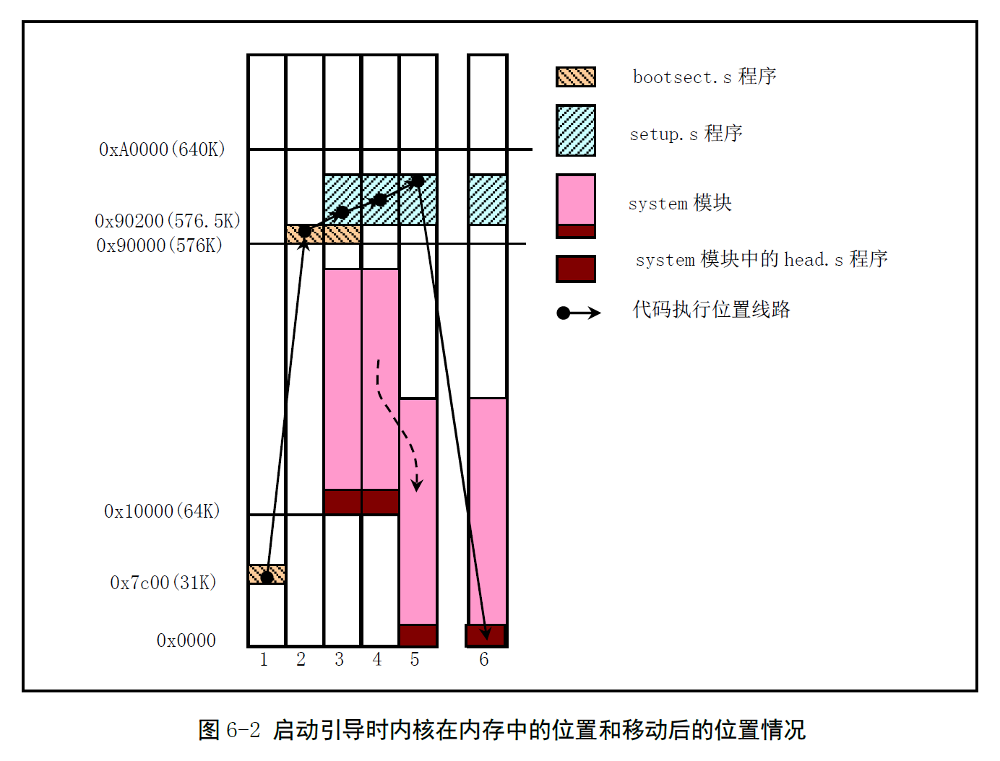
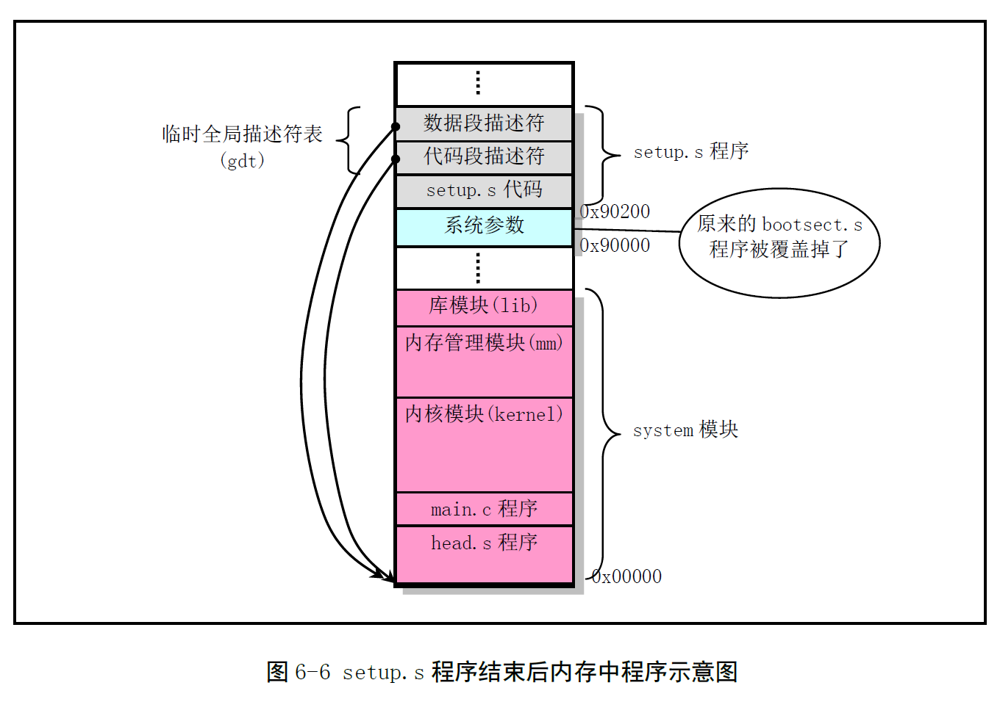
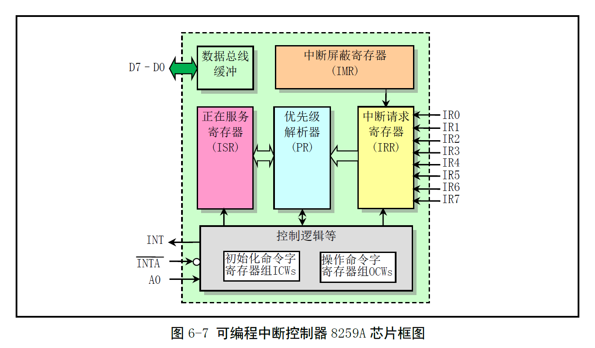
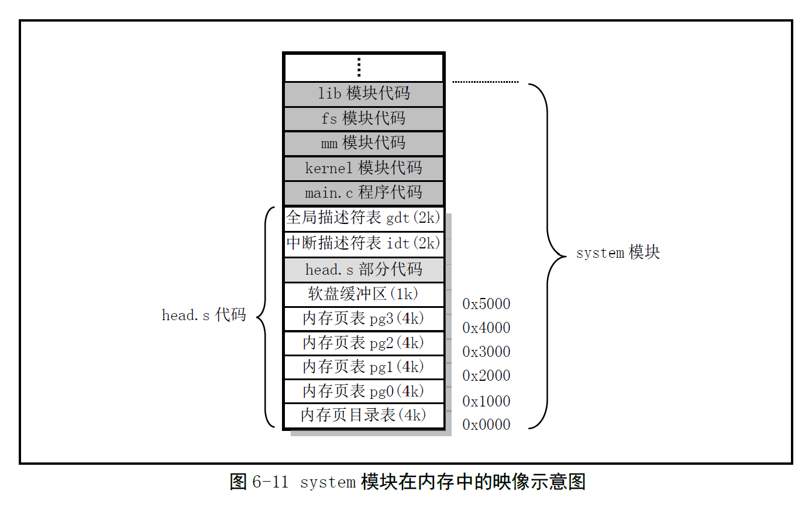
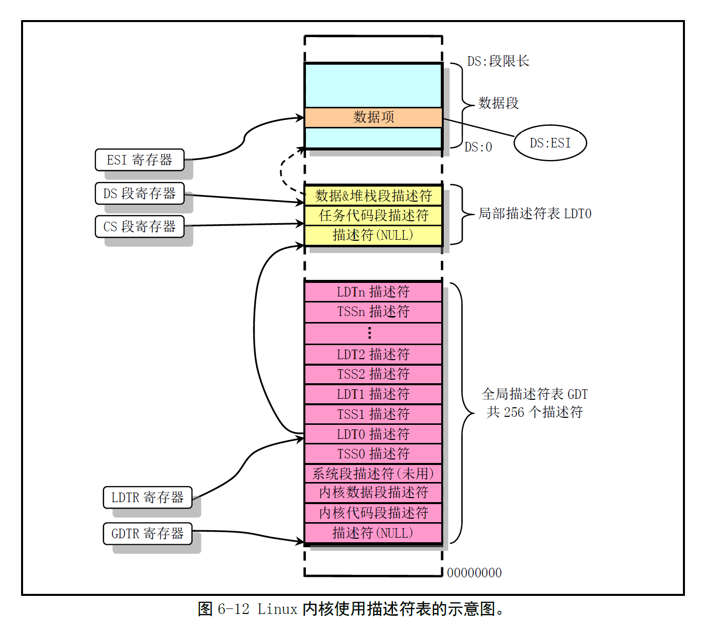

# Chapter 6 - 引导启动程序 (boot)

Created by : Mr Dk.

2019 / 08 / 10 22:27

Ningbo, Zhejiang, China

---

描述 `boot/` 目录下的三个汇编文件：

* `bootsect.S` 和 `setup.S` 是实地址模式下运行的 16-bit 代码
* `head.s` 运行在保护模式下

---

## 6.1 总体功能

PC 上电后，80X86 CPU 将进入实地址模式。执行程序的顺序如下：


从地址 `0xFFFF0` 处开始执行代码 (shadow?)：

* BIOS 执行硬件检测和诊断功能
* 在物理地址 0 处初始化 BIOS 中断向量
* 将可启动设备的第一个扇区读入内存 `0x7C00` 处，并跳转到这里执行引导

Linux 中的 `boot/bootsect.S` 保存在引导设备的第 1 扇区中 (512B)

* 由 BIOS 读取至内存 `0x7C00` (31KB) 处
* 执行时，将自身搬运到 `0x90000` (576KB) 处
* 将启动盘第 2、3、4、5 四个扇区 (2KB) 的 `boot/setup.S` 读取到 `0x90200` 处
* 将 `system` 模块读取到内存 `0x10000` (64KB) 处
* 跳转到 `setup.S` 中执行

`boot/setup.S` 程序保存在第 1 扇区之后的四个扇区中：

* 设备主机的某些特性，以及 VGA 卡的类型
* 将 `system` 模块移动到物理内存 0 处
* 做好保护模式的设置
* 进入保护模式，跳转到 `system` 模块开头的 `head.s` 中

`boot/head.s` (包括 system 模块) 从第 6 扇区开始存放：

* 重新设置 IDT、GDT
* 检测 A20 地址线、协处理器
* 设置分页处理机制
* 将预先放置在堆栈中的 `/init/main.c` 的入口地址弹出，并跳转到该地址运行



> 为什么要把各部分在内存中搬来搬去呢？
>
> 1. 为什么不把 `system` 模块直接加载到物理地址 0 处呢？在程序中，读取磁盘、配置机器参数等功能需要用到 BIOS 提供的中断向量，中断向量表位于 `0x0` 处开始的 1KB 空间内 😥，所以一开始不能覆盖；在 `boot/setup.S` 程序中，会对中断控制器进行重新设置，从而不再使用 BIOS 中断向量。
> 2. 为什么之后又要把 `system` 模块加载到物理地址 0 处呢？从 0 开始对于初始化来说岂不是更方便嘛 😒。

另外，完整的 Linux 系统还需要一个 **根文件系统 (Root file-system)** 的支持。通常位于另一个存储介质 (分区) 上，在 `boot/bootsect.S` 中指定根文件系统所在的默认设备块号和 swap 的外部设备号。

```assembly
# 语句从地址 506 (0x1FA) 开始
# swap 空间的设备号为 506、507 两字节
# 根文件系统的设备号为 508、509 两字节
# 第 510、511 两字节为有效引导扇区标志，由 BIOS 加载引导扇区时识别
.org 506
swap_dev:
    .word SWAP_DEV
root_dev:
    .word ROOT_DEV
boot_flag:
    .word 0xAA55
```

---

## 6.2 bootsect.S 程序

### 6.2.1 功能描述

`bootsetc.S` 程序驻留在磁盘的第 1 扇区中 (512B)。在 PC 加电，BIOS 自检后，BIOS 会把该扇区代码加载到 `0x7c00` 处并开始执行：

* 在该程序中，会将自身移动到 `0x90000` 处
* 并将从第 2 扇区开始的 4 个扇区的 `setup.S` 加载到随后的部分 `0x90200` 处，使用 BIOS 中断 `0x13`
* 取出磁盘参数表中当前启动引导盘的参数，使用 BIOS 中断 `0x13` 功能 8
* 在屏幕上显示 `Loading system...` 字符串，使用 BIOS `INT 0x10` 的功能 `0x03` 和 `0x13`
* 将磁盘上 `setup.S` 之后的 `system` 模块加载到内存 `0x10000` 处 (64KB 位置)
* 确定根文件系统的设备号，取 508、509 字节并判断是否被定义
* 长跳转到 `setup` 程序的入口处

### 6.2.2 代码注释

> 汇编不太有意思。。。 😑

### 6.2.3 其它信息

#### 6.2.3.1 Linux 0.12 硬盘设备号

Linux 系统中通过设备号来使用各种设备。设备号包含两个字节：

* 第一字节为主设备号，指定了设备种类
* 第二字节为次设备号，指定了具体的设备对象

| 主设备号 | 设备种类   |
| -------- | ---------- |
| 1        | 内存       |
| 2        | 磁盘       |
| 3        | 硬盘       |
| 4        | ttyx       |
| 5        | tty        |
| 6        | 并行接口   |
| 7        | 非命名管道 |

#### 6.2.3.2 从硬盘启动系统

如果想从硬盘启动，则需要使用多 OS 引导程序来引导加载系统：

* Shoelace
* LILO
* Grub
* ...

此时，`bootsect.S` 所执行的操作将由这些程序完成，该文件就不会被执行了。通常，内核映像文件 image 会存放在硬盘某个活动分区的根文件系统中。因此引导扇区程序需要能够 **识别** 并 **访问** 根文件系统，从中读取 image。过程：

1. 可启动硬盘的第 1 扇区 (主引导记录 MBR) 被 BIOS 加载到 `0x7c00` 并执行
2. 该程序将自己移动到 `0x600` 处，并根据 MBR 中的分区表指明的活动分区中的 第 1 扇区 (引导扇区) 加载到 `0x7c00` 处，然后开始执行

---

## 6.3 setup.S 程序

### 6.3.1 功能描述

首先，利用 BIOS 的中断读取系统数据，并将这些数据保存到从 `0x90000` 开始的位置。覆盖掉 bootsect 程序所在的地方，这些参数将被内核中的相关程序使用。接下来，将 `system` 模块从 `0x10000-0x8ffff` 整块向下移动到 `0x00000` 处，再加载 IDTR 和 GDTR。

> GDT 是临时的？

开启 A20 地址线，为了能够访问 1M 以上的地址空间。重新设置两个中断控制芯片 8259A，放置在 Intel 的保留中断之后，即 `INT 0x20 - 0x2f`。最后设置 CPU 的 CR0 寄存器，进入 32-bit 保护模式，跳转到 `system` 模块最前面的 `head.s` 继续运行 (`0x00000`)。

> 进入保护模式之前，不对任何寄存器进行设置，只是简单地跳转到绝对地址 0x00000 处。

### 6.3.2 代码注释

### 6.3.3 其它信息

#### 6.3.3.1 当前内存映像



此时临时的 GDT 表总有三个描述符：

* 第一个描述符为 NULL
* 另外两个分别是代码段描述符和数据段描述符，指向 `system` 模块起始处

因此，在进入保护模式后：

```assembly
mov ax, 0x0001 # 保护模式 PE 位
lmsw ax
jmpi 0, 8
```

段选择符 8 - 0b 0000, 0000, 0000, 1000。使用 GDT 中的第二个段描述符，偏移为 0，即指向 `0x00000`。

#### 6.3.3.2 BIOS 视频中断 0x10

#### 6.3.3.3 硬盘基本参数表 (INT 0x41)

#### 6.3.3.4 A20 地址线问题

一开始的 8088 CPU 只有 20 位地址线 (A0 - A19)，CPU 最多可寻址 1MB 的内存范围。最高可寻址处是 `0xffff:0xffff`，即 `0x10ffef`。对于其中超出 1MB 的内存地址，默认环绕寻址 `0x00000 - 0x0ffef`。

新的 CPU 有了更多的地址线，但部分程序已经被设计成利用这种环绕寻址来进行工作。为了兼容，IBM 使用一个开关来开启或禁止环绕寻址，即 A20 信号：若 A20 为 0，则 20-bit 以上的地址都被清除，实现兼容；默认条件下 A20 是禁止的。因此，32-bit 机器的 OS 必须设法启用它。

#### 6.3.3.5 8259A 中断控制器的编程方法



中断请求寄存器 IRR 用于保存所有引脚的中断请求，共 8-bit；中断屏蔽寄存器 IMR 用于屏蔽对应的中断位，也是 8-bit。优先级解析器 PR 选通 IRR 中最高优先级的中断请求到正在服务寄存器 ISR，ISR 中保存正在接受服务的中断请求。

控制逻辑用于接受 CPU 产生的两类命令：

* 初始化命令字 ICW
* 写入操作命令字 OCW：随时管理和控制 8259A 的工作方式

工作过程：

1. 在选出最高优先级的中断请求后，向 CPU 发出 INT 信号
2. CPU 执行完当前的最后一条指令后，向 8259A 返回 INTA 响应中断信号
3. 8259A 接收到 INTA 后，将中断保存在 ISR 中，IRR 中对应 bit 被复位
4. CPU 向 8259A 发送第二个 INTA 信号，8259A 将中断号发送到数据总线上
5. 如果 8259A 使用的是自动结束中断 AEOI (Automatic End of Interrupt) 方式，那么第 2 个 INTA 信号结束后，ISR 中的 bit 位被复位；否则，中断服务程序结束后，CPU 发送 EOI 命令表示中断结束，复位 ISR 中的 bit 位

---

## 6.4 head.s 程序

### 6.4.1 功能描述

`head.s` 被编译成目标文件后，与内核其它程序一起被链接为 `system` 模块，并位于 `system` 模块的最前面开始的部分。从此程序开始，内核完全运行在了保护模式下。

这段程序位于内存 `0x00000` 处，首先加载各个数据段寄存器，重新设置了 IDT 表，共 256 项，使每个项均指向一个哑中断子程序 `ignore_int` (初始化)。如果发生了一个没有重新设置过的中断，就会显示 `Unknown interrupt`。内核会在接下来的初始化过程中，陆续重新设置需要使用到的中断描述符。

重新设置了 GDT 表，将 GDT 表放在内存内核代码中比较合理的地方。检测 A20 地址线是否已开启，检测 PC 中是否含有数学协处理器芯片，设置分页管理机制：在 `0x00000` 处放置页目录表 (覆盖已经执行的 head.s)，紧随其后放置可寻址 16MB 的 4 个页表。

最后，利用 RET 指令将预先放置在堆栈中的 `init/main.c` 程序的入口地址弹出，相当于模拟 `main.c` 调用了一个子函数，因此返回到 `main.c` 的地址被保存在堆栈中。执行 RET 后，该返回地址被弹出 - 返回地址是 `main.c` 的第一条指令。

开始执行 `main()` 程序。

### 6.4.2 代码注释

分页准备部分：

```assembly
# 在物理地址 0x0 处开始放置页目录表和页表，共 5 页
# 4 页页表为内核专用，一一映射线性地址起始 16MB 空间范围到物理地址上
.align 2
setup_paging:
    movl $1024*5, %ecx # 对 5 页内存清零
    xorl %eax, %eax
    xorl %edi, %edi
    cld;rep;stosl
    
# 设置页目录表中的项
# 4 个页表，因此只需要设置 4 个页目录项，4B 一项
    movl $pg0+7, _pg_dir
    movl $pg1+7, _pg_dir+4
    movl $pg2+7, _pg_dir+8
    movl $pg3+7, _pg_dir+12
    
# 填写 4 个页表中所有项的内容，共 4096 项
# 即映射物理内存 4096 × 4KB = 16MB
# 从最后一个页表的最后一项开始倒退顺序填写
    movl $pg3+4092, %edi # 最后一页最后一项
    movl $0xfff007, %eax
    std
1:  stosl
    subl $0x1000, %eax
    jge 1b # 小于 0 则填写完毕
    
# 设置页目录表基地址寄存器 CR3，指向页目录表
# 设置 CR0 中的 PG 标志，开启分页处理
    xorl %eax, %eax
    movl %eax, %cr3
    movl %cr0, %eax
    orl $0x80000000, %eax
    movl %eax, %cr0
    ret
# 改变 PG 标志后需要使用转移指令刷新指令预取队列
# 同时弹出 main() 的地址，并跳转到 main() 中运行
```

### 6.4.3 其它信息

#### 6.4.3.1 程序执行结束后的内存映像



#### 6.4.3.2 Intel 32 位保护运行机制

32 位保护模式下的内存寻址方式需要拐个弯，使用描述符表中的描述符和内存页管理来确定。当 CPU 运行在保护模式下，某时刻 GDT 和 IDT 分别只能有一个，LDT 的个数由 GDT 表中的未用项数和所设计的具体系统确定。LDT 由 GDT 中的一个描述符来指定，内核对于每个任务使用一个 LDT。

每个任务在 GDT 中占有两个描述符项：

* LDT 的描述符 - 每个 LDT 中含有三个描述符：
  * 第一个不用
  * 第二个是任务代码段描述符
  * 第三个是任务数据段和堆栈段的描述符
* TSS 的描述符

寻址时的具体过程如图：



* 由 GDTR 找到 GDT，根据偏移量找到 LDT 描述符，将 LDT 基地址载入 LDTR (并缓存)
* LDTR 指向 LDT 表对应的段，其中 CS 段寄存器指向其中的任务代码段描述符，DS 段寄存器指向其中的任务数据 & 堆栈段描述符
* 访问数据时，根据 LDT 中的段描述符找到对应的段基址，加上偏移量后形成最终的线性地址

#### 6.4.3.3 伪指令 align

在编译时指示编译器填充位置计数器 (指令计数器) 到一个指定的内存边界处。

