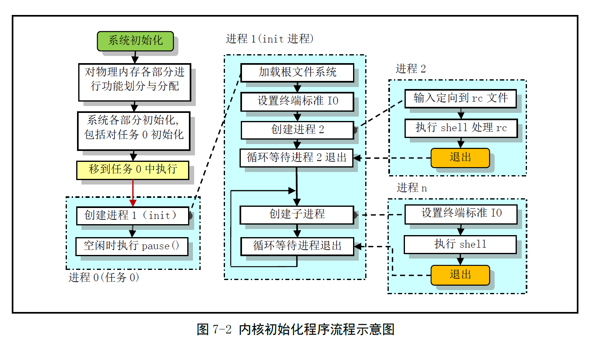

# Chapter 7 - 初始化程序 (init)

Created by : Mr Dk.

2019 / 08 / 13 21:21

Ningbo, Zhejiang, China

---

包含了内核初始化的所有操作

---

## 7.1 main.c 程序

### 7.1.1 功能描述

利用 `setup.s` 程序取得的机器参数

设置根文件设备号和内存全局变量

系统的内存被划分为：

* 内核程序
* 高速缓冲 (扣除显存和 BIOS) - 1KB 为一个数据块单位
* 虚拟盘
* 主内存区 - 4KB 为一个内存页单位

内核程序可以自由访问高速缓冲

但只能通过内存管理 mm 才能使用主内存区

之后，内核进行各方面的硬件初始化：

* 陷阱门 (中断)
* 块设备
* 字符设备
* tty

并人工设置第一个任务 task 0

开中断，切换到任务 0 运行

内核通过任务 0 创建几个最初的任务

运行 shell，并开始正常运行

#### 7.1.1.1 内核初始化程序流程



`main.c` 程序首先确定如何分配和使用物理内存

然后调用内核各部分的初始化函数：

* 内存管理
* 中断处理
* 块设备
* 字符设备
* 进程管理
* 硬盘和软盘硬件

此后，程序设置堆栈，将自己手工移到任务 0 中

* 特权级 0 → 3

使用 `fork()` 创建出进程 1 (init)

之后，进程 0 在系统空闲时被调度执行

* idle 进程
* 仅执行 `pause()` 系统调用，然后重新调用调度函数

进程 1 进行进一步的初始化工作

并在其中调用 `init()` 函数，主要工作包含：

1. 安装根文件系统
   * 使用 `setup()` 系统调用，收集硬盘分区表信息，并安装根文件系统
   * 如果有虚拟盘，则尝试把根文件系统加载到虚拟盘区中
2. 显示系统信息
   * 打开一个终端设备 tty0，在终端上显示一些系统信息
3. 执行资源配置文件
   * 新建进程 2
   * 调用 `/bin/sh` 程序运行 `/etc/rc` 中的命令
   * 执行完成后，立即退出，进程 2 结束
4. 执行登录 shell 命令
   * 进程 1 等待上述进程 2 的结束后，进入一个死循环中
   * 在循环中，进程 1 再度 fork 进程 2，以登录 shell 的方式 (cmd 参数不同) 再次执行 `/bin/sh`
   * 进程 1 继续等待进程 2 结束，系统正式开始运行
   * 如果用户在进程 2 中退出
     * 显示当前登录 shell 退出的信息
     * 死循环再次重复 fork shell 的过程

#### 7.1.1.2 初始用户栈的操作

由于 `fork()` 系统调用完全复制了父进程的代码段和数据段

首次使用 `fork()` 创建 init 进程时

应当确保新进程用户态堆栈中没有进程 0 的多余信息

因此要求进程 0 在创建首个进程 1 之前不使用用户堆栈

* 即，任务 0 不要调用函数
* 任务 0 中的 `fork()` 不能以函数形式调用

通过使用 gcc 的内联函数解决 - `static inline _syscall0(int, fork)`

* `_syscall0` 是 `unistd.h` 中的内嵌宏，以嵌入汇编的形式调用 `INT 0x80`

将宏展开后：

```c
static inline int fork(void)
{
    long __res;
    __asm__ volatile ("int $0x80": "=a"(__res) : "0"(__NR_fork));
    if (__res >= 0)
        return (int) __res;
    errno = -__res;
    return -1;
}
```

内联能够使上述函数体被直接插入到调用 `fork()` 的代码处

从而执行 `fork()` 不会引起函数调用

执行 `INT` 指令时不可避免会使用到堆栈

* 但是使用的是内核态堆栈
* 每个任务都有独立的内核态堆栈，不影响用户栈

进程 0 和进程 1 实际上使用着内核代码区内相同的代码和数据物理页面

只是执行的代码不在一处

因此也使用着相同的用户堆栈区

* 进程 0 的页表项属性为 __可读写__
* 进程 1 的页表项属性被设置为 __只读__

进程 1 中的出入栈操作会导致 __页面写保护异常__

* 内存管理模块会为进程 1 在主内存区中分配页面
* 并将任务 0 的用户栈中的内容复制到新页上
* 自此，任务 1 的用户态栈开始有自己独立的内存页面

另外，由于内核随机调度进程

可能任务 0 在 `fork()` 出任务 1 后，随即先运行任务 0

* 因此，任务 0 随后的 `pause()` 也必须使用内联函数的形式创建
* 避免任务 0 在任务 1 之前使用用户堆栈

当进程执行过 `execve()` 后

代码和数据区会位于主内存区中

* 可使用 Copy on Write 技术来处理进程的创建和执行

### 7.1.2 代码注释

在内核空间中 fork 是没有 Copy on Write 的 (任务 1)

任务 1 再次 fork 并执行 `execve()` 后，被加载程序已不属于内核空间，可以使用写时复制了

```c
/*
 * linux/init/main.c
 *
 * (C) 1991 Linus Torvalds
*/

#define __LIBRARY__
#include <unistd.h>
#include <time.h>

/*
 * we need this inline - forking from kernel space will result
 * in NO COPY ON WRITE (!!!), until an execve is executed. This
 * is no problem, but for the stack. This is handled by not letting
 * main() use the stack at all after fork(). Thus, no function
 * calls - which means inline code for fork too, as otherwise we
 * would use the stack upon exit from 'fork()'.
 *
 * Actually only pause and fork are needed inline, so that there
 * won't be any messing with the stack from main(), but we define
 * some others too.
*/
```

声明需要使用的内联系统调用：

```c
static inline _syscall0(int, fork); // fork()
static inline _syscall0(int, pause); // pause()，暂停进程执行，直到收到一个信号
static inline _syscall1(int, setup, void *BIOS); // 仅用于初始化
static inline _syscall0(int, sync); // 更新文件系统
```

在内核引导期间由 `setup.s` 程序设置的系统参数：

```c
// 1MB 后的扩展内存大小 (KB)
#define EXT_MEM_K (*(unsigned short *)0x90002)
// 选定的控制台屏幕行、列数
#define CON_ROWS ((*(unsigned short *)0x9000e) & 0xff)
#define CON_COLS (((*(unsigned short *)0x9000e) & 0xff00) >> 8)
// 硬盘参数表 32-bit 内容
#define DRIVE_INFO (*(struct drive_info *)0x90080)
// 根文件系统所在设备号
#define ORIG_ROOT_DEV (*(unsigned short *)0x901FC)
// 交换文件所在设备号
#define ORIG_SWAP_DEV (*(unsigned short *)0x901FA)
```

内核时间初始化 - 从 CMOS 中获取实时钟信息：

* `outb_p`、`inb_p` - 端口输入输出宏
  * 0x70 - 写地址端口号
  * 0x71 - 读数据端口号
  * 0x80 | addr - CMOS 内存地址

```c
#define CMOS_READ(addr) ({ \
    outb_p(0x80 | addr, 0x70); \
    inb_p(0x71); \
})

#define BCD_TO_BIN(val) ((val) = ((val) & 15) + ((val) >> 4) * 10)

static void time_init(void)
{
    struct tm time; // defined in include/time.h
    
    // CMOS 访问速度较慢
    // 以下循环保证 CMOS 误差在 1s 以内
    do {
        time.tm_sec = CMOS_READ(0);
        time.tm_min = CMOS_READ(2);
        time.tm_hour = CMOS_READ(4);
        time.tm_mday = CMOS_READ(7);
        time.tm_mon = CMOS_READ(8);
        time.tm_year = CMOS_READ(9);
    } while (time.tm_sec != CMOS_READ(0)); // 秒值发生变化就重新读取
    BCD_TO_BIN(time.tm_sec);
    BCD_TO_BIN(time.tm_min);
    BCD_TO_BIN(time.tm_hour);
    BCD_TO_BIN(time.tm_mday);
    BCD_TO_BIN(time.tm_mon);
    BCD_TO_BIN(time.tm_year);
    time.tm_mon--;
    // startup_time 为全局变量
    // kernel_mktime 定义在 kernel/mktime.c
    // 计算 1970.1.1 00:00:00 至现在的秒数
    startup_time = kernel_mktime(&time);
}
```

接下来定义了只有在本程序中才能被访问的静态变量：

```c
static long memory_end; // 机器具有的物理内存容量 (字节)
static long buffer_memory_end = 0; // 高速缓冲区末端地址
static long main_memory_start = 0; // 主内存区开始位置
static char term[32]; // 终端设置字符串 (环境参数)

// 读取并执行 /etc/rc 时使用的命令行参数和环境参数
static char * argv_rc[] = { "/bin/sh", NULL };
static char * envp_rc[] = { "HOME=/", NULL, NULL };

// 运行登录 shell 时所使用的命令行参数和环境参数
static char * argv[] = { "-/bin/sh", NULL };
static char * envp[] = { "HOME=/", NULL, NULL };

// 硬盘参数表信息
static drive_info { char dummy[32]; } drive_info;
```

进入主函数 (此时中断仍被关闭)：

```c
void main(void)
{
    // 保存根文件系统设备号、交换文件设备号
    // 获取并设置 TERM，作为 shell 的环境变量
    // 复制硬盘参数表
    ROOT_DEV = ORIG_ROOT_DEV; // ROOT_DEV defined in fs/super.c
    SWAP_DEV = ORIG_SWAP_DEV; // SWAP_DEV defined in mm/swap.c
    sprintf(term, "TERM=con%dx%d", CON_COLS, CON_ROWS); // 控制台行列数
    envp[1] = term;
    envp_rc[1] = term;
    drive_info = DRIVE_INFO; // 硬盘参数表 32-bit 内容
    
    // 根据机器物理内存容量
    // 设置高速缓冲区和主内存区的位置和范围
    memory_end = (1 << 20) + (EXT_MEM_K << 10); // 1MB + 扩展 (KB) × 1024
    memory_end &= 0xfffff000; // 忽略不到 4KB(一页) 的内存
    if (memory_end > 16*1024*1024)
        memory_end = 16*1024*1024; // 内存量超过 16MB，则按 16MB 计
    if (memory_end > 12*1024*1024)
        buffer_memory_end = 4*1024*1024; // 内存 > 12MB，缓冲区 = 末端 4MB
    else if (memory_end > 6*1024*1024)
        buffer_memory_end = 2*1024*1024; // 12MB ≥ 内存 > 6MB，缓冲区 = 末端 2MB
    else
        buffer_memory_end = 1*1024*1024; // 否则缓冲区为末端 1MB
    main_memory_start = buffer_memory_end;
    
    //如果 Makefile 中定义了虚拟盘，则初始化虚拟盘，主内存区减小
#ifdef RAMDIST
    main_memory_start += rd_init(main_memory_start, RAMDISK*1024);
#endif
    
    // 内核进行所有方面的初始化操作
    // 函数的定义分布在各个部分
    mem_init(main_memory_start, memory_end); // 主内存区初始化 (mm/memory.c)
    trap_init(); // 陷阱门(硬件中断向量)初始化 (kernel/traps.c)
    blk_dev_init(); // 块设备初始化 (blk_drv/ll_rw_blk.c)
    chr_dev_init(); // 字符设备初始化 (chr_drv/tty_io.c)
    tty_init(); // tty 初始化 (chr_drv/tty_io.c)
    time_init(); // 设置开机启动时间，函数定义如上
    sched_init(); // 调度程序初始化 (kernel/sched.c)
    buffer_init(buffer_memory_end); // 缓冲管理初始化 (fs/buffer.c)
    hd_init(); // 硬盘初始化 (blk_drv/hd.c)
    floppy_init(); // 软驱初始化 (blk_drv/floppy.c)
    
    sti(); // 开中断
    
    // 在堆栈中设置参数，利用 ret 指令启动任务 0 运行在用户态
    move_to_user_mode();
    if (!fork()) { // 建立任务 1
        init(); // 在任务 1 中运行
    }
    
    // 以下由任务 0 运行
    for (;;)
        __asm__("int $0x80::"a(__NR_pause):"ax"); // 执行系统调用 pause()
}
```

进程 1 开始运行的 `init()` 函数如下：

* 对第一个将要执行的 shell 的环境进行初始化
* 以登录 shell 的方式重新加载 shell

```c
void init(void)
{
    int pid, i;
    
    // 系统调用
    // 读取硬盘参数和分区表，加载虚拟盘，安装根文件系统设备
    setup((void *) &drive_info);
    
    // 以读写访问方式打开设备 "dev/tty0"
    (void) open("dev/tty1", O_RDWR, 0); // 打开 stdin(0)
    (void) dup(0); // 复制句柄，stdout(1)
    (void) dup(0); // 复制句柄，stderr(2)
    
    // 打印缓冲区块数(1024B)和总字节数
    // 打印主内存区空闲内存字节数
    printf("%d buffers = %d bytes buffer space\n\r", NR_BUFFERS, NR_BUFFERS * BLOCK_SIZE);
    printf("Free mem: %d bytes\n\r", memory_end - main_memory_start);
    
    // 创建子进程 2，运行 /etc/rc 中的命令
    // 运行完毕后立刻退出，进程 1 等待进程 2 退出
    if (!(pid = fork())) {
        // 进程 2
        // 关闭句柄 0 并立刻打开 /etc/rc
        // 相当于将 stdin 重定向到 /etc/rc
        close(0);
        if (open("/etc/rc", O_RDONLY, 0))
            _exit(1); // 文件打开失败
        // shell 从 stdin 中读取 /etc/rc 中的命令并执行
        execve("/bin/sh", argv_rc, envp_rc);
        _exit(2); // execve 执行失败
    }
    
    // 进程 1 等待进程 2 结束
    if (pid > 0) {
        while (pid != wait(&i)) // 返回值应当是子进程的进程号
    }
    
    // 死循环
    // 再次创建子进程，用于登录 shell
    // 死循环保证永远有一个 shell 正在处于交互状态
    while (1) {
        if ((pid = fork()) < 0) {
            printf("Fork failed in init \r\n");
            continue;
        }
        if (!pid) { // pid == 0，新的子进程
            close(0);close(1);close(2); // 归还遗留句柄
            setsid();
            (void) open("/dev/tty1", O_RDWR, 0); // stdin
            (void) dup(0); // stdout
            (void) dup(1); // stderr
            _exit(execve("/bin/sh", argv, envp)); // 子进程返回码
        }
        while (1) // 等待子进程结束
            if (pid == wait(&i))
                break;
        printf("\n\rchild %d died with code %04x\n\r", pid, i);
        sync(); // 同步操作，刷新缓冲区
    }
    _exit(0); // sys_exit 系统调用，不是普通函数库中的 exit()
}
```

### 7.1.3 其它信息

#### 7.1.3.1 CMOS 信息

CMOS 内存是由电池供电的 64/128 字节内存块

CMOS 的地址空间位于基本地址空间之外

需要通过 IN/OUT 指令访问

#### 7.1.3.2 调用 fork() 创建新进程

fork() 系统调用复制当前进程

在进程表中创建一个与原进程几乎完全一样的新表项

执行同样的代码

但新进程拥有自己的数据空间和环境参数

新进程主要使用 `exec()` 函数族去执行其它不同的程序

在 fork 调用返回位置处：

* 父进程恢复执行，fork 的返回值时子进程的 pid
* 子进程刚开始执行，fork 的返回值是 0

程序执行完成后，可以调用 `exit()` 来退出执行

* 终止并释放进程占用的内核资源

父进程使用 `wait()` 查看或等待子进程退出，并获取被终止进程的退出状态信息

#### 7.1.3.3 关于会话期 (session) 的概念

一个进程可以通过 `fork()` 创建一个或多个子进程

这些进程可以构成进程组

每个进程组都有一个唯一的进程组标识号 gid

每个进程组有一个称为组长的进程，组长进程的 pid == gid

进程可以通过调用 `setpgid()` 来参加一个现有的进程组或创建一个新的进程组

通常用于终止进程组中的所有进程

会话期 (Session) 是一个或多个进程组的集合

用户登录后执行的所有程序都属于一个会话期

登录 shell 是会话期首进程，使用的终端就是会话期的控制终端

* 会话期首进程也被称为控制进程

退出登录时，所有属于该会话期的进程都将被终止

`setsid()` 用于建立一个新的会话期，通常由环境初始化程序调用

一个会话期中的进程组被分为：

* 一个前台进程组 - 会话期中拥有控制终端的进程组
* 一个或几个后台进程组 - 其它进程组

控制终端对应于 `/dev/tty` 设备文件

* 要访问控制终端，可直接对 `/dev/tty` 文件进行读写操作

---

## 7.2 环境初始化工作

实际可用的系统：

* 程序根据 `/etc` 中的配置信息，对系统中支持的每个终端设备创建子进程
* 在子进程中运行终端初始化程序 agetty，该程序在终端上显示 `login:`
* 用户输入用户名后，getty 被替换为 login 程序
* login 程序验证用户输入的口令后，再被替换为 shell 程序，进入工作界面

init 进程根据 `/etc/rc` 和 `/etc/inittab`，为每个允许登录的终端设备创建子进程

* 每个子进程中运行 agetty 程序，init 进程调用 `wait()`，等待子进程结束
* 根据 `wait()` 返回的 pid 得知哪个终端对应的子进程结束
* 为相应终端设备再次创建一个新的子进程，并重新执行 getty 程序
* 每个被允许的终端设备始终有一个对应的进程为其等待处理

getty 程序打开并初始化一个 tty 窗口

* 显示提示信息，等待用户键入用户名
* 若 `/etc/issue` 文本存在，则会先显示其中的文本信息

login 程序根据用户输入的用户名

* 从口令文件 passwd 中取得对应用户登录项
* 调用 `getpass()` 显示输入密码的提示信息
* 读取用户键入的密码，使用加密算法对密码进行加密，与口令文件用户项中的 `pw_passwd` 字段比较
* 若失败几次，则 login 程序以错误码 1 退出，登录失败
* 若登录成功，login 会把当前工作目录修改成口令文件中指定的工作目录
* 将对终端设备的访问权限修改为用户可读写和组写
* 设置进程的 gid
* 初始化环境变量信息
  * 起始目录 HOME
  * shell 程序 SHELL
  * 用户名 USER 和 LOGNAME
  * 系统执行程序默认路径序列 PATH
* 显示 `/etc/motd` 文件中的文本信息
* 改变登录用户的 uid，执行口令文件中该用户项指定的 shell 程序

执行 shell 时，如果 `argv[0]` 的第一个字符是 `-`

表示该 shell 是作为一个登录 shell 被执行，因此会执行某些与登录过程相应的操作

首先从 `/etc/profile` 以及 `.profile` 文件中读取命令并执行

将环境变量 `ENV` 中指定的文件读取并执行

* 因此应当把每次登录都要执行的命令放在 `.profile` 中
* 把每次运行 shell 都要执行的命令放在 `ENV` 指定的文件中

---

## Summary

可以 😀 看 C 代码比看汇编舒服多了

内核初始化的过程明白了些

接下来好像就要真正进入内核了耶 😆

---

