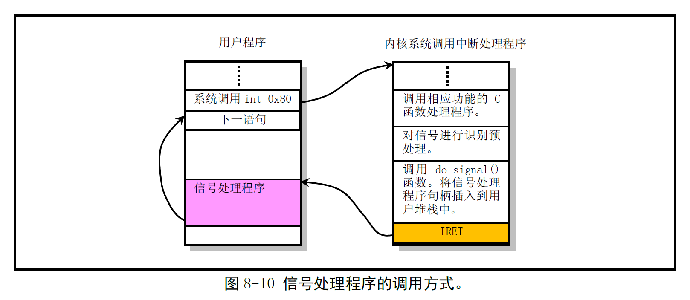
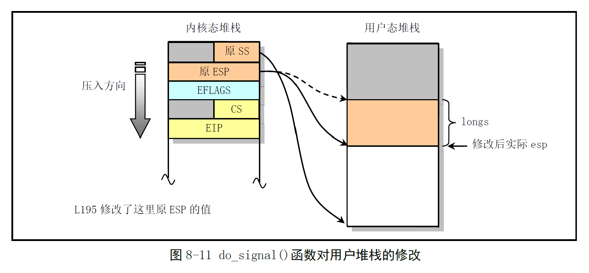
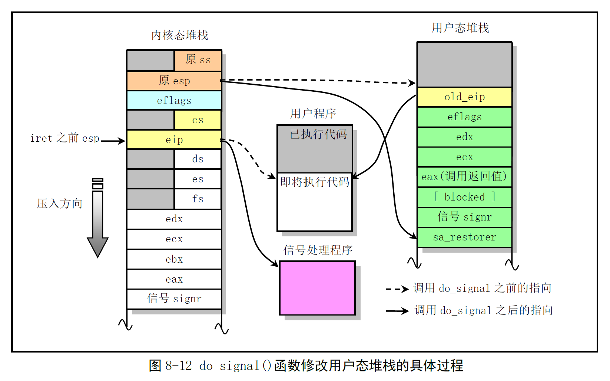

# Chapter 8.7 - signal.c 程序

Created by : Mr Dk.

2019 / 08 / 20 11:58

Ningbo, Zhejiang, China

---

## 8.7 signal.c 程序

### 8.7.1 功能描述

涉及内核中所有有关信号处理的函数。

UNIX 类系统中，信号是一种软件中断处理机制，异步处理事件。信号是一个整数值，除了指明信号类别，不携带任何信息。早期 UNIX 内核中信号处理方法并不是那么的可靠，可能导致信号丢失。POSIX 提供了一种可靠处理信号的方法。为保持兼容性，Linux 内核同时提供了两种处理信号的方法。

#### 8.7.1.1 Linux 中的信号

用一个 `unsigned long` (32-bit) 的 bitmap 来表示不同的信号

* 系统中最多可以有 32 个不同的信号
* 其中 20 种是 POSIX.1 标准中规定的信号
* 另两种是 Linux 专用信号 `SIGUNUSED` (未定义) 和 `SIGSTKFLT` (堆栈错)

进程收到信号时，可以有三种处理方式：

* 忽略信号：但 `SIGKILL` 和 `SIGSTOP` 忽略不掉
* 捕获信号：告诉内核，在指定的信号发生时，调用自定义的信号处理函数
* 默认操作：由系统响应的默认信号处理程序进行处理

#### 8.7.1.2 信号处理的实现

一大堆相关的系统调用：

* `sys_ssetmake()`：设置信号屏蔽码
* `sys_sgetmask()`：获取信号屏蔽码
* `sys_signal()`：信号处理，即传统的 `signal()`
* `sys_sigaction()`：可靠的信号处理函数 `sigaction()`

系统调用中断处理程序中，处理信号的程序 `do_signal()`。以上，`signal()` 和 `sigaction()` 的功能比较类似，都用于更改信号的原处理句柄。`signal()` 是内核处理信号的传统方式，在某些特殊时刻会导致信号丢失。这两个系统调用会在进程 PCB 的 `sigaction[]` 结构体数组中，将自定义信号处理函数的指针和相关属性记录到结构体中。当内核 **退出** 系统调用和某些中断过程时，会检测当前进程是否收到信号。若收到了信号，那么就会根据 `sigaction[]` 中对应的结构项执行信号处理服务程序。

##### signal() 函数

两个参数：

* 要捕获的信号值：`int signr`
* 新的信号处理函数指针：`void (*handler)(int)`

函数指针可以是用户定义的信号处理函数，也可以是内核提供的特定函数指针。

```c
#define SIG_DFL ((void (*)(int))0) // 默认操作
#define SIG_IGN ((void (*)(int))1) // 忽略
```

`0` 和 `1` 是实际程序中不可能出现的函数地址，所以 `signal()` 函数就可以根据这两个值来决定对信号进行默认处理或忽略。`SIGKILL` 和 `SIGSTOP` 不能被忽略。

程序刚开始时，系统设置所有的信号处理方式为 `SIG_DFL` 或 `SIG_IGN`。另外，当程序 fork 一个子进程时，子进程会 **继承** 父进程的信号处理方式 (屏蔽码)。在父进程对信号的设置和处理方式，在子进程中同样有效。

`signal()` 函数不可靠的原因：信号发生后，系统会将信号处理函数重新设置为默认值。因此，在自定义的信号处理函数中，首先需要再一次设置信号处理函数。在此之前，如果又来了一个信号，将会被丢失。

```c
void sig_handler(int signr)
{
    // 信号发生，调用信号处理函数
    // 系统将该信号的处理函数重置为默认
    // 如果想要继续捕获该信号，需要再一次设置处理函数
    signal(SIGINT, sig_handler); // 在此语句之前，若再来一个信号，将会被丢失
}

main()
{
    signal(SIGINT, sig_handler); // 第一次设置信号处理函数
    ...
}
```

##### sigaction() 函数

可靠地内核处理信号机制。

```c
int sigaction(int sig, struct sigaction *act, struct sigaction *oldact);
```

很显然，就是将 act 对应的结构放置到进程 PCB 的 sigaction[] 中，并返回数组中原来的 sigaction 结构。该结构定义如下：

```c
struct sigaction {
    void (*sa_handler)(int);
    sigset_t sa_mask;
    int sa_flags;
    void (*sa_restorer)(void);
}
```

其中，sa_mask 是一个暂时性的信号屏蔽集合？

* 在 sa_handler 被调用前，sa_mask 被加入进程 PCB 的信号屏蔽集合中
* 在 sa_handler 被调用后，系统会恢复进程原来的信号屏蔽 bitmap

在处理一指定信号期间，能确保阻塞同一个信号而不让其丢失，直到此次处理完毕？？？

一个信号被阻塞期间而多次发生时，通常只保存一个样例，即对于阻塞的多个同一信号，只会再调用一次信号处理句柄。修改了一个信号处理句柄后，除非再次更改，否则一直使用该处理句柄；而 `signal()` 函数会在处理句柄结束后，恢复成信号的默认处理句柄。sa_flags 用于指定处理信号的选项，改变信号处理的默认流程。

```c
#define SA_NOCLDSTOP 1
#define SA_INTERRUPT 0x20000000
#define SA_NO_MASK   0x40000000
#define SA_ONESHOT   0x80000000
```

sa_restorer 是一个函数指针，在编译链接时由 Libc 函数库提供。在信号处理函数结束后清理用户态堆栈，恢复系统调用返回值。

##### do_signal() 函数

在进程每次从系统调用中断、时钟中断等退出时，若进程已收到信号，则把信号的处理句柄插入到 **用户程序堆栈** 中。这样，中断返回后会立刻执行信号处理程序，再返回用户程序。处理过程如图所示：



如何把信号处理句柄塞进用户态堆栈呢？

* 函数首先处理两个默认信号句柄
* 若用户自定义了处理句柄
  * 将内核态堆栈中返回到原用户程序的 eip 指针保存为 old_eip
  * 将 eip 替换为自定义句柄的入口指针
  * 将内核态堆栈中的 esp 指针减小 - 使用户态堆栈向下扩展
  * 将内核态堆栈上的一些寄存器内容复制到用户态堆栈上
    * old_eip：使信号句柄执行完后可以返回用户程序继续执行
    * eax：本来存放着系统调用返回值，但在信号处理句柄中可能会使用到 eax - 所以将 eax 保存在堆栈上
    * edx、ecx、eflags 也需要被恢复
    * 可能有进程的阻塞码
    * 此外，信号处理函数还需要信号值 signr 作为参数



这样，从中断返回后，程序首先转移到信号处理句柄中执行。执行完毕后再返回到用户程序。

##### sa_restorer() 函数

由函数库提供，负责清理信号处理程序执行完毕后，恢复用户程序的寄存器值和系统调用返回值。

```assembly
.globl ____sig_restore
.globl ____masksig_restore
# 没有 blocked
____sig_restore:
    addl $4, %esp # 丢弃堆栈上的信号值 signr
    popl %eax
    popl %ecx
    popl %edx
    popfl
    ret
# 有 blocked
____masksig_restore:
    addl $4, %esp # 丢弃堆栈上的信号值 signr
    call ____ssetmask
    addl $4, %esp # 丢弃堆栈上的 blocked
    popl %eax
    popl $ecx
    popl %edx
    popfl
    ret
```

综上，`do_signal()` 执行完后，`sys_call.s` 将进程内核态堆栈上 eip 以下的值全部弹出。执行 IRET 指令后，弹出用户态堆栈信息，返回用户特权级执行程序。此时，eip 已经被改为信号处理句柄，所以立即执行信号处理程序。处理完后，通过 RET 指令，CPU 将控制权移交 `sa_restorer()`，该函数清理用户态堆栈，使堆栈看起来像没有运行过信号处理程序一样。完成后，再通过 RET 指令，弹出 old_eip，恢复原用户程序的执行。用户态堆栈的数据如下图所示：



### 8.7.1.3 进程挂起

该程序中还包含一个 `sys_sigsuspend()` 的系统调用实现函数

* 临时把进程的信号屏蔽码替换成参数中给定的集合
* 然后挂起进程，直到收到一个信号为止

```c
int sys_sigsuspend(int restart, unsigned long old_mask, unsigned long set);
```

restart 为重启标志：

* 0 - 当前的屏蔽码保存在 oldmask 中，阻塞信号，直到收到任何一个信号
* 非 0 - 从保存的 oldmask 中恢复进程的原屏蔽码

实际调用时，通过函数库中的形式调用：

```c
int sigsuspend(unsigned long set);
```

由库函数来维护前两个参数：

* 第一次调用系统调用时，restart 为 0，保存原来的 blocked 为 old_mask
* 第二次调用时，恢复进程保存在 old_mask 中的屏蔽码

#### 8.7.1.4 被信号中断的系统调用的重新启动

慢速系统调用。被阻塞期间，收到了一个信号。在处理信号时，引入了对某些中断系统调用重新启动的功能：

* `ioctl`、`read`、`write` 对低速设备操作时，才会被信号中断
* `wait` 和 `waitpid` 在捕捉到信号时总是会被中断

在 Linux 0.12 内核中，在 sigaction 结构体中可以设置是否重新启动被中断的系统调用：

* 如果设置 `SA_INTERRUPT` 标志
* 且信号不是 `SIGCONT`、`SIGSTOP`、`SIGTSTP`、`SIGTTIN` 和 `SIGTTOU`

那么在系统调用执行时，收到信号就会被中断，否则内核自动重新执行被中断的系统调用。在目前的 Linux 系统中，`SA_INTERRUPT` 已经弃置不用，使用意义相反的 `SA_RESTART`。

### 8.7.2 代码注释

#### 与信号屏蔽相关的系统调用

```c
// 获取当前任务的信号屏蔽 bitmap (signal-get-mask)
int sys_sgetmask()
{
    return current->blocked
}
```

```c
// 设置新的信号屏蔽 bitmap，返回原信号屏蔽 bitmap
// SIGKILL 和 SIGSTOP 不能被屏蔽
int sys_ssetmask(int newmask)
{
    int old = current->blocked;
    
    currrent->blocked = newmask & ~(1<<(SIGKILL-1)) & ~(1<<(SIGSTOP-1));
    return old;
}
```

```c
// 取得进程收到的但被屏蔽的信号
// fill in "set" with signals pending but blocked
// set 应当是一个用户空间指针，所以需要验证存储空间
int sys_sigpending(sigset_t *set)
{
    verify_area(set, 4); // 4B
    put_fs_long(current->blocked & current->signal, (unsigned long *)set);
    return 0;
}
```

```c
// 更换新的信号屏蔽码，并等待信号到来
// restart 不为 0，则重新运行程序 - 恢复 old_mask 的原进程屏蔽码
// restart 为 0，则是第一次调用 - 保存进程当前屏蔽码到 old_mask，替换新的屏蔽码
int sys_sigsuspend(int restart, unsigned long old_mask, unsigned long set)
{
    extern int sys_pause(void);
    
    if (restart) {
        // restarting system call
        current->blocked = old_mask;
        return -EINTR; // 系统调用被信号中断
    }
    
    *(&restart) = 1;
    *(&old_mask) = current->blocked;
    current->blocked = set;
    (void) sys_pause(); // 等待信号到来
    return -ERESTARTNOINTR; // 处理信号，并返回本系统调用继续运行 - 不中断
}
```

#### sigaction 数据在内核空间和用户空间之间的互相拷贝

`fs` 数据段表示用户空间。

```c
static inline void save_old(char *from, char *to)
{
    int i;
    
    verify_area(to, sizeof(struct sigaction)); // 验证用户空间内存是否够大
    for (i = 0; i < sizeof(struct sigaction); i++) {
        put_fs_byte(*from, to);
        from++;
        to++;
    }
}
```

```c
static inline void get_new(char *from, char *to)
{
    int i;
    
    for (i = 0; i < sizeof(struct sigaction); i++)
        *(to++) = get_fs_byte(from++);
}
```

#### signal() 系统调用

为指定的信号安装新的信号句柄：

* 可以是用户指定的函数
* 也可以是 `SIG_DFL` 或 `SIG_IGN`

```c
// 参数 restorer 由 Libc 库提供
// 返回原信号句柄
int sys_signal(int signum, long handler, long restorer)
{
    struct sigaction tmp;
    
    // 验证信号在有效范围内 (1-32)
    // 不能是信号 SIGKILL 和 SIGSTOP - 这两个信号不能被进程捕获
    if (signum<1 || signum>32 || signum==SIGKILL || signum==SIGSTOP)
        return -EINVAL;
    
    // 构造 sigaction 结构体内容
    tmp.sa_handler = (void (*)(int)) handler;
    tmp.sa_mask = 0;
    tmp.sa_flags = SA_ONESHOT | SA_NOMASK; // 句柄使用一次后恢复默认
    tmp.sa_restorer = (void (*)(void)) restorer;
    
    // 替换 sigaction 结构体
    handler = (long) current->sigaction[signum-1].sa_handler;
    current->sigaction[signum-1] = tmp;
    return handler;
}
```

#### sigaction() 系统调用

改变进程在收到一个信号时的操作 - SIGKILL 除外

* 新 action 不为空，则新 action 被安装
* oldaction 不为空，则原 action 被保存到 oldaction 中

```c
int sys_sigaction(int signum, const struct sigaction *action, struct sigaction *oldaction)
{
    struct sigaction tmp;
    
    // 验证信号值在有效范围内 (1-32)
    // 信号不得是 SIGKILL 和 SIGSTOP
    if (signum<1 || signum>32 || signum==SIGKILL || signum==SIGSTOP)
        return -EINVAL;
    
    // 旧的 sigaction 结构体
    tmp = current->sigaction[signum-1];
    // 从用户空间中拷贝新的 sigaction 结构
    get_new((char *)action, (char *) (signum - 1 + current->sigaction)); 
    if (oldaction)
        save_old((char *) &tmp, (char *) oldaction);
    
    if (current->sigaction[signum-1].sa_flags & SA_NOMASK)
        current->sigaction[signum-1].sa_mask = 0;
    else
        current->sigaction[signum-1].sa_mask |= (1 << (signum-1)); // ?
    
    return 0;
}
```

#### core dump

目前暂未实现。

#### do_signal() 函数

系统调用中断处理程序中，真正的信号预处理程序：

* 将信号处理句柄插入到用户态堆栈中
* 使系统调用结束后立刻去执行信号处理句柄
* 然后继续执行用户程序

函数的参数在 `sys_call.s` 中被依次压入内核态堆栈：

* CPU 执行中断指令后，保存的用户态堆栈的 SS、ESP、EFLAGS、CS、EIP
* DS、ES、FS 段寄存器；EAX 寄存器
* EDX、ECX、EBX
* 系统调用返回值 EAX
* 当前信号值 signr

```c
int do_signal(long signr, long eax, long ebx, long ecx, long edx,long orig_eax，
             long fs, long es, long ds,
             long eip, long cs, long eflags,
             unsigned long * esp, long ss)
{
    unsigned long sa_handler;
    long old_eip = eip; // 用户程序返回地址
    struct sigaction * sa = current->sigaction + signr - 1; // current->sigaction[signr-1]
    int longs; // 用户态堆栈扩展的长度
    
    unsigned long * tmp_esp;
    
#ifdef notdef
    // printk ...
    // debug info
#endif
    
    // 功能号不为 -1，是系统调用
    if ((orig_eax != -1) &&
        ((eax == -ERESTARTSYS) || (eax == -ERESTARTNOINTR))) {
        if ((eax == -ERESTARTSYS) &&
            ((sa->saflags & SA_INTERRUPT) || signr < SIGCONT || signr > SIGTTOU))
            // 系统调用返回码是 -ERESTARTSYS (重新启动系统调用)
            // 并且 sigaction 中含有标志 SA_INTERRUPT
            // 信号不是 SIGCONT、SIGSTOP、SIGTSTP、SIGTSTP、SIGTTIN、SIGTTOU
            *(&eax) = -EINTR; // 返回 被信号中断的系统调用
        else {
            // 返回用户程序时，让程序重新启动被信号中断的系统调用
            *(&eax) = orig_eax; // 恢复 eax 中的系统调用功能号
            *(&eip) = old_eip -= 2; // 指令指针回调
        }
    }
    
    sa_handler = (unsigned long) sa->sa_handler;
    
    if (sa_handler == 1) // 信号句柄为 SIG_IGN - 忽略
        return (1);
    if (!sa_handler) { // 信号句柄为 SIG_DFL - 默认处理
        // 根据具体的信号进行分别处理
        switch (signr) {
            case SIGCONT:
            case SIGCHLD:
                // 默认忽略
                return (1);
            case SIGSTOP:
            case SIGTSTP:
            case SIGTTIN:
            case SIGTTOU:
                // 当前进程状态置为停止状态
                // 若父进程对该进程的 SIGCHLD 信号没有设置处理标志 SA_NOCLDSTOP
                // 向父进程发送 SIGCHLD 信号
                current->state = TASK_STOPPED;
                current->exit_code = signr;
                if (!(current->p_pptr->sigaction[SIGCHLD-1].sa_flags & SA_NOCLDSTOP))
                    current->p_pptr->signal |= (1<<(SIGCHLD-1));
                return (1);
            case SIGQUIT:
            case SIGILL:
            case SIGTRAP:
            case SIGIOT:
            case SIGFPE:
            case SIGSEGV:
                if (core_dump(signr))
                    do_exit(signr | 0x80);
            default:
                do_exit(signr);
        }
    }
    
    // 句柄只使用一次，则置空
    // 目前句柄已经保存在 sa_handler 中
    if (sa->sa_flags & SA_ONESHOT)
        sa->sa_handler = NULL;
    
    *(&eip) = sa_handler; // 修改 eip 为信号处理句柄
    longs = (sa>sa_flags & SA_NOMASK) ? 7 : 8;
    *(&esp) -= longs; // 堆栈向下扩展
    verify_area(esp, longs * 4);
    
    tmp_esp = esp; // tmp_esp 用作暂时的栈顶指针
    put_fs_long((long) sa->sa_restorer, tmp_esp++);
    put_fs_long(signr, tmp_esp++);
    if (!(sa->sa_flags) & SA_NOMASK)
        put_fs_long(current->blocked, tmp_esp++);
    put_fs_long(eax, tmp_esp++);
    put_fs_long(ecx, tmp_esp++);
    put_fs_long(edx, tmp_esp++);
    put_fs_long(eflags, tmp_esp++);
    put_fs_long(old_eip, tmp_esp++);
    current->blocked |= sa->sa_mask;
    return (0);
}
```

### 8.7.3 其它信息

#### 8.7.3.1 进程信号说明

| Index | Name      | Description                                  | Default Operation               |
| ----- | --------- | -------------------------------------------- | ------------------------------- |
| 1     | SIGHUP    | 当不再有控制终端时产生                       | 挂断控制终端或进程              |
| 2     | SIGINT    | 键盘中断 - `^C`                              | 终止程序                        |
| 3     | SIGQUIT   | 键盘退出中断 - `^\`                          | 程序被终止，产生 core dump 文件 |
| 4     | SIGILL    | 非法指令                                     | 程序被终止，产生 core dump 文件 |
| 5     | SIGTRAP   | 调试，跟踪断点                               |                                 |
| 6     | SIGABRT   | 放弃执行，异常结束                           | 程序被终止，产生 core dump 文件 |
| 6     | SIGIOT    | 同 SIGABRT                                   | 程序被终止，产生 core dump 文件 |
| 7     | SIGUNUSED | 没有使用                                     |                                 |
| 8     | SIGFPE    | 浮点异常                                     | 程序被终止，产生 core dump 文件 |
| 9     | SIGKILL   | 终止 - 该信号不能被捕获或者忽略              | 程序被终止                      |
| 10    | SIGUSR1   | 用户定义的信号                               | 进程被终止                      |
| 11    | SIGSEGV   | 程序引用无效内存                             | 程序被终止，产生 core dump 文件 |
| 12    | SIGUSR2   | 用于定义的信号                               | 进程被终止                      |
| 13    | SIGPIPE   | 程序向一个 socket 写时没有读者               | 进程被终止                      |
| 14    | SIGALRM   | 设定的 alarm 延迟时间到                      | 进程被终止                      |
| 15    | SIGTERM   | 要求程序终止，可以被捕获                     | 进程被终止                      |
| 16    | SIGSTKFLT | 协处理器堆栈错误                             | 进程被终止                      |
| 17    | SIGCHLD   | 子进程发出，子进程已停止或终止               | 忽略                            |
| 18    | SIGCONT   | 致使被 SIGSTOP 停止的进程恢复运行            | 恢复进程执行                    |
| 19    | SIGSTOP   | 停止进程的运行 - 不可被捕获或忽略            | 停止进程运行                    |
| 20    | SIGTSTP   | 向终端发送停止键序列                         | 停止进程运行                    |
| 21    | SIGTTIN   | 后台进程试图从一个不再被控制的终端上读取数据 | 停止进程运行                    |
| 22    | SIGTTOU   | 后台进程试图向一个不再被控制的终端上输出数据 | 停止进程运行                    |

