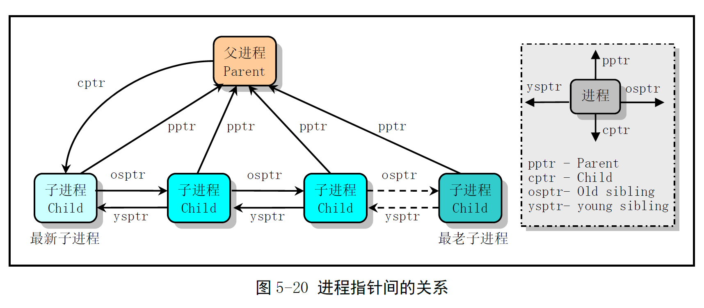

# Chapter 8.8 - exit.c 程序

Created by : Mr Dk.

2019 / 08 / 20 17:43

Ningbo, Zhejiang, China

---

## 8.8 exit.c 程序

### 8.8.1 功能描述

主要实现进程终止和退出的相关处理事宜。

### 8.8.2 代码注释

#### release() 函数

在 `sys_kill()` 和 `sys_waitpid()` 系统调用中被调用，释放进程占用的任务数组项，以及 TSS 占用的内存页面：

* 扫描任务数组指针表
* 如果找到，清空任务槽，释放任务数据结构占用的内存页面
* 执行调度函数，在返回时立刻退出

如果表中没有找到指定任务对应的项，则内核 panic，将任务 p 从进程双向链表中删除：



```c
void release(struct task_struct * p)
{
    int i;
    
    if (!p)
        // 任务指针为 NULL
        return;
    if (p == current) {
        printk("task releasing itself\n\r");
        return;
    }
    
    for (i = 1; i < NR_TASKS; i++)
        if (task[i] == p) {
            task[i] = NULL;
            
            // 更新进程链表的链接
            // 将任务 p 从双向链表中删除
            if (p->p_osptr)
                // 不是最老子进程
                p->p_osptr->p_ysptr = p->p_ysptr;
            if (p->p_ysptr)
                // 不是最新子进程
                p->p_ysptr->p_osptr = p->p_osptr;
            else
                // 最新子进程需要设置父进程指针
                p->p_pptr->p_cptr = p->p_osptr;
            
            free_page((long) p);
            schedule();
            return;
        }
    
   panic("trying to release non-existent task");
}
```

#### 检查进程树 - 调试函数

下面的部分是条件编译的，仅在调试时使用。因为这个函数很慢：

* 验证 p_ysptr 和 p_osptr 构成的双向链表
* 检查 p_cptr 和 p_pptr 构成的进程树

逻辑有些无聊，我不乐意写。

#### send_sig() - 向任务发送信号

首先判断参数的正确性。判断条件是否能够满足 - 是否有发送信号的权利。如果满足条件，就向指定的进程发送信号。

```c
static inline int send_sig(long sig, struct task_struct *p, int priv)
{
    if (!p)
        return -EINVAL;
    // 没有权限 && 当前进程的有效用户 ID 和 p 不同 && 不是超级用户
    // suser() - (current->euid == 0)
    if (!priv && (current->euid != p->euid) && !suser())
        return -EPERM;
    
    // 如果发送的信号是 SIGKILL 或 SIGCONT
    // 如果此时 p 处于停止状态，就置其为就绪状态
    // 修改进程的信号 bitmap，去掉会导致进程停止的信号
    //   -- SIGSTOP, SIGTSTP, SIGTTIN, SIGTTOU
    if ((sig == SIGKILL) || (sig == SIGCONT)) {
        if (p->state == TASK_STOPPED)
            p->state = TASK_RUNNING;
        p->exit_code = 0;
        p->signal &= ~( (1 << (SIGSTOP-1)) | (1 << (SIGTSTP-1)) |
                        (1 << (SIGTTIN-1)) | (1 << (SIGTTOU-1)));
    }
    
    // 发送的信号被进程忽略，因此不需要发送信号
    if ((int) p->sigaction[sig-1].sa_handler == 1)
        return 0;
    
    // 如果信号是 SIGSTOP、SIGTSTP、SIGTTIN、SIGTTOU 之一
    // 就要让接收信号的进程停止运行
    // 因此还要复位让进程继续运行的信号 - SIGCONT
    if ((sig >= SIGSTOP) && (sig <= SIGTTOU))
        p->signal &= ~(1 << (SIGCONT-1));
    
    // 发送信号
    p->signal |= (1<<(sig-1));
    return 0;
}
```

#### session_of_pgrp() - 根据进程组号取得进程所属会话号

```c
int session_of_pgrp(int pgrp)
{
    struct task_struct **p;
    
    for (p = &LAST_TASK; p > &FIRST_TASK; --p)
        if ((*p)->pgrp == pgrp)
            return ((*p)->session);
    
    return -1;
}
```

#### kill_pg() - 向进程组发送信号

> 有意思的是，Linux 里面的 kill 实际上是向进程或进程组发送信号，而不是杀死进程的意思。只是其中有一个信号可以杀死进程。

```c
int kill_pg(int pgrp, int sig, int priv)
{
    struct task_struct **p;
    int err, retval = -ESRCH;
    int found = 0;
    
    if (sig < 1 || sig > 32 || pgrp <= 0)
        return -EINVAL;
    for (p = &LAST_TASK; p > &FIRST_TASK; --p)
        if ((*p)->pgrp == pgrp) {
            if (sig && (err = send_sig(sig, *p, priv)))
                // 信号发送失败，返回发送失败的错误码
                retval = err;
            else
                // 信号发送成功
                found++;
        }
    
    return (found ? 0 : retval); // 只要有一次信号发送成功，就返回 0
}
```

#### kill_proc() - 向进程发送信号

```c
int kill_proc(int pid, int sig, int priv)
{
    struct task_struct **p;
    
    if (sig < 1 || sig > 32)
        return -EINVAL;
    for (p = &LAST_TASK; p > &FIRST_TASK; --p)
        if ((*p)->pid == pid)
            // 发送成功返回 0，发送失败返回出错号
            return (sig ? send_sig(sig, *p, priv) : 0);
    return (-ESRCH); // 进程不存在
}
```

#### sys_kill() - kill 系统调用

可用于向任何进程或进程组发送任何信号，并非只是杀死进程：

* pid 是进程号
  * pid > 0 : 信号发送给 pid 进程
  * pid = 0 : 信号发送给当前进程的进程组中的所有进程
  * pid = -1 : 信号发送给除 init 进程意外的所有进程
  * pid < -1 : 信号发送给进程组 -pid 的所有进程
* sig 是要发送的信号
  * sig = 0 则不发送信号，但仍会进行错误检查

```c
int sys_kill(int pid, int sig)
{
    struct task_struct **p = NR_TASKS + task;
    int err, retval = 0;
    
    // 当前进程组中的所有进程
    if (!pid)
        return (kill_pg(current->pid, sig, 0));
    // 除 init 进程之外的所有进程
    if (pid == -1) {
        while (--p > &FIRST_TASK)
            if (err = send_sig(sig, *p, 0))
                retval = err;
        return (retval);
    }
    // 进程组 -pid 中的所有进程
    if (pid < 0)
        return (kill_pg(-pid, sig, 0));
    // 普通的信号发送
    return (kill_proc(pid, sig, 0));
}
```

#### is_orphaned_pgrp() - 判断孤儿进程组

两种情况下，当一个进程终止时，可能导致进程组变成孤儿。

* 组外最后一个连接父进程的进程终止
* 最后一个父进程的直接后裔终止


孤儿进程组中的所有进程会与它们的作业控制 shell 断开联系。因此，含有停止状态进程的孤儿进程组需要接收到一个 SIGHUP 信号和一个 SIGCONT 信号，指示它们已经从它们的会话中断开联系：

* SIGHUP 信号将导致进程终止
* SIGCONT 信号使进程继续运行

```c
// 判断进程组是否是孤儿进程
// 如果不是则返回 0，如果是则返回 1
int is_orphaned_pgrp(int pgrp)
{
    struct task_struct **p;
    
    for (p = &LAST_TASK; p > &FRIST_TASK; --p) {
        if (!(*p) ||                           // 空槽
            ((*p)->pgrp != pgrp) ||            // 不是指定进程组的成员
            ((*p)->state == TASK_ZOMBIE) ||    // 已经处于僵死状态
            ((*p)->p_pptr->pid == 1))          // 父进程是 init 进程
            continue;                          // 跳过
        if (((*p)->p_pptr->pgrp != pgrp) &&           // 父进程不属于进程组
            ((*p)->p_pptr->session == (*p)->session)) // 属于同一个会话
            return 0;                                 // 肯定不是孤儿
    }
    return (1); // 否则，一定是孤儿进程组
}
```

> 这一段没看懂 😥

#### has_stopped_jobs() - 判断进程组中是否含有处于停止状态的作业

```c
static int has_stopped_jobs(int pgrp)
{
    struct task_struct **p;
    
    for (p = &LAST_TASK; p > &FIRST_TASK; --p) {
        if ((*p)->pgrp != pgrp)
            continue;
        if ((*p)->state == TASK_STOPPED)
            return (1);
    }
    
    return (0);
}
```

#### do_exit() - 程序退出处理函数

被 `exit()` 系统调用处理函数调用。根据当前进程自身的特性进行处理，将当前进程的状态设置为僵死状态。调用调度函数执行其它进程，不再返回。

```c
volatile void do_exit(long code)
{
    struct task_struct *p;
    int i;
    
    // 释放当前进程代码段和数据段所占内存页
    free_page_tables(get_base(current->ldt[1]), get_limit(0x0f)); // 代码段
    free_page_tables(get_base(current->ldt[2]), get_limit(0x17)); // 数据段
    // 关闭进程打开的所有文件
    for (i = 0; i < NR_OPEN; i++)
        if (current->filp[i])
            sys_close(i);
    // inode 以及库文件的同步操作
    iput(current->pwd);
    current->pwd = NULL;
    iput(current->root);
    current->root = NULL;
    iput(current->executable);
    current->executable = NULL;
    iput(current->library);
    current->library = NULL;
    
    // 设置进程状态
    current->state = TASK_ZOMBIE;
    current->exit_code = code;
    
    // 检查当前进程的退出，是否会造成任何进程组变成孤儿进程组
    // 如果有，且有处于停止状态的进程，则发送 SIGHUP 和 SIGCONT 信号
    
    // 情况 1 - 父进程在另一个进程组中，本进程是进程组与外界唯一的联系
    // 所以进程组将变成一个孤儿进程组
    if ((current->p_pptr->pgrp != current->pgrp) &&
        (current->p_pptr->session == current->session) &&
        is_orphaned_pgrp(current->pgrp) &&
        has_stopped_jobs(current->pgrp)) {
        kill_pg(current->pgrp, SIGHUP, 1);
        kill_pg(current->pgrp, ISGCONT, 1);
    }
    
    // 通知父进程当前进程将要终止
    current->p_pptr->signal |= (1 << (SIGCHLD-1));
    
    // 处理当前进程所有的子进程
    // 让 init 进程集成当前进程的所有子进程
    if (p = current->p_cptr) {
        while (1) {
            p->p_pptr = task[1];
            if (p->state == TASK_ZOMBIE)
                // 向 init 进程发送 SIGCHLD
                task[1]->signal |= (1 << (SIGCHLD-1));
            
            // 情况 2 - 当前进程和子进程在不同的进程组中
            // 本进程是它们与外界的唯一链接
            // 子进程所在的进程组将变成孤儿进程组
            if ((p->pgrp != current->pgrp) &&
                (p->session == current->session) &&
                is_orphaned_pgrp(p->pgrp) &&
                has_stopped_jobs(p->pgrp)) {
                kill_pg(p->pgrp, SIGHUP, 1);
                kill_pg(p->pgrp, SIGCONT, 1);
            }
            
            if (p->p_osptr) {
                p = p->p_osptr;
                continue; // 处理下一个子进程
            }
            
            // 最老的子进程
            p->p_osptr = task[1]->p_cptr; // 链接到 task 1 的最新子进程
            task[1]->p_cptr->p_ysptr = p; // task 1 的原最新子进程反链接
            task[1]->p_cptr = current->p_cptr; // task 1 的最新子进程
            current->p_cptr = 0; // 本进程的子进程置空
            break;
        }
    }
    
    // 当前进程是会话首领进程
    // 如果有控制终端，则应当向使用控制终端的进程组发送挂断信号 SIGHUP 并释放终端
    // 扫描任务数组，将属于当前进程会话的进程终端置空
    if (current->leader) {
        struct task_sturct **p;
        struct tty_struct *tty;
        
        if (current->tty >= 0) {
            tty = TTY_TABLE(current->tty);
            if (tty->pgrp > 0)
                kill_pg(tty->pgrp, SIGHUP, 1);
            tty->pgrp = 0;
            tty->session = 0;
        }
        for (p = &LAST_TASK; p > &FIRST_TASK; --p)
            if ((*p)->session == current->session)
                (*p)->tty = -1;
    }
    
    // 当前进程使用过协处理器
    if (last_task_used_math == current)
        last_task_used_math = NULL;
    
#ifdef DEBUG_PROC_TREE
    audit_ptree();
#endif
    
    schedule();
}
```

#### 系统调用 exit()

```c
// 系统调用 exit()
// error_code 是用户程序提供的退出状态信息，只有低字节有效
// 被左移 8 位，低字节中将用来保存 wait() 的状态信息
int sys_exit(int error_code)
{
    do_exit((error_code & 0xff) << 8);
}
```

#### 系统调用 waitpid()

挂起当前进程，直到以下情况发生：

* pid 指定的子进程退出
* 收到要求终止该进程的信号
* 需要调用一个信号句柄

若 pid 所指进程早已僵死，则本系统调用立刻返回，并释放子进程占用的资源

* pid > 0：等待进程号为 pid 的子进程
* pid = 0：等待进程组号 == 当前进程组号的任何子进程
* pid < -1：等待进程组号等于 -pid 的任何子进程
* pid = -1：等待任何子进程

选项：

* WUNTRACED：如果子进程是停止的，也马上返回
* WNOHANG：如果没有子进程退出或终止，就马上返回

```c
int sys_waitpid(pid_t pid, unsigned long * stat_addr, int options)
{
    int flag;
    struct task_struct *p;
    unsigned long oldblocked;
    
    verify_area(stat_addr, 4); // 验证存放状态信息的内存空间是否足够
repeat:
    flag = 0;
    for (p = current->p_cptr; p; p = p->p_osptr) {
        if (pid > 0) {
            if (p->pid != pid)
                // 当前进程的其它子进程，跳过
                continue;
        } else if (!pid) {
            if (p->pgrp != current->pgrp)
                // pid == 0
                // 该进程的进程组和当前进程组不同，跳过
                continue;
        } else if (pid != -1) {
            if (p->pgrp != -pid)
                // pid < -1
                // 该进程的进程组号不为 -pid
                continue;
        }
        
        // pid == -1
        // pid > 0 && p->pid == pid
        // pid == 0 && p->pgrp == current->pgrp
        // pid == -1 && p->pgrp == -pid
        
        // 此时，p 已经指向选择到的一个进程
        switch (p->state) {
            case TASK_STOPPED:
                // 子进程已停止
                if (!(options & WUNTRACED) || !p->exit_code)
                    continue;
                put_fs_long((p->exit_code << 8) | 0x7f, stat_addr);
                p->exit_code = 0;
                return p->pid;
            case TASK_ZOMBIE:
                // 子进程已僵死
                // 累计时间
                current->cutime += p->utime;
                current->cstime += p->stime;
                flag = p->pid;
                // 放置退出码
                put_fs_long(p->exit_code, stat_addr);
                // 释放子进程
                release(p);
                return flag;
            default:
                // 既不停止，也不僵死
                // 找到过一个符合要求的子进程，但其处于运行态或睡眠态
                flag = 1;
                continue;
        }
    }
    
    if (flag) {
        // 存在符合等待要求的子进程，但没有处于退出或僵死状态
        if (options & WNOHANG)
            // 选项 - 如果没有子进程处于退出或终止状态，就立刻返回
            return 0;
        // 把当前进程置为可中断等待状态
        // 保留并修改当前进程的信号屏蔽 bitmap，允许接收 SIGCHLD
        // 调度
        current->state = TASK_INTERRUPTIBLE;
        oldblocked = current->blocked;
        current->blocked &= ~(1 << (SIGCHLD-1));
        schedule();
        current->blocked = oldblocked;
        if (currrent->signal & ~(current->blokced | (1 << (SIGCHLD-1))))
            // 接收到其它未屏蔽信号，返回 - 重新启动系统调用
            return -ERESTARTSYS;
        else
            goto repeat;
    }
    
    // flag == 0，没有找到符合要求的子进程
    return -ECHILD; // 子进程不存在
}
```

