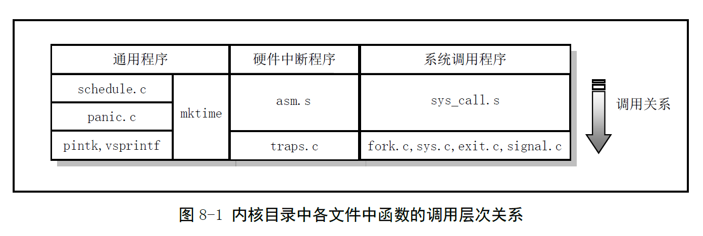
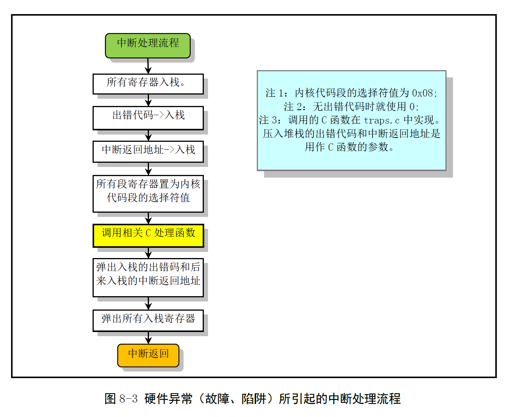

# Chapter 8.1 - 内核代码总体功能

Created by : Mr Dk.

2019 / 08 / 14 19:46

Ningbo, Zhejiang, China

---

`linux/kernel/`

* blk_drv/
* chr_drv/
* math/
* Makefile
* asm.s
* exit.c
* fork.c
* mktime.c
* panic.c
* printk.c
* sched.c
* signal.c
* sys.c
* sys_call.c
* traps.c
* vsprintf.c

---

## 8.1 总体功能

总体上分为三类：

* 硬件 (异常) 中断处理程序
* 系统调用服务处理程序
* 进程调度等通用功能

最喜欢的是这张调用关系图：

> 太 tm 合我的口味了 😆

### 8.1.1 中断处理程序

* asm.s
  * 实现大部分硬件异常所引起的中断服务过程的汇编部分
* traps.c
  * 实现 asm.s 中断处理过程中的 C 函数部分

另外有几个硬件中断处理程序在别的地方实现

在 Linux 系统中，中断服务功能由内核提供

* 中断处理过程使用进程的 __内核态堆栈__

涉及到优先级变化时

CPU 会将被中断代码段的 __堆栈段值 SS__ 和 __堆栈指针 ESP__ 压入中断处理程序的堆栈中

* 被中断代码段的堆栈，即进程的用户态堆栈
* 中断处理程序的堆栈，即进程的内核态堆栈

之后还需要在内核态堆栈上压入 EFLAGS 和返回地址 CS、EIP

asm.s 代码主要对 Intel 的保留中断 INT 0 - INT 16 做处理

INT 17 - INT 31 由 Intel 公司留作今后使用

8259A 上发出的 INT 32 - INT 47 分别在各种硬件的初始化程序中设置和处理

Linux 系统调用中断 INT 128 的服务程序则在 `kernel/sys_call.s` 中

某些异常引起中断时，CPU 内部会产生一个出错码，压入堆栈

* 因此 asm.s 根据是否携带出错码分为两类分别进行处理
* 但处理过程相同，如下图

### 8.1.2 系统调用处理相关程序

Linux 应用程序使用系统资源时需要利用中断 INT 0x80 进行

并需要在寄存器 EAX 中放入调用号

如果需要传递参数，则可以通过 EBX、ECX、EDX

sys_call.s 程序的作用类似于 asm.s 的作用

* 提供系统调用处理过程的入口汇编程序

其它几个 C 文件则提供了中断调用的 C 处理函数

### 8.1.3 其它通用类程序

* schedule.c - 内核的核心调度程序
* mktime.c - 仅包含一个内核使用的时间函数
* panic.c - 包含一个 `panic()` 函数，用于在内核运行出现错误时显示错误并停机
* printk.c 和 vsprintf.c - 内核显示信息的支持程序

---

