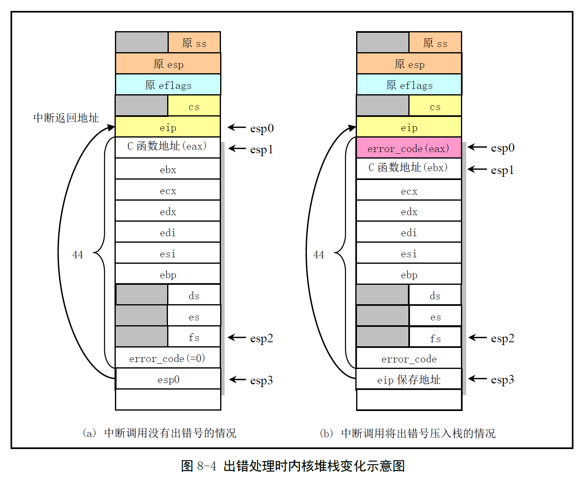

# Chapter 8.2 - asm.s 程序

Created by : Mr Dk.

2019 / 08 / 14 21:11

Ningbo, Zhejiang, China

---

## 8.2 asm.s 程序

### 8.2.1 功能描述

包含 CPU 探测到的大部分异常的故障处理底层代码

与 `kernel/traps.c` 程序有着密切的联系

主要处理方式：

* 在中断处理程序中调用 traps.c 中的 C 函数程序
* 显示出错位置和出错号
* 退出中断

首先，从用户态堆栈切换到内核态堆栈

* SS、ESP 入内核栈
* EFLAGS 入内核栈
* 用户程序返回地址 CS、EIP 入内核栈

之后，将错误码 (如果有) 和对应的处理 C 函数入栈

并用 `XCHG` 指令将错误码和 C 函数指针换出至寄存器中

将所有通用寄存器入栈

将错误码入栈

最后将中断返回地址 EIP 入栈

最后两步中，错误码和中断返回地址作为对应 C 函数的参数入栈

* 以便 C 函数打印出错位置和错误码

整体过程如图所示：



### 8.2.2 代码注释

主要涉及对 Intel 保留中断 INT 0 - INT 16 的处理

全局函数名的声明，其实现位于 traps.c 中

```assembly
.globl _divide_error, _debug, _nmi, _int3, _overflow, _bounds, _invalid_op
.globl _double_fault, _coprocessor_segment_overrun
.globl _invalid_TSS, _segment_not_present, _stack_segment
.globl _general_protection, _coprocessor_error, _irq13, _reserved
.globl _alignment_check
```

以下汇编是 __没有错误码__ 的异常处理过程：

* eax 寄存器放置了对应 C 函数的地址

```assembly
# INT 0 - 除法出错
# 除数为 0，或 EAX 中容纳不了一个合法除操作的结果
# 下面的 _do_divide_error 是 C 函数 do_divide_error() 编译后生成模块中对应的名称
_divide_error:
    pushl $_do_divide_error # 调用的 C 函数地址入栈
no_error_code:
    xchgl %eax, (%esp) # 将 C 函数交换到 eax 寄存器中
    pushl %ebx # 保存通用寄存器
    pushl %ecx
    pushl %edx
    pushl %edi
    pushl %esi
    pushl %ebp
    push %ds
    push %es
    push %fs
    pushl $0 # 错误码为 0 (即无错误码) 入栈
    lea 44(%esp), %edx # 取调用原返回地址的栈指针位置
    pushl %edx # 调用返回地址栈指针入栈
    movl $0x10, %edx # 段寄存器加载内核段选择符
    mov %dx, %ds
    mov %dx, %es
    mov %dx, %fs
    call *%eax # 调用 C 函数，相当于 do_divide_error(long esp, long error_code)
    addl $8, %esp # 相当于将两个函数参数 pop
    pop %fs # 恢复通用寄存器
    pop %es
    pop %ds
    popl %ebp
    popl %esi
    popl %edi
    popl %edx
    popl %ecx
    popl %ebx
    popl %eax
    iret
```

其余无错误码的异常，复用了标号为 `no_error_code` 的汇编代码：

```assembly
# INT 1 - debug 调试中断入口点
# EFLAGS 中 TF 标志置位引发的异常中断
_debug:
    pushl $_do_int3
    jmp no_error_code
```

```assembly
# INT 2 - 非屏蔽中断调用入口
# 接受到 NMI 信号时，CPU 内部产生中断向量 2
# CPU 收到 NMI 信号并开始执行时，随后所有的硬件中断都将被忽略
_nmi:
    pushl $_do_nmi
    jmp no_error_code
```

```assembly
# INT 3 - 断点指令引起的中断入口点
# 由 INT 3 指令触发，通常由调试器插入被调试的代码中
_int3:
    pushl $_do_int3
    jmp no_error_code
```

```assembly
# INT 4 - 溢出出错处理中断入口点
# EFLAGS 中的 OF 标志置位时 CPU 执行 INTO 指令引发中断
_overflow:
    pushl $_do_overflow
    jmp no_error_code
```

```assembly
# INT 5 - 边界检查出错中断入口点
# 操作数在有效范围以外时触发 - BOUND 指令
_bounds:
    pushl $_do_bounds
    jmp no_error_code
```

```assembly
# INT 6 - 无效操作指令出错中断入口点
# CPU 执行机构检测到一个无效的操作码
_invalid_op:
    pushl $_do_invalid_op
    jmp no_error_code
```

```assembly
# INT 9 - 协处理器段超出中断入口点
# 协处理器出错保护 - 浮点指令操作数太大
_coprocessor_segment_overrun:
    pushl $_do_coprocessor_segment_overrun
    jmp no_error_code
```

```assembly
# INT 15 - 其它 Intel 保留中断的入口点
_reserved:
    pushl $_do_reserved
    jmp no_error_code
```

下面是一个特殊的设置：

Linux 设置的数学协处理器硬件中断 INT 45

* 当协处理器执行完一个操作就会发出 IRQ 13 中断信号
* 80837 在执行计算时，CPU 会等待其操作完成
* 0xF0 是协处理器端口，用于清除忙锁存器，清除 CPU 的 BUSY 信号，重新激活 PEREQ

```assembly
_irq13:
    pushl %eax
    xorb %al, %al
    outb %al, $0xF0
    movb $0x20, %al
    outb %al, $0x20
    jmp 1f
    jmp 1f
    outb %al, $0xA0
    popl %eax
    jmp _coprocessor_error
```

以下汇编是 __有错误码__ 的异常处理过程：

* eax 中放置了错误码
* ebx 中放置了对应 C 函数的地址

```assembly
# INT 8 - 双出错故障
# 当 CPU 调用前一个异常处理程序时又检测到了新的异常，两个异常会被串行处理
# 少数情况下，CPU 不能进行这样的串行处理，因而引发该中断
_double_fault:
    pushl $_do_double_fault
error_code:
    xchgl %eax, 4(%esp)
    xchgl %ebx, (%esp)
    pushl %ecx # 保存通用寄存器
    pushl %edx
    pushl %edi
    pushl %esi
    pushl %ebp
    push %ds
    push %es
    push %fs
    pushl %eax # 错误码入栈
    lea 44(%esp), %eax # 返回地址位移
    pushl %eax # 返回地址指针入栈
    movl $0x10, %eax # 段寄存器加载内核段选择符
    mov %ax, %ds
    mov %ax, %es
    mov %ax, %fs
    call *%ebx # 间接调用 C 函数 (参数已入栈)
    addl $8, %esp # 丢弃入栈的 2 个 C 函数的参数
    pop %fs # 恢复通用寄存器
    pop %es
    pop %ds
    popl %ebp
    popl %esi
    popl %edi
    popl %edx
    popl %ecx
    popl %ebx
    popl %eax
    iret
```

其余产生错误码的异常，复用了标号为 `error_code` 的汇编代码：

```assembly
# INT 10 - 无效的任务状态段 TSS
_invalid_TSS:
    pushl $_do_invalid_TSS
    jmp error_code
```

```assembly
# INT 11 - 段不存在
# 被引用的段不在内存中
_segment_not_present:
    pushl $_do_segment_not_present
    jmp error_code
```

```assembly
# INT 12 - 堆栈段错误
# 指令操作试图超出堆栈段范围，或者堆栈段不在内存中
# INT 11 和 INT 13 的特例
_stack_segment:
    pushl $_do_stack_segment
    jmp error_code
```

```assembly
# INT 13 - 一般保护性出错
# 不属于其它任何类的错误
_general_protection:
    pushl $_do_general_protection
    jmp error_code
```

```assembly
# INT 17 - 边界对齐检查出错
# 启用内存边界检查时，特权级 3 数据非边界对齐时会产生该异常
_alignment_check:
    pushl $_do_alignment_check
    jmp error_code
```

其余中断在别处被设置：

```assembly
# INT 7 - 设备不存在 _device_not_available - kernel/sys_call.s
# INT 14 - 页错误 _page_fault - mm/page.s
# INT 16 - 协处理器错误 _coprocessor_error - kernel/sys_call.s
# INT 0x20 - 时钟中断 _timer_interrupt - kernel/sys_call.s
# INT 0x80 - 系统调用 _system_call - kernel/sys_call.s
```

---

