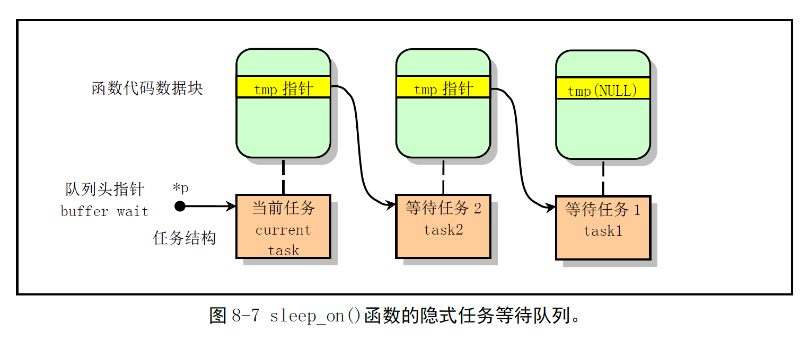

# Chapter 8.6 - sched.c 程序

Created by : Mr Dk.

2019 / 08 / 18 11:50

Ningbo, Zhejiang, China

---

## 8.6 sched.c 程序

### 8.6.1 功能描述

内核中有关任务 (进程) 调度管理的程序，包含：

* 几个有关调度的基本函数
* 一些简单的系统调用
* 系统时钟中断的定时函数和软盘驱动器定时程序

#### 8.6.1.1 调度函数

调度函数 `schedule()` 负责选择系统中下一个要运行的任务

首先，对所有任务进行检测，__唤醒任何一个已经得到信号的任务__

* 检查报警器定时值 alarm，如果已经过时，就在信号位图中设置 `SIGALRM` 信号，清除 alarm
* 如果进程的信号位图中，除去被阻塞的信号外还有其它信号，并处于可中断睡眠状态 `TASK_RUNNING`，则置任务为就绪状态 `TASK_RUNNING`

随后是调度的核心部分

根据进程的 __时间片__ 和 __优先级__

选择随后要执行的任务

并利用 `switch_to()` 切换到该任务

若所有就绪态任务的时间片都为 0

则根据任务的优先级重新设置每个任务的运行时间片

再次重新检查所有任务的时间片，并进行选择

#### 8.6.1.2 睡眠和唤醒函数

`sleep_on()` 函数的主要功能：

* 当一个进程所请求的资源 __正被占用__ 或 __不在内存__
* 暂时将该进程切换出去，放在等待队列中等待一段时间

函数涉及三个任务指针的操作：

* `*p` - 等待队列头指针
  * 文件系统中 `i_wait` 指针
  * 内存缓冲中 `buffer_wait` 指针
  * ...
* `tmp` - 存储在当前任务的内核态堆栈上，指向前一个正在等待的任务
* `current` - 当前任务指针

`sleep_on()` 函数使 `*p` 指向当前任务，使当前任务的 `tmp` 指针指向 `*p` 原来指向的正在等待的任务

当几个进程为了等待同一资源而分别调用 `sleep_on()` 时

构筑出了一个等待队列：



> 这队列很奇怪 因为它好像不是 FIFO 的.. 😥
>
> 更像一个链式栈
>
> `*p` 指向队尾 (栈顶)
>
> 后面看代码可以得知，这个数据结构是 FILO 的

将进程插入队列后，`sleep_on()` 函数就会调用 `schedule()` 函数去执行别的进程

当进程被唤醒时，就会把比它更早进入队列的进程唤醒

唤醒函数 `wake_up()` 用于把等待可用资源的指定任务置位就绪状态

`sleep_on()` 还有一种形式 - `interruptible_sleep_on()` 函数

* 调度其它任务前，将当前任务置为 __可中断等待状态__
* 在本任务被唤醒后，还需要判断队列上是否有后来的任务；若有，则需要先调度它们
* Linux 0.12 中，这两种情况都由 `sleep_on()` 实现，用任务的状态作为参数区分这两种情况

### 8.6.2 代码注释

> 进程调度和信号处理之间联系较多
>
> 所以我觉得要结合 `sys_call.s` 和 `signal.c` 一块儿看
>
> 才能加强理解

#### 信号操作宏

首先定义了两个宏，用于快速操作信号：

* 信号的编号是从 1 开始，到 32 为止
* 但信号在 bitmap 中是从第 0 位到第 31 位，所以要注意这个转变

```c
// 取编号为 nr 的信号在 bitmap 中的对应数值
#define _S(nr) (1 << ((nr)-1))
// 除 SIGKILL 和 SIGSTOP 信号以外，其它信号是可以被阻塞的
#define _BLOCKABLE (~(_S(SIGKILL) | _S(SIGSTOP)))
```

> 关于信号和阻塞的一点理解：
>
> 内核通过在进程 PCB 中设置信号位来给进程发送信号
>
> 如果进程处于可中断睡眠状态，则设置信号位后唤醒进程
>
> 如果进程处于不可中断睡眠状态，则只设置信号位
>
> 进程处理信号的时机在其从内核态返回用户态时
>
> * 收到信号后进程退出
> * 进程忽略信号
> * 捕捉某类信号 - 调用对应的信号处理函数
>
> 一种可能的思路：
>
> 向进程发送某个信号后，会将该信号的阻塞位置位
>
> 进程处理完该信号后，将该阻塞位复位
>
> 如果进程处理信号期间，又来了同样的信号
>
> 那么会被阻塞位给屏蔽掉，即丢弃
>
> (所谓的不可靠信号)
>
> 可靠的信号处理形式：排队记录，那么就不存在丢弃的问题

OK，看代码，一开始是内核调试函数

#### 显示各任务的详细信息

```c
void show_task(int nr, struct task_struct * p)
{
    int i, j = 4096-sizeof(struct task_struct); // 内核栈最大容量
                                                // PCB 和内核态堆栈共占一页物理内存
    
    printk("%d: pid=%d, state=%d, father=%d, child=%d, ",
            nr, p->pid, p->state, p->p_pptr->pid,
            p->p_cptr ? p->p_cptr->pid : -1);
    
    i = 0;
    while (i < j && !((char *)(p+1))[i])
        i++; // 检测指定任务数据结构以后等于 0 的字节数 (大约)
             // 即，内核态堆栈空闲字节数
    
    printk("%d/%d chars free in kstack\n\r", i, j);
    printk(" PC=%08X.", *(1019 + (unsigned long *) p));
    if (p->p_ysptr || p->p_osptr)
        printk(" Younger sib=%d, older sib=%d\n\r",
                p->p_ysptr ? p->p_ysptr->pid : -1,
                p->p_osptr ? p->p_osptr->pid : -1);
    else
        printk("\n\r");
}

void show_state(void)
{
    int i;
    
    printk("\rTask-info:\n\r");
    for (i = 0; i < NR_TASKS; i++) // NR_TASKS 为内核支持的最多任务数
        if (task[i]) // 任务指针不为空 (任务存在)
            show_task(i, task[i]);
}
```

#### 数据结构定义

```c
union task_union {
    struct task_struct task;
    char stack[PAGE_SIZE];
};
// ???
// union 大一上 C 语言课的时候一笔带过
// 有空再弄明白这具体是个啥

// 任务 0 初始化
static union task_union init_task = { INIT_TASK, };

// 初始化系统滴答
// volatile 和编译器有关，需要有空弄弄明白
// 系统滴答 10ms 一次，是系统时钟单位
unsigned long volatile jiffies = 0;
// 开机时间
unsigned long startup_time = 0;
// 为调整时钟而需要增加的滴答数
int jiffies_offset = 0;

// 当前任务指针，指向任务 0
struct task_struct *current = &(init_task.task);
// 上一个使用协处理器的任务指针
struct task_struct *last_task_used_math = NULL; 
// 定义任务指针数组，第一项被初始化为任务 0
struct task_struct *task[NR_TASKS] = { &(init_task.task), };

// 任务 0 的用户态堆栈
// 1K 项，共 4KB
long user_stack[ PAGE_SIZE >> 2 ];

// SS:ESP
// SS 的段选择符为内核数据段选择符 0x10
// ESP 是逆向入栈的 (地址递减)，因此初始地址指向 user_stack 的最后一项
struct {
    long *a;
    short b;
} stack_start = { & user_stack [ PAGE_SIZE >> 2 ], 0x10 };
```

接下来是一个子函数

用于在任务被调度切换之后

保存原任务的协处理器状态，恢复新任务的协处理器状态

```c
void math_state_restore()
{
    if (last_task_used_math == current)
    {
        return; // 任务没变，直接返回
    }
    __asm__("fwait"); // 发送协处理器指令之前要先发 WAIT 指令
    if (last_task_used_math)
    {
        __asm__("fnsave %0"::"m" (last_task_used_math->tss.i387));
    }
    last_task_used_math = current; // 指向当前任务
    if (current->used_math) { // 当前任务使用过协处理器
        __asm__("frstor %0"::"m" (current->tss.i387)); // 恢复协处理器状态
    } else { // 首次使用协处理器
        __asm__("fninit"::); // 初始化协处理器
        current->used_math = 1; // 设置已使用协处理器标志
    }
}
```

#### 调度函数 schedule()

下面是最核心的 `schedule()` 函数 (会被很多地方调用到！)：

* 调度进程
* 处理信号

```c
void schedule(void)
{
    int i, next, c;
    struct task_struct **p;
    
    // 首先检测各进程的定时器
    // 唤醒已得到信号的可中断任务
    for (p = &LAST_TASK; p > &FIRST_TASK; --p)
        if (*p) {
            if ((*p)->timeout && (*p)->timeout < jiffies) {
                // 已设置定时器 && 已经超时
                (*p)->timeout = 0; // 复位定时器
                if ((*p)->state == TASK_INTERRUPTIBLE)
                    (*p)->state = TASK_RUNNING;
            }
            if ((*p)->alarm && (*p)->alarm < jiffies) {
                // 已设置 SIGALRM 信号 && 已经超时
                (*p)->signal |= (1 << (SIGALRM-1)); // 置 SIGALRM 信号
                (*p)->alarm = 0;
            }
            if (((*p)->signal & ~(_BLOCKALBE & (*p)->blocked)) &&
                (*p)->state == TASK_INTERRUPTIBLE})
                // 信号 bitmap 中存在除被阻塞的信号外还有信号存在
                // 且任务处于可中断等待状态
                (*p)->state = TASK_RUNNING;
        }
    
    // 调度程序的主要部分
    while (1) {
        c = -1; // 数值最大的时间片
        next = 0; // 下一个要调度的任务
        i = NR_TASKS; // 任务 index
        p = &task[NR_TASKS]; // 最后一个任务项
        
        // 从最后一个任务开始循环
        while (--i) {
            if (!&--p)
                continue; // 跳过空槽
            if ((*p)->state == TASK_RUNNING && (*p)->counter > c)
                c = (*p)->counter, next = i;
        }
        
        // 有大于 0 的时间片，则跳出循环，将任务切换到 next
        // 或没有一个可运行任务 (c == -1, next == 0)，则跳出循环，切换到任务 0
        if (c) break;

        // 所有进程的时间片都为 0
        // 根据优先级重新计算 counter
        // counter = counter/2 + priority
        for (p = &LAST_TASK; p > &FIRST_TASK; --p)
            if (*p)
                (*p)->counter = ((*p)->counter >> 1) + (*p)->priority;
    }
    
    switch_to(next); // 任务切换宏
}
```

接下来的各种函数中全部都使用了该 `schedule()` 函数

#### 系统调用 pause()

* 将当前任务设定为可中断等待状态，并重新调度
* (还没有完全实现？)

```c
int sys_pause(void)
{
    current->state = TASK_INTERRUPTIBLE;
    schedule();
    return 0;
}
```

#### 睡眠函数 sleep_on()

* 将当前任务置为 __可中断睡眠状态__ 或 __不可中断睡眠状态__
* 将等待队列头指针指向当前任务
* 参数 `state` 可以为 `TASK_UNINTERRUPTIBLE` 或 `TASK_INTERRUPTIBLE`
  * 不可中断睡眠状态需要利用 `wake_up()` 函数明确唤醒
  * 可中断睡眠状态可以通过信号、任务超时等手段唤醒

```c
static inline void __sleep_on(struct task_struct **p, int state)
{
    struct task_struct *tmp;
    
    if (!p) // 指针所指对象可以为 NULL，但指针本身不会为 0
        return;
    if (current == &(init_task.task))
        panic("task[0] trying to sleep");
    
    // 插入等待队列
    tmp = *p;
    *p = current;
    current->state = state;
repeat:
    schedule(); // 重新调度
    
    // 任务被唤醒后，将从这里继续执行
    // 如果等待队列头指针并非指向自己
    // 说明之后还有进程进入了等待队列
    // 先将队头置为就绪状态，将自身置为不可中断等待状态
    // 队列中的进程使用 wake_up() 依次显式唤醒前一个任务
    if (*p && *p != current) {
        (**p).state = 0;
        current->state = TASK_UNINTERRUPTIBLE;
        goto repeat;
    }
    
    // 此时，任务被真正唤醒，*p == current
    if (!*p)
        printk("Warning: *P = NULL\n\r");
    if (*p = tmp)
        // 头指针指向队列中的前一个任务
        // 如果该任务存在，则唤醒
        // 等待队列头指针最终会变为 NULL
        tmp->state = 0;
}

// 上述函数是接下来两个函数的实现函数：
void interruptible_sleep_on(struct task_struct **p)
{
    __sleep_on(p, TASK_INTERRUPTIBLE);
}

void sleep_on(struct task_struct **p)
{
    __sleep_on(p, TASK_UNINTERRUPTIBLE);
}
```

#### 唤醒函数 wake_up()

* 唤醒不可中断等待任务
* 由于新等待任务插入在等待队列的头指针处，因此唤醒的是最后进入等待队列的任务

```c
void wake_up(struct task_struct **p)
{
    if (p && *p) {
        if ((**p).state == TASK_STOPPED)
            printk("wake_up: TASK_STOPPED");
        if ((**p).state == TASK_ZOMBIE)
            printk("wake_up: TASK_ZOMBIE");
        (**p).state = 0; // TASK_RUNNING
    }
}
```

#### 内核定时器

```c
#define TIME_REQUESTS 64 // 最多 64 个定时器

static struct timer_list {
    long jiffies;            // 定时滴答数
    void (*fn)();            // 定时处理程序
    struct timer_list *next; // 指向下一个定时器
} timer_list[TIME_REQUESTS], * next_timer = NULL; // 定时器队列头指针

void add_timer(long jiffies, void (*fn)(void))
{
    struct timer_list *p;
    
    if (!fn) // 处理程序指针为空
        return;
    
    cli(); // 关中断
    
    if (jiffies <= 0) // 定时器的值 ≤ 0，则立刻调用处理程序，不加入链表
        (fn)();
    else {
        // 从定时器中找一个空闲项
        for (p = timer_list; p < timer_list + TIME_REQUESTS; p++)
            if (!p->fn)
                break;
        
        if (p >= timer_list + TIME_REQUESTS) // 定时器数组用完
            panic("No more time requests free");
        p->fn = fn;
        p->jiffies = jiffies;
        p->next = next_timer;
        next_timer = p; // 插入定时器队头
        
        // 链表按定时值从小到大排序
        // 排序时减去排在前面的定时器所需要的滴答数
        // 处理定时器时，只需要查看表头的定时器是否到期
        while (p->next && p->next->jiffies < p->jiffies) {
            p->jiffies -= p->next->jiffies;
            
            fn = p->fn;
            p->fn = p->next->fn;
            p->next->fn = fn;
            
            jiffies = p->jiffies;
            p->jiffies = p->next->jiffies;
            p->next->jiffies = jiffies;
            
            p = p->next;
        }
    }
    
    sti(); // 开中断
}
```

#### 时钟中断处理函数

* 由 `sys_call.s` 中的 `_timer_interrupt` 调用
* 调用时，会将当前 CPU 的 CPL 压入堆栈，作为函数参数
  * 表示中断发生时，CPU 正在执行用户代码还是内核代码

执行计时更新操作，以及任务切换

```c
void do_timer(long cpl)
{
    // 黑屏操作
    static int blanked = 0;
    if (blankcount || !blankinterval) {
        if (blanked)
            unblank_screen();
        if (blankcount)
            blankcount--;
        blanked = 0;
    } else if (!blanked) {
        blank_screen();
        blanked = 1;
    }
    
    // 硬盘操作超时
    if (hd_timeout)
        if (!--hd_timeout)
            hd_times_out();
    // 扬声器
    if (beepcount)
        if (!--beepcount)
            sysbeepstop();
    
    // 如果当前代码运行在内核态，则递增 stime
    // 如果当前代码运行在用户态，则递增 utime
    if (cpl) // cpl == 3
        current->utime++;
    else
        current->stime++;
    
    // 如果设置了内核定时器，则将第一个定时器的值 -1
    // 如果已经到时，则调用相应处理程序，并移除定时器
    if (next_timer) {
        next_timer->jiffies--;
        while (next_timer && next_timer->jiffies <= 0) {
            void (*fn)(void);
            fn = next_timer->fn;
            next_timer->fn = NULL;
            next_timer = next_timer->next; // 删除队头
            (fn)(); // 调用定时处理函数
        }
    }
    
    // 软盘
    if (current_DOR & 0xf0)
        do_floppy_timer();
    
    // 当前进程时间片还没用完，继续执行
    if ((--current->counter) > 0)
        return;
    current->counter = 0;
    if (!cpl) // 内核态程序，不依赖 counter 进行调度
        return;
    schedule();
}
```

#### 与进程相关的几个系统调用

```c
// 设定新定时时间，并返回原定时时间的剩余值
// alarm 的时间单位是系统滴答，所以设计滴答和秒的单位转换
int sys_alarm(long seconds)
{
    int old = current->alarm;
    if (old)
        old = (old-jiffies) / HZ; // 剩余时间
    current->alarm = (seconds > 0) ? (jiffies + HZ * seconds) : 0;
    return (old);
}
```

```c
// 取当前进程号 pid
int sys_getpid(void)
{
    return current->pid;
}
```

```c
// 取父进程号 ppid
int sys_getppid(void)
{
    return current->p_pptr->pid;
}
```

```c
// 取用户号 uid
int sys_getuid(void)
{
    return current->uid;
}
```

```c
// 取有效用户号 euid
int sys_geteuid(void)
{
    return current->euid;
}
```

```c
// 取组号 gid
int sys_getgit(void)
{
    return current->gid;
}
```

```c
// 取有效的组号 egid
int sys_getegit(void)
{
    return current->egid;
}
```

```c
// 降低对 CPU 的使用权
int sys_nice(long increment)
{
    if (current->priority - increment > 0) // 防止优先权增大
        current->priority -= increment;
    return 0;
}
```

#### 内核调度初始化程序

```c
void sched_init(void)
{
    int i;
    struct desc_struct *p; // 描述符表
    
    // 兼容 POSIX 标准，并无实际意义
    if (sizeof(struct sigaction) != 16)
        panic("Struct sigaction MUST be 16 bytes");
    
    // 在 GDT 中设置 Task 0 的 TSS 和 LDT
    // FIRST_TSS_ENTRY == 4
    // FIRST_LDT_ENTRY == 5
    // gdt 是一个描述符表数组
    set_tss_desc(gdt+FIRST_TSS_ENTRY, &(init_task.task.tss));
    set_ldt_desc(gdt+FIRST_LDT_ENTRY, &(init_task.task.ldt));
    
    // 初始化任务数组和描述符表项
    p = gdt + FIRST_TSS_ENTRY + 2; // 指向 GDT 第六项
    for (i = 1; i < NR_TASKS; i++) { // 跳过了 Task 0
        task[i] = NULL;
        p->a = p->b = 0;
        p++;
        p->a = p->b = 0;
        p++;
    }
    
    // 复位 NT 标志
    __asm__("pushfl; andl $0xffffbfff, (%esp); popfl");
    
    // 加载 Task 0 的 TSS 和 LDT
    // 只手动加载这一次，之后新任务的 LDT 由 CPU 根据 TSS 中的 LDT 项自动加载
    ltr(0);
    lldt(0);
    
    // 初始化 8253 定时器
    // 通道 0，工作方式 3
    // 输出引脚接在 8259 主芯片的 IRQ0 上
    // 10ms 发出一次 IRQ0 请求
    outb_p(0x36, 0x43);
    outb_p(LATCH & 0xff, 0x40);
    outb(LATCH >> 8, 0x40);
    
    // 设置时钟中断门，修改中断控制器屏蔽码，允许时钟中断
    // 设置系统调用中断门
    set_intr_gate(0x20, &timer_interrupt);
    outb(inb_p(0x21) & ~0x01, 0x21);
    set_system_gate(0x80, &system_call);
}
```

---

## Summary

这个程序感觉算是内核里最复杂的代码了叭

不是因为逻辑复杂

是因为涉及到进程状态的转换、进程的切换

因此代码执行就不是连续的了

---

