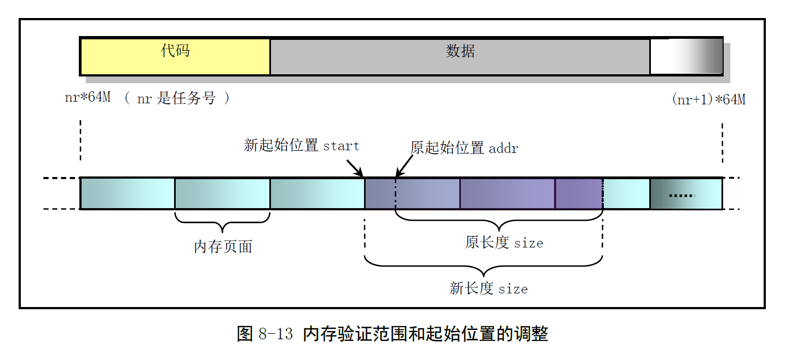

# Chapter 8.9 - fork.c 程序

Created by : Mr Dk.

2019 / 08 / 21 11:34

Ningbo, Zhejiang, China

---

## 8.9 fork.c 程序

### 8.9.1 功能描述

fork 系统调用用于创建子进程

在 Linux 中，所有进程都是进程 0 的子进程

该程序是 `sys_fork()` 函数的辅助处理函数集

* `find_empty_process()`
* `copy_process()`

`copy_process()` 函数用于复制进程的代码段和数据段，以及环境

* 为新建进程在主内存区中申请内存
* 复制当前进程的任务数据结构中的所有内容，作为新进程任务数据结构的模板
* 对复制的任务数据结构进行修改
  * 利用系统调用发生时，压入堆栈的寄存器信息，重新设置任务结构中的 TSS
  * 使新进程的状态保持父进程即将进入中断过程前的状态
* 复制当前进程的页目录项和页表项
* 同步文件使用
* 在 GDT 中设置 LDT 和 TSS，新任务设置为可运行状态，向当前进程返回新进程号

### 8.9.2 代码注释

#### 进程空间区域写前验证函数 verify_area()

对于 80386 CPU，在执行特权级 0 代码时，页保护标志不起作用

* copy-on-write 失去作用 - 该函数用于解决这个问题

对于 80486 CPU，内核可以通过设置 CR0 中的写保护标志 WP 禁止向用户空间只读页面写数据

检测以页为单位进行操作，因此程序需要首先定位到 addr 所在页面的基地址



该地址时进程空间中的逻辑地址，即相对于进程起始地址空间的偏移量

然后加上进程数据段基地址，变换为 CPU 线性空间中的地址

最后调用 `write_verify()` 对指定大小的内存空间进行写前验证

若页面只读，则执行共享检验和写时复制

```c
void verify_area(void *addr, int size)
{
    unsigned long start;
    
    start = (unsigned long) addr;
    size += start & 0xfff; // addr 在页内的偏移
    start &= 0xfffff000; // 对齐页边界，进程空间中的逻辑地址
    
    start += get_base(current->ldt[2]); // 加上进程数据段基址，转换为线性地址
    
    while (size > 0) {
        // 循环进行写页面验证
        // 如果页面不可写，则复制页面
        size -= 4096;
        write_verify(start);
        start += 4096;
    }
}
```

#### 复制内存页表函数 copy_mem()

参数 `nr` 是新任务号，`p` 是新任务数据结构的指针

为新任务在线性地址空间中设置代码段和数据段的基地址、限长，并复制页表

仅为新进程设置当前进程 (父进程) 的页目录表项和页表项，并不分配物理页面

* 此时，新进程与当前进程共享所有内存页面

```c
int copy_mem(int nr, struct task_struct * p)
{
    unsigned long old_data_base, new_data_base, data_limit;
    unsigned long old_code_base, new_code_base, code_limit;
    
    code_limit = get_limit(0x0f); // 代码段选择符
    data_limit = get_limit(0x17); // 数据段选择符
    old_code_base = get_base(current->ldt[1]); // 代码段线性基地址
    old_data_base = get_base(current->ldt[2]); // 数据段线性基地址
    if (old_data_base != old_code_base)
        // Linux 0.12 不支持代码段和数据段分离
        panic("We don't support separate I&D");
    if (data_limit < code_limit)
        panic("Bad data_limit");
    
    // 设置新进程在线性地址空间中的基地址
    new_data_base = new_code_base = nr * TASK_SIZE;
    p->start_code = new_code_base;
    set_base(p->ldt[1], new_code_base); // 设置代码段线性基地址
    set_base(p->ldt[2], new_data_base); // 设置数据段线性基地址
    
    // 复制页表项和页目录项
    if (copy_page_tables(old_data_base, new_data_base, data_limit)) {
        // 复制出错，回收页表项
        free_page_tables(new_data_base, data_limit);
        return -ENOMEM;
    }
    
    return 0;
}
```

#### 进程拷贝函数 copy_process()

复制进程信息 task[n]，并设置必要的寄存器

整个地复制数据段 (也是代码段)

函数参数是汇编依次压入堆栈的寄存器数据

```c
int copy_process(int nr, long ebp, long edi, long esi, long gs, long none,
                long ebx, long ecx, long edx, long orig_eax,
                long fs, long es, long ds,
                long eip, long cs, long eflags, long esp, long ss)
{
    struct task_struct *p;
    int i;
    struct file *f;
    
    // 为新的 PCB 申请一页
    // 并将地址放入任务数组中
    p = (struct task_struct *) get_free_page();
    if (!p)
        return -EAGAIN;
    task[nr] = p;
    *p = *current; // 只复制任务结构，不复制内核态堆栈
    
    // 对复制来的任务数据结构进行一些修改
    p->state = TASK_UNINTERRUPTIBLE; // 防止被内核调度执行
    p->pid = last_pid; // 新进程号
    p->counter = p->priority; // 进程时间片
    p->signal = 0; // 信号 bitmap
    p->alarm = 0; // 报警定时值
    p->leader = 0; // 进程领导权不能继承
    p->utime = p->stime = 0; // 用户态和核心态运行时间
    p->cutime = p->cstime = 0; // 子进程用户态和核心态运行时间
    p->start_time = jiffies; // 进程开始运行时间
    
    // 修改 TSS 的内容
    p->tss.back_link = 0;
    p->tss.esp0 = PAGE_SIZE + (long) p; // 指向页面顶端
    p->tss.ss0 = 0x10;
    p->tss.eip = eip;
    p->tss.eflags = eflags;
    p->tss.eax = 0; // fork() 返回时，新进程返回 0
    p->tss.ecx = ecx;
    p->tss.edx = edx;
    p->tss.ebx = ebx;
    p->tss.esp = esp;
    p->tss.ebp = ebp;
    p->tss.esi = esi;
    p->tss.edi = edi;
    p->tss.es = es & 0xffff; // 段寄存器仅 16 位有效。
    p->tss.cs = cs & 0xffff;
    p->tss.ss = ss & 0xffff;
    p->tss.ds = ds & 0xffff;
    p->tss.fs = fs & 0xffff;
    p->tss.gs = gs & 0xffff;
    p->tss.ldt = _LDT(nr); // 任务 LDT 描述符的选择符 (LDT 描述符在 GDT 中)
    p->tss.trace_bitmap = 0x80000000;
    
    // 如果当前任务使用了协处理器，就保存上下文到新进程的 i387 中
    if (last_task_used_math == current)
        __asm__("clts; fnsave %0; frstor %0"::"m"(p->tss.i387));
    
    // 复制进程页表
    if (copy_mem(nr, p)) {
        // 出错
        task[nr] = NULL;
        free_page((long) p); // 回收 PCB 所在页
        return -EAGAIN;
    }
    
    // 子进程与父进程共享打开的文件
    // 将对应文件的打开次数 +1
    for (i = 0; i < NR_OPEN; i++)
        if (f = p->filp[i])
            f->f_count++;
    
    // 父进程的 pwd、root、executable 的 inode 引用次数 +1
    if (current->pwd)
        current->pwd->i_count++;
    if (current->root)
        current->root->i_count++;
    if (current->executable)
        current->executable->i_count++;
    if (current->library)
        current->library->i_count++;
    
    // 在 GDT 表中设置新任务的 TSS 段和 LDT 段描述符
    set_tss_desc(gdt + (nr<<1) + FIRST_TSS_ENTRY, &(p->tss));
    set_ldt_desc(gdt + (nr<<1) + FIRST_LDT_ENTRY, &(p->ldt));
    
    // 将进程插入进程链表
    p->p_pptr = current; // 设置新进程的父进程为当前进程
    p->p_cptr = 0; // 新进程无子进程
    p->p_ysptr = 0; // 新进程无更年轻的兄弟进程
    p->p_osptr = current->p_cptr; // 设置新进程的老兄弟进程
    if (p->p_osptr) // 设置老兄弟进程的年轻兄弟进程指针
        p->p_osptr->p_ysptr = p;
    current->p_cptr = p; // 设置当前进程的最新子进程
    
    p->state = TASK_RUNNING; // 子进程就绪
    return last_pid;
}
```

#### 寻找进程槽 find_empty_process()

为新进程取得不重复的进程号，返回在任务数组中的 index

```c
int find_empty_process(void)
{
    int i;
    
    // 寻找唯一的 pid
repeat:
    if ((++last_pid < 0))
        last_pid = 1; // overflow
    for (i = 0; i < NR_TASKS; i++)
        if (task[i] && ((task[i]->pid == last_pid) || (task[i]->pgrp == last_pid)))
            goto repeat;
    
    // 唯一的 pid 已找到
    // 寻找任务数组空槽
    for (i = 1; i < NR_TASKS; i++)
        if (!task[i])
            return i; // 找到任务数组空槽
    return -EAGAIN;
}
```

---

