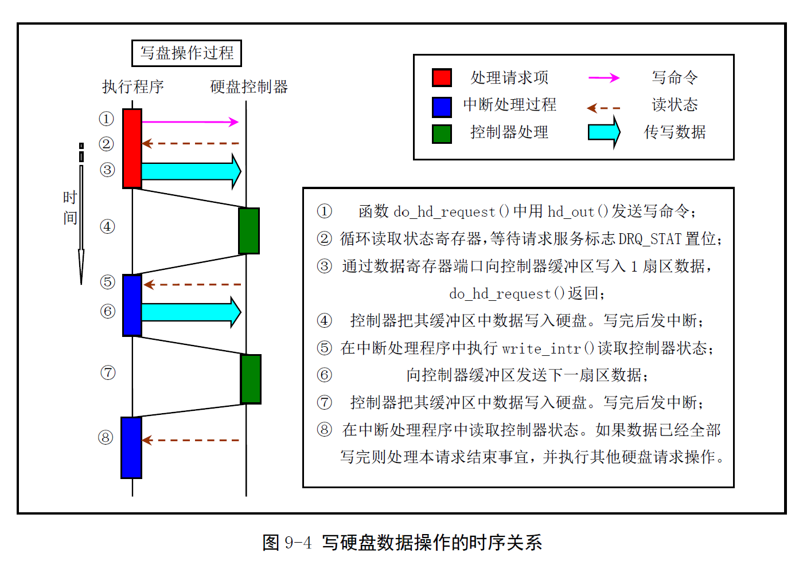
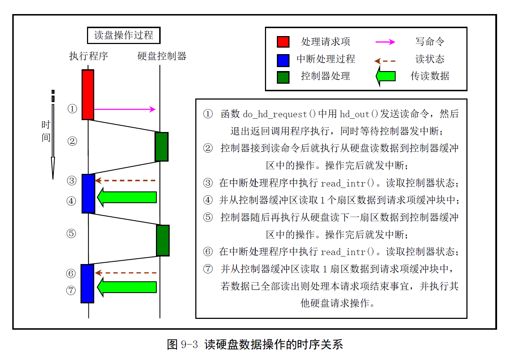

# Chapter 9.3 - hd.c 程序

Created by : Mr Dk.

2019 / 08 / 22 18:57

Ningbo, Zhejiang, China

---

## 9.3 hd.c 程序

### 9.3.1 功能描述

`sys_setup()` 函数

* 利用 `boot/setup.s` 程序中提供的信息，对硬盘驱动器的参数进行设置
* 读取硬盘分区表
* 尝试把启动引导盘上的虚拟盘根文件系统映像文件复制到内存虚拟盘中

`hd_init()` 函数

* 在内核初始化时设置 **硬盘控制器** 的 中断描述符
* 复位硬盘控制器的 **中断屏蔽码**，允许硬盘控制器发送中断请求信号

`hd_out()` 函数

* 硬盘控制器操作命令的发送函数
* 带有一个中断过程中调用的 C 函数指针
* 在向控制器发送命令之前，需要先用这个指针预置为中断处理过程中的调用指针
* 然后按照规定向硬盘控制器发送命令参数
* 立刻返回，不等待硬盘控制器执行命令

`do_hd_request()` 是硬盘请求项的操作函数

1. 判断当前请求项是否为空
2. 对请求项中指明的设备号和扇区号进行合法性验证
3. 计算请求数据的磁道号、磁头号、柱面号
4. 如果 reset 标志置位，那么设置 recalibrate 标志，并执行硬盘复位操作
5. 如果 recalibrate 标志置位，那么设置中断执行的函数 `recal_intr()`，并发送重新校正命令
6. 如果是写操作
   * 首先设置中断执行函数为 `write_intr()`
   * 使用 `do_out()` 向控制器发送写命令，循环查询 DRQ
   * 若控制器同意接收数据，则将请求项缓冲区的数据被写入控制器缓冲区
   * 若查询超时后，DRQ 还没有置位，则操作失败，调用 `bad_rw_intr()`
   * 根据出错次数决定是否放弃处理当前请求项 / 设置复位标志继续重新处理当前请求项
   * 
7. 如果是读操作
   * 设置中断执行函数为 `read_intr()`
   * 使用 `do_out()` 向控制器发送读命令
   * 
8. 立刻返回

在中断处理过程的调用函数中：

* 首先调用 `win_result()` 函数，读取控制器的 **状态寄存器**，判断是否有错误发生
  * 若发生错误，则调用 `bad_rw_intr()`
  * 若没有错误，继续
* 调用 `post_write()` 或 `post_read()` 完成读写
* 若没有更多数据需要读写，调用 `end_handler()` 处理请求结束事宜
* 继续调用 `do_hd_request()` 以处理其它请求项

### 9.3.2 代码注释

#### 硬盘信息结构体定义

```c
#define MAJOR_NR 3 // 硬盘主设备号

#define MAX_ERRORS 7 // 读/写扇区时允许的最多出错次数
#define MAX_HD 2     // 系统支持的最多硬盘数

// 硬盘信息结构
struct hd_i_struct {
    int head,  // 磁头数
        sect,  // 每磁道扇区数
        cyl,   // 柱面数
        wpcom, // 写前预补偿柱面号
        lzone, // 磁头着陆区柱面号
        ctl;   // 控制字节
};

#ifdef HD_TYPE // 在 include/linux/config.h 中定义了符号常数
struct hd_i_struct hd_info[] = { HD_TYPE }; // 预定义的硬盘信息数组
#define NR_HD ((sizeof(hd_info) / (sizeof(struct hd_i_struct))) // 硬盘个数
#else
struct hd_i_struct hd_info[] = { {0,0,0,0,0,0}, {0,0,0,0,0,0} };
static int NR_HD = 0;
#endif
```

#### 硬盘分区结构体定义

```c
// 5 的倍数的项代表整个硬盘的参数 hd[0]/hd[5]
static struct hd_struct {
    long start_sect; // 分区在硬盘中的起始物理扇区
    long nr_sects;   // 分区中的扇区总数
} hd[5*MAX_HD] = { {0,0},  };

// 硬盘每个分区的数据块总数
static int hd_sizes[5*MAX_HD] = { 0,  };
```

#### 端口读写的嵌入汇编

```c
// 读端口 port，读 nr 字，保存在 buf 中
#define port_read(port, buf, nr) \
__asm__("cld; rep; insw"::"d"(port), "D"(buf), "c"(nr):"cx", "di")
// 写端口 port，写 nr 字，从 buf 中取数据
#define port_write(port, buf, nr) \
__asm__("cld; rep; outsw"::"d"(port), "S"(buf), "c"(nr):"cx", "si")
```

#### 系统设置函数 sys_setup()

只在初始化时被调用一次。函数参数 BIOS 由初始化程序设置为指向硬盘参数表结构体的指针。该结构体中包含两个硬盘参数表的内容，从内存 0x90080 处复制而来。0x90080 处的硬盘参数表由 setup.s 程序利用 ROM BIOS 获得。

```c
int sys_setup(void * BIOS)
{
    static int callable = 1; // 调用次数标志
    int i, drive;
    unsigned char cmos_disks;
    struct partition *p;
    struct buffer_head *bh;
    
    if (!callable)
        // 已经被调用一次
        return -1;
    callable = 0;
    
#ifndef HD_TYPE
    for (drive = 0; drive < 2; drive++) {
        hd_info[drive].cyl = *(unsigned short *) BIOS; // 柱面数
        hd_info[drive].head = *(unsigned char *) (2+BIOS); // 磁头数
        hd_info[drive].wpcom = *(unsigned short *) (5+BIOS); // 写前预补偿柱面号
        hd_info[drive].ctl = *(unsigned char *) (8+BIOS); // 控制字节
        hd_info[drive].lzone = *(unsigned short *) (12+BIOS);// 磁头着陆区柱面号
        hd_info[drive].sect = *(unsigned char *) (14+BIOS); // 每磁道扇区数
        BIOS += 16; // 每个硬盘参数表 16B
    }
    
    // 判断第二个硬盘的参数表是否为 0，判断是否有第二个硬盘
    if (hd_info[1].cyl)
        NR_HD = 2;
    else
        NR_HD = 1;
#endif
    
    // 设置硬盘的分区结构体
    // 项 1-4 和 6-9 分别表示两个硬盘 4 个分区的参数
    // 这里仅设置第 0 和 5 项，即整个硬盘的信息
    for (i = 0; i < NR_HD; i++) {
        hd[i*5].start_sect = 0;
        hd[i*5].nr_sects = hd_info[i].head * hd_info[i].sect * hd_info[i].cyl;
    }
    
    // 检测硬盘是否是 AT 控制器兼容的
    if ((cmos_disks == CMOS_READ(0x12)) & 0xf0)
        if (cmos_disks & 0x0f)
            NR_HD = 2;
        else
            NR_HD = 1;
    else
        NR_HD = 0;
    // 如果两个硬盘都不兼容，则两个硬盘的数据结构清 0
    // 如果只有一个兼容，则将第二个硬盘的数据结构清 0
    for (i = NR_HD; i < 2; i++) {
        hd[i*5].start_sect = 0;
        hd[i*5].nr_sects = 0;
    }
    
    // 读取每个硬盘上的分区表信息，设置硬盘分区结构体
    for (drive = 0; drive < NR_HD; driver++) {
        // 分配缓冲区，读硬盘第一个扇区
        // 0x300 和 0x305 分别是两个硬盘的设备号
        if (!(bh = bread(0x300 + drive*5, 0))) {
            // 读取失败
            printk("Unable to read partition table of drive %d\n\r", drive);
            panic("");
        }
        
        if (bh->b_data[510] != 0x55 || (unsigned char) bh->b_data[511] != 0xAA) {
            // 第一扇区最后两字节不是 0xAA55，硬盘数据无效
            printk("Bad partition table on drive %d\n\r", drive);
            panic("";)
        }
        
        // 分区表位于第一扇区 0x1BE 处
        p = 0x1BE + (void *) bh->b_data;
        // 设置各分区的信息
        for (i = 1; i < 5; i++, p++) {
            hd[i+5*drive].start_sect = p->start_sect;
            hd[i+5*drive].nr_sects = p->nr_sects;
        }
        
        brelse(bh); // 释放存放硬盘第一扇区的缓冲区
    }
    
    // 对每个分区中的数据块总数进行统计
    for (i = 0; i < 5*MAX_HD; i++)
        hd_sizes[i] = hd[i].nr_sects >> 1; // 扇区数 / 2 == 块数
    blk_size[MAJOR_NR] = hd_sizes; // 块设备的扇区总数指向该数组
    
    if (NR_HD)
        printk("Partition table%s ok.\n\r", (NR_HD > 1) ? "s" : "");
    rd_load(); // 内存虚拟盘
    init_swapping(); // swap 分区
    mount_root(); // 根文件系统
    return (0);
}
```

#### 循环判断并等待硬盘控制器就绪 controller_ready()

读取硬盘控制器的状态寄存器端口，检测其中的 *状态寄存器忙* bit 来判断控制器是否处于忙状态。如果返回值为 0，则说明等待控制器空闲的时间已经超时而出错；否则说明在等待时间期限内控制器回到空闲状态。

```c
static int controller_ready(void)
{
    int retries = 100000;
    
    while (--retries && (inb_p(HD_STATUS) & 0xc0) != 0x40);
    return (retries); // 返回循环等待的次数
}
```

#### 向硬盘控制器发送命令 hd_out()

等待硬盘控制器就绪，设置全局的函数指针变量 `do_hd` 指向硬盘中断处理程序将要调用的 C 处理函数，再向硬盘控制器发送 **控制字节** 和 **参数命令块**：

```c
static void hd_out(unsigned int drive, unsigned int nsect, unsigned int sect,
                   unsigned int head, unsigned int cyl, unsigned int cmd,
                   void (*intr_addr)(void))
{
    register int port asm("dx");
    
    // 参数合法性检查
    if (drive > 1 || head > 15)
        // 驱动器号 > 1 || 磁头号 > 15
        panic("Trying to write bad sector");
    if (!controller_ready())
        panic("HD controller not ready");
    
    SET_INTR(intr_addr); // do_hd = intr_addr
    outb_p(hd_info[drive].ctl, HD_CMD); // 向控制寄存器输出控制字节
    port = HD_DATA; // dx 寄存器指向数据寄存器端口
    outb_p(hd_info[drive].wpcom >> 2, ++port); // 参数：补偿柱面号
    outb_p(nsect, ++port); // 参数：读/写扇区总数
    outb_p(sect, ++port); // 参数：起始扇区
    outb_p(cyl, ++port); // 参数：柱面号低 8 位
    outb_p(cyl >> 8, ++port); // 参数：柱面号高 8 位
    outb_p(0xA0 | (drive << 4) | head, ++port); // 参数：驱动器号 + 磁头号
    outb(cmd, ++port);
}
```

#### 检测硬盘执行命令后的状态 win_result()

如果执行出错，需要再读错误寄存器 HD_ERROR。

```c
static int win_result(void)
{
    int i = inb_p(HD_STATUS); // 读取状态寄存器
    if ((i & (BUSY_STAT | READY_STAT | WRERR_STAT | SEEK_STAT | ERR_STAT)) == (READY_STAT | SEEK_STAT))
        return (0);
    if (i & 1)
        i = inb(HD_ERROR);
    return (1);
}
```

#### 循环判断并等待硬盘就绪 drive_busy()

循环读取控制器的主状态寄存器 HD_STATUS，仅检测 **忙位**、**就绪位**、**寻道结束位**，如果忙位复位，就绪位和寻道结束位置位，则表示硬盘就绪；否则等待超时，显示警告信息。

```c
static int drive_busy(void)
{
    unsigned int i;
    unsigned char c;
    
    for (i = 0; i < 50000; i++) {
        c = inb_p(HD_STATUS);
        c &= (BUSY_STAT | READY_STAT | SEEK_STAT);
        if (c == (READY_STAT | SEEK_STAT))
            return 0;
    }
    printk("HD controller times out\n\r");
    return (1);
}
```

#### 重新校正硬盘控制器 reset_controller()

向控制寄存器端口发送控制字节，循环等待一段时间，让控制器进行复位操作。再向端口发送正常的控制字节，等待硬盘就绪。若超时，则显示忙警告信息，并读取错误寄存器中的内容。**不引发中断**。

```c
static void reset_controller(void)
{
    int i;
    
    outb(4, HD_CMD); // 发送复位控制字节
    for (i = 0; i < 1000; i++)
        // 等待一段时间
        nop();
    outb(hd_info[0].ctl & 0x0f, HD_CMD); // 发送正常控制字节
    if (drive_busy())
        printk("HD-controller still busy\n\r");
    if ((i = inb(HD_ERROR)) != 1)
        printk("HD-controller reset failed: %02x\n\r", i);
}
```

#### 硬盘复位 reset_hd()

首先复位 (校正) 硬盘控制器，发送建立驱动器参数命令。在这条命令引起的中断处理程序中，再次调用本函数。根据命令执行结果判断是否进行错误处理或是继续进行请求项处理。

```c
static void reset_hd(void)
{
    static int i;
    
repeat:
    if (reset) {
        reset = 0;
        i = -1;
        reset_controller();
    } else if (win_result()) {
        bad_rw_intr();
        if (reset)
            goto repeat;
    }
    i++; // 处理下一个硬盘
    if (i < NR_HD) {
        hd_out(i, hd_info[i].sect, hd_info[i].sect, hd_info[i].head-1, hd_info[i].cyl, WIN_SPECIFY, &reset_hd);
    } else
        do_hd_request();
}
```

#### 读写硬盘失败处理调用函数 bad_rw_intr()

读扇区出错次数 ≥ 7：

* 结束当前请求项
* 唤醒等待该请求的进程
* 缓冲区更新标志复位，表示数据没有更新

写扇区出错次数 > 3：复位硬盘控制器。

```c
static void bad_rw_intr(void)
{
    if (++CURRENT->errors >= MAX_ERRORS)
        end_request(0);
    if (CURRENT->errors > MAX_ERRORS / 2)
        reset = 1; // 设置复位标志
}
```

#### 意外硬盘中断调用的默认函数 unexpected_hd_interrupt()

默认 - 当被调用函数的指针为 NULL 时，就会调用该函数。设置复位标志，继续调用 `do_hd_request()` 执行复位处理操作。

```c
void unexpected_hd_interrupt(void)
{
    printk("Unexpected HD interrupt\n\r");
    reset = 1;
    do_hd_request();
}
```

#### 读扇区中断调用函数 read_intr()

在读命令完成后引发的中断中被调用：

```c
static void read_intr(void)
{
    if (win_result()) {
        // 读命令操作出错
        bad_rw_intr(); // 读写硬盘失败处理
        do_hd_request(); // 再次请求硬盘处理
        return;
    }
    
    // 读操作没有出错
    port_read(HD_DATA, CURRENT->buffer, 256); // 读数据到请求结构缓冲区 (256 内存字，即 512B)
    CURRENT->errors = 0; // 清理出错次数
    CURRENT->buffer += 512; // 缓冲区指针
    CURRENT->sector++; // 起始扇区号 + 1
    
    if (--CURRENT->nr_sectors) {
        // 还没读完
        SET_INTR(&read_intr); // 重新设置中断调用函数
        return;
    }
    
    // 所有扇区已经读完
    end_request(1); // 数据已更新标志位置位
    do_hd_request();
}
```

#### 写扇区中断调用函数 write_intr()

```c
static void write_intr(void)
{
    if (win_result()) {
        // 写命令操作出错
        bad_rw_intr(); // 失败处理
        do_hd_request(); // 再次请求硬盘处理
        return;
    }
    
    // 写操作没有出错
    // 还有更多扇区要写
    if (--CURRENT->nr_sectors) {
        CURRENT->sector++; // 起始扇区
        CURRENT->buffer += 512; // 调整缓冲区指针
        SET_INTR(&write_intr); // 重新设置中断调用函数
        port_write(HD_DATA, CURRENT->buffer, 256); // 向数据端口写 256 个内存字
        return;
    }
    
    // 全部扇区数据已经写完
    end_request(1); // 设置更新标志，善后
    do_hd_request();
}
```

#### 硬盘控制器重新校正 (复位) 中断调用函数 recal_intr()

```c
static void recal_intr(void)
{
    // 硬盘控制器是否返回错误信息
    if (win_result())
        bad_rw_intr(); // 读写失败处理
    do_hd_request();
}
```

#### 硬盘操作超时处理函数 hd_times_out()

会在 `do_timer()` 中被调用。向硬盘控制器发送命令后，在 hd_timeout 个滴答后控制器还没有发出硬盘中断信号，说明硬盘控制器或硬盘操作超时。`do_timer()` 函数调用本函数来设置硬盘复位标志，并调用 `do_hd_request()` 来执行复位处理。

```c
void hd_times_out(void)
{
    if (!CURRENT)
        return;
    printk("HD timeout");
    
    if (++CURRENT->errors >= MAX_ERRORS)
        end_request(0); // 不设置缓冲区更新标志
    SET_INTR(NULL); // 将中断调用函数指针置空
    reset = 1; // 置位 reset 标志
    do_hd_request(); // 执行复位处理
}
```

#### 执行硬盘读写请求 do_hd_request()

根据当前请求项中的设备号和起始扇区号。计算得到：

- 硬盘上的柱面号
- 当前磁道中的扇区号、磁头号数据

根据当前请求项中的命令对硬盘控制器发送相应的读写命令。如果控制器或硬盘需要复位，则首先进行复位操作。如果请求项是第一个，那么块设备的当前请求项指针将直接指向该请求项，立刻调用本函数进行读写操作；否则，在一个读写操作完成引发的硬盘中断过程中，若还有请求项需要处理，也会在硬盘中断过程中调用本函数。

```c
void do_hd_request(void)
{
    int i, r;
    unsigned int block, dev;
    unsigned int sec, head, cyl;
    unsigned int nsect;
    
    // 检测请求项合法性
    INIT_REQUEST; // 对当前请求项结构体中的内容进行合法性检查
    dev = MINOR(CURRENT->dev); // 子设备号
    block = CURRENT->sector; // 起始扇区
    if (dev >= 5*NR_HD || block+2 > hd[dev].nr_sects) {
        // 设备号不存在 || 一次读写一块 (1024B) 超出范围
        end_request(0);
        goto repeat; // blk.h 的最后
    }
    
    block += hd[dev].start_sect;
    dev /= 5; // 硬盘号 0/1
    
    // 根据硬盘信息结构中的每磁道扇区数和硬盘磁头数计算
    // 计算扇区号、柱面号、磁头号
    // 啊啊啊啊啊啊啊啊
    __asm__("divl %4":"=a"(block), "=d"(sec):"0"(block), "1"(0), "r"(hd_info[dev].head));
    __asm__("divl %4":"=a"(cyl), "=d"(head):"0"(block), "1"(0), "r"(hd_info[dev].head));
    sec++;
    nsect = CURRENT->nr_sectors;
    
    // 首先查看是否需要复位硬盘或硬盘控制器
    // 需要复位硬盘
    if (reset) {
        recalibrate = 1; // 同时也复位 (重新校准) 硬盘驱动器
        reset_hd();
        return;
    }
    if (recalibrate) {
        recalibrate = 0;
        hd_out(dev, hd_info[CURRENT_DEV].sect, 0, 0, 0, WIN_RESTORE, &recal_intr);
        return;
    }
    
    // 开始向硬盘控制器发送命令
    if (CURRENT->cmd == WRITE) {
        hd_out(dev, nsect, sec, head, cyl, WIN_WRITE, &write_intr);
        for (i = 0; i < 10000 && !(r = inb_p(HD_STATUS) & DRQ_STAT); i++)
            // 循环查询状态寄存器的 DRQ_STAT 是否置位
            // 驱动器是否准备好接收写数据
            ;
        if (!r) {
            bad_rw_intr();
            goto repeat; // blk.h 的最后面
        }
    } else if (CURRENT->cmd == READ) {
        hd_out(dev, nsect, sec, head, cyl, WIN_READ, &read_intr);
    } else
        panic("unknown hd-command");
}
```

#### 硬盘系统初始化 hd_init()

- 设置硬盘中断描述符
- 允许硬盘控制器发送中断请求信号

在内核初始化时被调用。INT 46：对应 8259A 从片 IRQ14，级联到 8259A 主片 IRQ2。

```c
void hd_init(void)
{
    blk_dev[MAJOR_NR].request_fn = DEVICE_REQUEST; // do_hd_request()
    set_intr_gate(0x2E, &hd_interrupt); // INT 0x2e(46)
    outb_p(inb_p(0x21) & 0xfb, 0x21); // 复位 8259A 主片级联屏蔽位
    oubb(inb_p(0xA1) & 0xbf, 0xA1); // 复位 8259A 从片中断请求屏蔽位
}
```

#### *附 - 硬盘中断处理程序 (sys_call.s)*

```assembly
# INT 46 - 硬盘中断处理程序
# 响应硬件中断请求 IRQ 14
_hd_interrupt:
    pushl %eax
    pushl %ecx
    pushl %edx
    push %ds
    push %es
    push %fs
    movl $0x10, %eax # ds,es 置为内核数据段
    mov %ax, %ds
    mov %ax, %es
    movl $0x17, %eax # fs 置为用户数据段
    mov %ax, %fs
    
    movb $0x20, %al
    outb %al, $0xA0 # 没有采用自动 EOI，因此手动结束中断
    jmp 1f
1:  jmp 1f # 延时
1:  xorl %edx, %edx
    movl %edx, _hd_timeout # 置 0，控制器已在规定时间内产生了中断
    xchgl _do_hd, %edx # 硬盘中断调用函数放置在 edx 中
    testl %edx, %edx
    jne 1f # 若函数为空，则使用默认的 C 函数
    movl $_unexpected_hd_interrupt
1:  outb %al, $0x20 # 结束硬件中断
    call *%edx # 调用 do_hd 指向的函数
    pop %fs
    pop %es
    pop %ds
    popl %edx
    popl %ecx
    popl %eax
    iret
```

