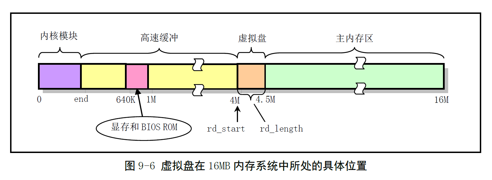
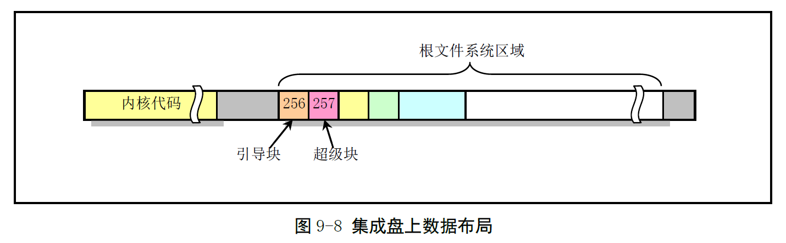

# Chapter 9.5 - ramdisk.c 程序

Created by : Mr Dk.

2019 / 08 / 23 21:32

Ningbo, Zhejiang, China

---

## 9.5 ramdisk.c 程序

### 9.5.1 功能描述

虚拟盘 - 利用物理内存来模拟实际磁盘存储数据

目的：提高对磁盘数据的读写速度

缺点：系统关闭或崩溃时，虚拟盘中的数据将会丢失

因此虚拟盘中通常存放一些系统命令等常用工具程序或临时数据

编译时，如果开启了 RAMDISK 选项

那么虚拟盘的位置会在内核初始化时确定

位于内核高速缓冲区和主内存区之间：



对于虚拟盘的读写访问操作原则上与普通磁盘的操作相同

也按照块设备的访问方式进行操作

但由于在实现上不牵扯到与外部控制器的同步操作

* 因此不需要硬盘中的中断机制
* 只需要实现内存数据的拷贝即可

`rd_init()` 函数在内核初始化时被调用

用于确定虚拟盘在物理内存中的具体位置和大小

`do_rd_request()` 是虚拟盘设备的请求处理函数

`rd_load()` 是虚拟盘根文件系统的加载函数

* 在内核初始化阶段，尝试从引导盘上把根文件系统加载到虚拟盘中
* 起始磁盘块 - 第 256 块

在使用普通方法从别的磁盘设备上加载根文件系统之前

系统首先执行 `rd_load()` 函数，尝试从第 257 块中读取根文件系统的 __超级块__

* 如果成功，就把根文件映像文件读到内存虚拟盘中，并设置根文件系统设备为虚拟盘设备
* 否则退出该函数，从别的设备上加载根文件系统

系统尝试检测从第 256 次磁盘块开始，是否存在一个根文件系统

判断第 257 磁盘块中是否是一个根文件系统的有效超级块



### 9.5.2 代码注释

#### 虚拟盘在内存中的起始位置

会在初始化函数 `rd_init()` 中确定

该函数会在内核初始化时被调用

```c
char *rd_start; // 虚拟盘在内存中的开始地址
int rd_length = 0; // 虚拟盘所占内存大小 (字节)
```

#### 虚拟盘的请求处理函数 do_rd_request()

在请求项加入虚拟盘设备的请求链表之后

调用该函数对请求项进行处理

首先计算：

* 指定的 __起始扇区__ 对应 __虚拟盘所处内存的起始位置__
* 要求的 __扇区数__ 对应的 __字节长度值__

然后根据读/写命令进行操作

* __请求项所指向的缓冲区__ 和 __虚拟盘设备对应的内存区__ 之间的数据复制

复制完成之后，直接调用 `end_request()` 销毁本次请求

然后跳转到函数开始处，处理下一个请求项

(因为不需要通过中断机制与设备控制器进行同步)

```c
void do_rd_request(void)
{
    int len;
    char *addr;
    
    // 检测请求项合法性
    // repeat:
    INIT_REQUEST; // 当前请求项为空，直接退出
    // 计算当前处理扇区的内存地址，和处理扇区的字节长度
    addr = rd_start + (CURRENT->sector << 9); // sector * 512B
    len = CURRENT->nr_sectors << 9; // sector * 512B
    
    if ((MINOR(CURRENT->dev) != 1) || (addr+len > rd_start+rd_length)) {
        // 子设备号不为 1 || 对应内存位置大于虚拟盘末尾
        end_request(0); // 直接结束请求
        goto repeat; // 处理下一个请求项
    }
    
    // 进行实际的读写操作
    if (CURRENT->cmd == WRITE) {
        (void) memcpy(addr, CURRENT->buffer, len); // 缓冲区 -> 虚拟盘
    } else if (CURRENT->cmd == READ) {
        (void) memcpy(CURRENT->buffer, addr, len); // 虚拟盘 -> 缓冲区
    } else
        panic("unknown ramdisk-command");
    
    // 请求项处理成功
    // 后处理
    end_request(1); // 释放请求项，指向下一个请求项
    goto repeat; // 处理下一个请求
}
```

#### 虚拟盘初始化函数 rd_init()

设置虚拟盘的请求项处理函数

确定虚拟盘在物理内存中的起始地址和长度

将整个虚拟盘区清零

最终返回盘区长度

```c
long rd_init(long mem_start, int length)
{
    int i;
    char *cp;
    
    blk_dev[MAJOR_NR].request_fn = DEVICE_REQUEST; // do_rd_request()
    
    rd_start = (char *) mem_start;
    rd_length = length;
    
    cp = rd_start;
    for (i = 0; i < length; i++)
        *cp++ = '\0';
    return (length);
}
```

#### 加载根文件系统到虚拟盘中 rd_load()

__根文件系统映像__ 位于第 256 磁盘块开始处

```c
void rd_load(void)
{
    struct buffer_head *bh;
    struct super_block s; // 文件系统 super block
    int block = 256; // 根文件系统映像磁盘块号
    int i = 1;
    int nblocks; // 文件系统盘块数
    char *cp;
    
    // 检查虚拟盘的有效性和完整性
    if (!rd_length)
        // 虚拟盘长度为 0
        return;
    printk("Ram disk: %d bytes, starting at 0x%x\n", rd_length, (int) rd_start);
    if (MAJOR(ROOT_DEV) != 2)
        // 根文件设备不是软盘
        return;
    
    // 读取根文件系统的基本参数
    bh = breada(ROOT_DEV, block+1, block, block+2, -1); // 读入缓冲区
    if (!bh) {
        // 读取失败
        printk("Disk error while looking for ramdisk!\n");
        return;
    }
    *((struct d_super_block *) &s) = *((struct d_super_block *) bh->b_data); // 从缓冲区中拷贝文件系统超级块
    brelse(bh); // 释放缓冲区
    if (s.s_magic != SUPER_MAGIC)
        // 磁盘中没有根文件系统映像文件
        return;
    
    // 尝试将整个根文件系统读入内存虚拟盘中
    // 超级块结构体中的 s_nzones 字段保存了文件系统的总逻辑块数
    // 一个逻辑块中含有的数据块数由 s_log_zone_size 指定
    // 文件系统中的数据块总数 = s_nzones * 2^s_log_zone_size
    nblocks = s.s_nzones << s.s_log_zone_size;
    if (nblocks > (rd_length >> BLOCK_SIZE_BITS)) {
        // 虚拟盘无法容纳文件系统数据块总数
        // 不能执行加载操作
        printk("Ram disk image too big! (%d blocks, %d avail)\n", nblocks, rd_length >> BLOCK_SIZE_BITS);
        return;
    }
    
    printk("Loading %d bytes into ram disk... 0000k", nblocks << BLOCK_SIZE_BITS);
    cp = rd_start; // 指向虚拟盘开始处
    while (nblocks) {
        // 将一个块读取到缓冲区中
        if (nblocks > 2)
            bh = breada(ROOT_DEV, block, block+1, block+2, -1);
        else
            bh = bread(ROOT_DEV, block);
        if (!bh) {
            printk("I/O error on block %d, aborting load\n", block);
            return;
        }
        (void) memcpy(cp, bh->b_data, BLOCK_SIZE); // 缓冲区 -> 虚拟盘
        brelse(bh); // 释放缓冲区
        
        printk("\010\010\010\010\010%4dk", i);
        cp += BLOCK_SIZE; // 虚拟盘当前的空白位置
        block++; // 读取的磁盘块号
        nblocks--; // 剩余要读取的磁盘块数
        i++; // 当前复制的块数
    }
    
    // 根文件系统加载完毕
    printk("\010\010\010\010\010done \n");
    ROOT_DEV = 0x0101; // 根文件系统设备号修改为虚拟盘设备号
}
```

---

## Summary

块设备这一章就看到这里

软盘的驱动程序不准备看了

因为现在的电脑里都没有软盘驱动器了

看了也没啥意义

所以，半本书算是看完辣 😎

---

