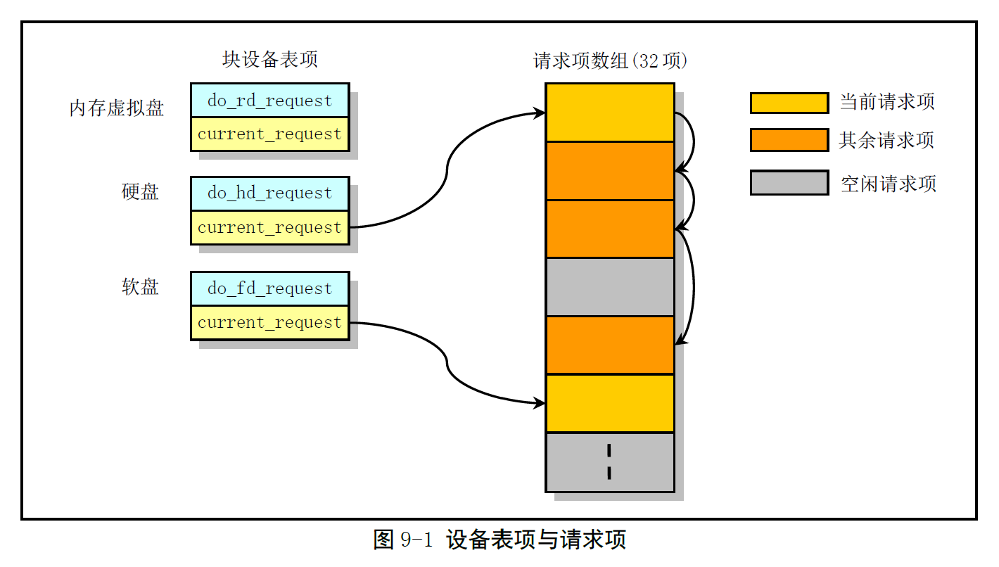

# Chapter 9.1 - 块设备驱动程序 总体功能

Created by : Mr Dk.

2019 / 08 / 22 12:18

Ningbo, Zhejiang, China

---

操作系统的所有设备可以粗略地分为两种类型：

* 块设备 - block device
* 字符型设备 - character device

块设备是一种可以以固定大小的数据块为单位进行寻址和访问的设备

字符型设备是一种以字符流作为操作对象的设备，不能进行寻址操作

为了便于管理和访问

OS 将这些设备统一以 __设备号__ 进行分类

每个类型中的设备可再根据 __从设备号__ 进行分类

| 主设备号 | 名称 | 类型            | 说明            |
| -------- | ---- | --------------- | --------------- |
| 0        | /    | /               | /               |
| 1        | ram  | block/character | RAM，内存虚拟盘 |
| 2        | fd   | block           | 软盘驱动器      |
| 3        | hd   | block           | 硬盘驱动器      |
| 4        | ttyx | character       | 虚拟或串行终端  |
| 5        | tty  | character       | tty 设备        |
| 6        | lp   | character       | 打印机设备      |

Linux 0.12 支持硬盘、软盘、内存虚拟盘三种块设备

`linux/kernel/blk_drv` 中的文件分类如下：

* 对应各设备的驱动程序
  * `hd.c` - 硬盘驱动程序
  * `floppy.c` - 软盘驱动程序
  * `ramdisk.c` - 内存虚拟盘驱动程序
* 用于内核中其它程序访问块设备的接口程序 `ll_rw_blk.c`
* 块设备专用头文件 `blk.h`

---

## 9.1 总体功能

内核每次读写的数据量以一个逻辑块 (1024B) 为单位

而块设备控制器以扇区 (512B) 为单位访问块设备

内核使用 __读写请求项等待队列__ 来顺序地缓冲一次读写多个逻辑块的操作

程序需要读取一个逻辑块时，首先向 __缓冲区管理程序__ 提出申请，然后进入睡眠等待状态

缓冲区管理程序首先在缓冲区中寻找以前是否已经读取过这块数据

* 若有，则将缓冲区头指针返回，并唤醒进程
* 若没有，则调用 `ll_rw_blk()`，向设备发出操作请求

创建一个请求结构项，并以电梯算法插入请求结构项

若此时块设备的请求项队列为空，则表明设备不忙

直接向块设备控制器发出读数据命令

当块设备控制器将数据读入指定的缓冲区后，发出中断信号，调用后处理函数

* 关闭设备
* 设置缓冲区数据更新标志
* 唤醒等待该块数据的进程

### 9.1.1 块设备请求项和请求队列

对于各种块设备，内核维护一张块设备表 blk_dev[] 来进行管理

每种块设备都在块设备表中占有一项

```c
struct blk_dev_struct {
    void (*request_fn) (void);         // 请求项操作的函数指针
    struct request * current_request;  // 当前请求项
};
extern struct blk_dev_struct blk_dev[NR_BLK_DEV]; // 7
```

* 第一个参数，用于对相应的块设备请求进行操作
  * `do_rd_request()`
  * `do_hd_request()`
  * `do_floppy_request()`
* 第二个参数，指向本设备当前正在处理的请求项 (初始化为 NULL)

内核发出操作时，利用相应的请求项操作函数 `do_XX_request()` 建立 __块设备请求项__

并利用 __电梯算法__ 插入到请求项队列中

__请求项队列__ 由 __请求项数组__ 中的项构成：

```c
struct request {
    int dev; // 主设备号，-1 表示该项空闲
    int cmd; // READ == 0, WRITE == 1
    int errors; // 操作产生的错误次数
    unsigned long sector; // 起始扇区
    unsigned long nr_sectors; // 读/写扇区数
    char * buffer; // 数据缓冲区
    struct task_struct * waiting; // 等待操作完成的任务
    struct buffer_head * bh; // 缓冲区头指针
    struct request * next; // 下一个请求项
};
extern struct request request[NR_REQUEST]; // 32
```

请求项数组共有 32 个空槽

而项与项之间利用 next 字段形成链表

即数组 + 链表结构

* 数组结构方便搜索空闲请求快
* 链表结构满足电梯算法的插入请求项操作

这个请求项数组中保存了所有类型块设备的请求项

每个类型的块设备有一条自己的链表：



若设备的 `current_request` 为 NULL，说明设备空闲

新建立的请求项被 `current_request` 指向后，会立刻调用对应设备的操作函数进行操作

若 `current_request` 不为 NULL，则利用电梯算法将请求项插入链表的适当位置

另外，为了满足 __读操作__ 的优先权

* 建立写操作请求的空闲项搜索范围为数组的前 2/3
* 剩下的 1/3 请求项专门为读操作建立请求使用

### 9.1.2 块设备访问调度处理

对于内存来说，访问硬盘、软盘等块设备较为耗时

因此需要对链表中的请求项进行排序

使请求项访问的磁盘扇区数据块尽量依次进行操作

__电梯算法__ - 向一个方向移动，直至该方向上的最后一个请求；再向相反方向移动

* 对于磁盘来说，磁头一直向盘片圆心方向移动，或反之向盘片边缘移动

因此，内核并非按照请求项到来顺序对块设备进行处理

而是要对请求项的顺序进行优化处理

这部分称为 I/O 调度程序

* Linux 0.1x 中仅对请求项进行了排序处理
* 目前流行的 Linux 内核还包含对访问相邻磁盘扇区的两个或多个请求进行合并处理

### 9.1.3 块设备操作方式

首先理清三个对象之间的相互作用：


> 这么一看就比较清楚了
>
> 设备控制器和驱动器之间的事，交给内部的电路完成
>
> Kernel 只需要向设备控制器发送命令
>
> 然后设备控制器完成后发来中断，由 CPU 的中断处理程序完成相应功能即可

* 首先，系统指明控制器引发中断后，应当调用的 C 函数
* 向块设备控制器发送读 / 写 / 复位等命令
* 控制器完成指定命令，发出中断请求信号，引发系统执行块设备的中断处理过程，在其中调用指定的 C 函数

对于写盘操作：

* 系统发出写命令
* 查询等待 __控制状态寄存器__ 的 __数据请求服务标志 DRQ__ 置位
* 置位后，系统向控制器缓冲区发送一个扇区的数据
* 控制器将数据写入驱动器后，产生中断请求信号
* 引发中断处理过程，并调用指定的 C 函数，在函数中判断是否还有数据要写
  * 如果有，则再将一个扇区的数据送往控制寄存器
* 若所有数据都已写入驱动器，则进行后处理工作
  * 唤醒等待请求项数据的进程
  * 唤醒等待空闲请求项的进程
  * 释放当前请求项，修改指针从链表中删除
  * 释放锁定的相关缓冲区
  * 调用请求项操作函数，执行下一个请求项

对于读盘操作：

* 向控制器发出读命令
* 控制器将指定的一扇区数据从驱动器传到自己的缓冲区中，并发出中断请求
* 在预置的 C 函数中，将控制器缓冲中的数据复制到系统缓冲区中
  * 若还有数据要读，则继续等待下一个中断信号
* 若所有数据都已经读到系统缓冲区中，则进行后处理工作

对于虚拟盘设备：

* 由于不牵扯到与外设之间的操作，因此没有中断处理过程
* 读写操作完全在 `do_rd_request()` 中实现

注意：向控制器发送读写命令后，发送命令的函数会立刻返回，不会等待命令被执行的过程

* 在调用了 `ll_rw_block()` 之后，调用等待函数 `wait_on_buffer()` 让执行当前代码的进程立刻进入睡眠状态，直到 I/O结束，在 `end_request()` 中被唤醒

---

## Summary

总体来看，只要了解具体操作流程以后

设备驱动程序应当相对简单一些

感觉困难的可能是最开始的初始化部分

因为和硬件打交道需要了解硬件的结构

然后针对这些结构进行相应的编程，比较复杂

---

